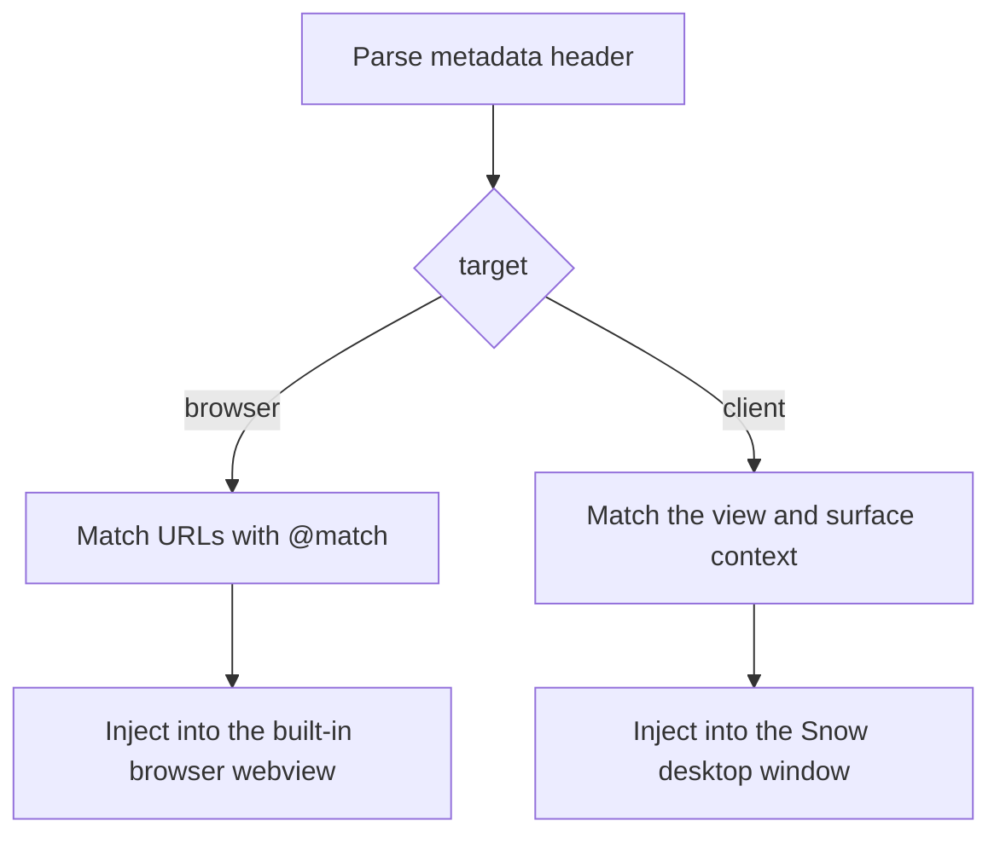
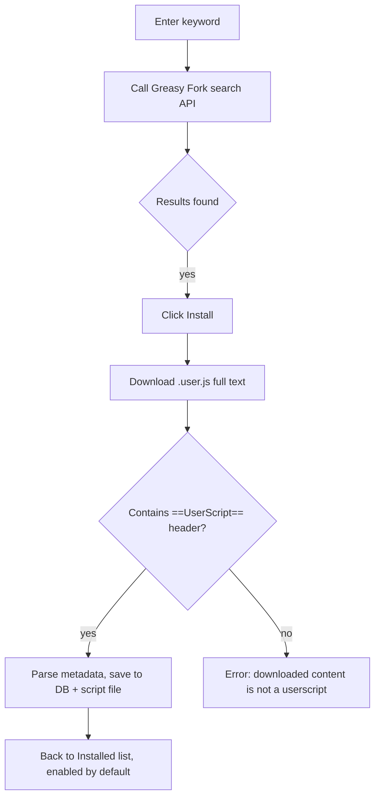

# 22-Userscripts

> Applies to: Tampermonkey-compatible userscripts of **two kinds** — **browser scripts** injected into built-in browser webview pages (entry: `Settings → Browser settings → Userscripts`), and **client UI scripts** injected into the **Snow desktop window itself** to customize the app interface (entry: `Plugins → Plugin list → Script plugins`). Both kinds are **separate capabilities** from the AI Agent's `browser` MCP tools in [Browser automation](6-browser-automation.md): neither kind injects into instances created by the AI `browser` tools.

## Two kinds of scripts

Both kinds share the same metadata parser, `GM_*` implementation, and storage location; only the injection target and the management entry differ:

| Dimension             | Browser scripts                                             | Client UI scripts                                                                                                              |
| --------------------- | ----------------------------------------------------------- | ------------------------------------------------------------------------------------------------------------------------------ |
| Injected into         | Web pages inside the built-in browser webview               | The Snow main-window renderer (the app UI itself)                                                                              |
| Managed in            | Settings → Browser settings → Userscripts                   | Plugins page → Plugin list → Script plugins                                                                                    |
| Match basis           | `@match` / `@include` URL rules                             | View (`@snow-view`) and surface (`@snow-surface`) directives                                                                   |
| Scope declaration     | Default, no extra directive                                 | `@snow-target client` in the metadata header, or `@match snow://client/<view>`                                                 |
| Execution environment | The page's main world (equivalent to the page's own script) | One dedicated isolated world per script (sandboxed mode) by default; the **main world** (full-permission mode) after opting in |
| UI impact             | Only the page it is injected into                           | The Snow client UI itself                                                                                                      |

The new `target` column of the `userscripts` table (`browser` / `client` / `all`) decides where a script belongs; script files stay at `~/.snowapp/browser-script/{script_id}.user.js`:



The **Userscripts** list in browser settings shows browser scripts only (`browser`, plus `all`, which lives on both sides); the **Plugin list → Script plugins** sub-tab of the Plugins page manages `client` and `all` only. Historical scripts carry no `@snow-*` directive, so `target` defaults to `browser` and their behavior is unchanged.

## Browser scripts (built-in browser)

### Goal

Run Tampermonkey-compatible userscripts in Snow's built-in browser: modify page DOM, work around some cross-origin restrictions, register right-click menu commands, persist settings (`GM_*` values), download files, and more. Scripts are automatically injected into pages that match their `@match`/`@include` rules.

### Prerequisites

- The script file must contain a complete `// ==UserScript==` ... `// ==/UserScript==` metadata header (`@name` and at least one `@match` or `@include` are required — see the metadata table below).
- Searching and installing from Greasy Fork requires network access to `https://api.greasyfork.org`, and the download URL must be `https://`.
- Scripts run in the **page's main world** (the page's `window`), with full access to page objects — equivalent to running the page's own script. Only install scripts from trusted sources.

### Entry point

Open **Settings → Browser settings** (settings page id: `browser-settings`; an agent can open it via `app-control-openSettings page=browser-settings`) and switch to the **Userscripts** tab. The tab has two sub-tabs, **Installed** and **Search & Download**, and lists **browser scripts only**; client UI scripts are managed under the Plugins page's **Plugin list → Script plugins** sub-tab, see "Client scripts (desktop window)" below.

> Note: this tab lives in the same settings panel (`BrowserSettingsPanel`) as the homepage and password features in [17-Browser settings, passwords, and import](17-browser-settings-passwords-and-import.md), just a different tab.

### Steps

#### 1. Create a new script

Click **New script**. The editor opens prefilled with a minimal template:

```javascript
// ==UserScript==
// @name         My Script
// @namespace    snow-app
// @version      1.0
// @description  Describe what this script does
// @author       You
// @match        https://example.com/*
// @run-at       document-idle
// @grant        none
// ==/UserScript==

console.log("Hello from userscript!");
```

Saving writes the record to the app database and the script file, and the script is injected automatically into matching built-in browser pages (no app restart needed).

#### 2. Edit / enable / disable / delete

The **Installed** list shows name, description, version, match-rule summary, and run-at timing. Each row supports:

- **Enable toggle**: takes effect immediately; a disabled script is no longer matched (stops injecting on the next navigation).
- **Edit**: opens the full source (metadata header included) in a code editor; saving rewrites the file and re-parses metadata.
- **Delete**: after a confirmation dialog, removes the database record and the on-disk script file (irreversible).
- **Refresh**: reloads the list from the database and disk (use after manually editing `~/.snowapp/browser-script/`).

#### 3. Search & install from Greasy Fork

The **Search & Download** tab calls the Greasy Fork search API (sorted by install count). Results include name, description, rating, install count, and a detail link:



Already-installed scripts (deduplicated by name) are shown as "Installed" with the button disabled. The search API does not return a total count; pagination relies on `hasMore` (whether the page returned the full requested number of items) to decide if a next page exists.

#### 4. Let the AI install it for you (`config` tool, `userscripts` scope)

Besides the UI, you can have the AI manage userscripts directly through the `config` tool without opening the settings page:

```text
# Recommended flow: write the full source to a file first, then let the backend read the file
# (avoids passing a huge string in tool arguments)
filesystem-create writes ./scripts/demo.user.js (full // ==UserScript== content)
config-set scope=userscripts key="new" value={sourcePath: "/abs/path/demo.user.js"}

# Small scripts can be inlined directly
config-set scope=userscripts key="new" value={raw: "// ==UserScript==\n// @name Demo\n// @match https://example.com/*\n// ==/UserScript==\nconsole.log('hi');"}

# Update an existing script
config-set scope=userscripts key="<scriptId>" value={sourcePath: "..."}  // or {raw: "..."}

# Enable / disable
config-set scope=userscripts key="<scriptId>" value={enabled: false}

# Read / write GM_* persistent values
config-set scope=userscripts key="<scriptId>" value={values: {"k": "v"}}
config-set scope=userscripts key="<scriptId>" value={deleteValues: ["k"]}
config-get scope=userscripts key="<scriptId>"   // returns metadata + full source + GM values

# Uninstall (removes the database record + the on-disk file)
config-delete scope=userscripts key="<scriptId>" confirmed=true
```

`key` is the script's `scriptId` (the UUID returned by the list API); `"new"` means create. See the `config` tool's `userscripts` scope in the [built-in tools reference](../3-reference/2-builtin-tools-reference.md).

### Metadata fields

The table below covers the generic fields both kinds of scripts share; the client-only `@snow-*` directives are listed in the metadata subsection of "Client scripts (desktop window)".

The parser only recognizes lines starting with `// @`, with keys matched case-insensitively. Localized variants such as `@name:zh-CN` are used as a fallback when a bare `@name` is missing, selected by the app locale (exact tag → primary language → first available variant).

| Field                         | Required                                | Default         | Notes                                                                                                                                              |
| ----------------------------- | --------------------------------------- | --------------- | -------------------------------------------------------------------------------------------------------------------------------------------------- |
| `@name`                       | Yes (unless a localized variant exists) | —               | Script name; localized variants like `@name:zh-CN` / `@name:en` are supported                                                                      |
| `@match` / `@include`         | At least one                            | —               | Match rules, multiple allowed; if both lists are empty, the script matches **all** URLs                                                            |
| `@version`                    | No                                      | `1.0`           | Version                                                                                                                                            |
| `@description`                | No                                      | empty           | Description                                                                                                                                        |
| `@namespace`                  | No                                      | empty           | Namespace                                                                                                                                          |
| `@author`                     | No                                      | empty           | Author                                                                                                                                             |
| `@run-at`                     | No                                      | `document-idle` | `document-start` / `document-end` / `document-idle`                                                                                                |
| `@noframes`                   | No                                      | `true`          | When true, the script does not run inside `iframe` child frames                                                                                    |
| `@grant`                      | No                                      | empty           | Declares which `GM_*` APIs are used, multiple allowed; display-only, does not actually gate available APIs                                         |
| `@exclude` / `@exclude-match` | No                                      | empty           | Exclusion rules; take priority over `@match`/`@include`                                                                                            |
| `@require`                    | No                                      | empty           | External JS dependency URL(s); warmed up asynchronously and inlined (may not be ready on the very first navigation — takes effect on the next one) |
| `@resource`                   | No                                      | empty           | External resources, shaped like `@resource <name> <url>`, readable via `GM_getResourceText` / `GM_getResourceURL`                                  |

**Wildcard rules** (`@match`): `*` matches any non-`/` characters; the host part supports `*.example.com` (any subdomain), `*example.com` (suffix match), and `*` (any host); `*://` matches any scheme; in the path, `*` matches any characters and `/*` matches everything under that path. `@include`/`@exclude` use the same wildcard semantics but may omit the scheme (in which case the pattern is anchored as a substring).

### GM_* API support matrix

This section describes the `GM_*` implementation used by scripts injected into built-in browser pages; the subset available to client scripts, plus the `snow` extension API, is listed in the API subsection of "Client scripts (desktop window)".

Before a script's main-world code runs, that script's `GM_*` APIs are attached to `window` (each script gets its own closure context, so `GM_getValue`/`GM_setValue` etc. only affect that script's own persistent namespace).

| API                                                                | Notes                                                                                                                                                                                                                                                             |
| ------------------------------------------------------------------ | ----------------------------------------------------------------------------------------------------------------------------------------------------------------------------------------------------------------------------------------------------------------- |
| `GM_getValue` / `GM_setValue` / `GM_deleteValue` / `GM_listValues` | Persistent key-value store, saved in the `userscript_values` database table (unique per `scriptId` + `key`); `GM_setValue` also broadcasts the change to other tabs (a tab's own listener is **not** triggered by its own write, matching Tampermonkey semantics) |
| `GM_addValueChangeListener` / `GM_removeValueChangeListener`       | Listen for `GM_setValue`/`GM_deleteValue` changes                                                                                                                                                                                                                 |
| `GM_getTab` / `GM_saveTab` / `GM_getTabs`                          | Session-scoped (per webContents) in-memory store; cleared on process restart                                                                                                                                                                                      |
| `GM_xmlhttpRequest`                                                | Issued via the main process, **bypassing the page's CORS restrictions**; supports `text`/`json`/`arraybuffer`/`blob` (binary returned as base64); only `http(s)` URLs allowed, 30-second timeout                                                                  |
| `GM_notification`                                                  | Creates a system notification; supports `onclick` / `ondone` callbacks (click and failure events are delivered back to the script)                                                                                                                                |
| `GM_setClipboard`                                                  | Writes to the system clipboard                                                                                                                                                                                                                                    |
| `GM_addStyle`                                                      | Injects a `<style>` node into the page                                                                                                                                                                                                                            |
| `GM_addElement`                                                    | Creates and attaches a DOM element                                                                                                                                                                                                                                |
| `GM_registerMenuCommand` / `GM_unregisterMenuCommand`              | Registers a **page right-click menu** command that runs the given callback when clicked (idempotent: the same title reuses the same id)                                                                                                                           |
| `GM_openInTab`                                                     | Opens a URL in a new built-in browser tab (`active:false` opens in the background)                                                                                                                                                                                |
| `GM_download`                                                      | Starts a download with `onload`/`onerror`/`onprogress`; allows `http(s)`/`blob:`/`data:` URLs                                                                                                                                                                     |
| `GM_getResourceText` / `GM_getResourceURL`                         | Reads `@resource`-declared external resource content / produces a data URL                                                                                                                                                                                        |
| `GM_log`                                                           | Equivalent to `console.log`                                                                                                                                                                                                                                       |
| `GM_cookie.list` / `GM_cookie.set` / `GM_cookie.delete`            | Reads/writes/deletes cookies in the current Electron session (Tampermonkey beta API)                                                                                                                                                                              |
| `GM_info`                                                          | Read-only metadata (`script.name` / `version` / `description` / `scriptMetaStr` / `scriptHandler` / `version`)                                                                                                                                                    |

**Known differences vs. a full Tampermonkey implementation**:

- `window.prompt()` is not supported in Electron; scripts calling it get a synchronous fallback that returns the default value (with a console warning), so code paths that rely on interactive user input will just proceed with the default.
- When multiple scripts match the same page, they share a single `window.GM_*` singleton (bound to the **last** prepared script's context), which differs slightly from Tampermonkey's per-script isolation — though each script's `GM_*` persistent values are still stored independently per `scriptId`.
- `@require` content is warmed up asynchronously: on the very first navigation, if a dependency hasn't finished downloading yet, a placeholder comment is used instead; the real content is inlined starting with the **next** navigation.

## Client scripts (desktop window)

Client UI scripts inject into the **Snow desktop window itself** (the main-window renderer) to customize the app interface: hide or rearrange regions, add buttons next to the chat input, react to view switches, inject your own styles, and so on. They only affect the Snow client and never change how pages behave inside the built-in browser.

### Entry and management

Open the **Plugins** page at the bottom of the sidebar (main-content view id `plugins`) and drill into **Plugin list** → **Script plugins**: the page has two top-level tabs, **Plugin list** and **Metadata catalog**, and **Plugin list** itself carries two sub-tabs with counters, **Panel plugins** and **Script plugins**, the latter managing client scripts. Inside the sub-tab you find, from top to bottom, a toolbar (**New script** / **Import file** / **Refresh**), the install-from-URL row, and the script list; while the list is empty a centered empty state (icon + description + **Build with AI** request box) is shown, and both sub-tabs share the same layout. Each row shows the script name, version (with author and run-at), and scope badges, plus an **enable toggle**, **Edit**, and **Delete**:

| Route                 | Steps                                                                                                                                                                                                                                                                                                                                                                                                                                                                                                               |
| --------------------- | ------------------------------------------------------------------------------------------------------------------------------------------------------------------------------------------------------------------------------------------------------------------------------------------------------------------------------------------------------------------------------------------------------------------------------------------------------------------------------------------------------------------- |
| New script            | Click **New script** to open the large modal editor — the very same one as in **Settings → Browser settings → Userscripts** (`Modal` plus the line-numbered, highlighted `FileViewerContent`), prefilled with the client-script template (`@snow-target client` plus anchor and slot examples)                                                                                                                                                                                                                      |
| Edit a script         | Click the pencil button on a row to open the same editor with the virtual file name `<script name>.user.js`; **Save** writes the database, re-matches and takes effect immediately, while closing the modal cancels                                                                                                                                                                                                                                                                                                 |
| Import a local file   | Click **Import file**, pick a `.user.js` in the system file dialog, then save the source loaded into the same editor (the virtual file name is the picked file's name)                                                                                                                                                                                                                                                                                                                                              |
| Install from a URL    | Paste a **https** direct link to a `.user.js` and click **Install URL** (same implementation as the built-in browser install; only `https://` is accepted)                                                                                                                                                                                                                                                                                                                                                          |
| Build with AI         | Describe what you want in the empty-state request box (Enter sends, Shift+Enter inserts a new line) and click **Build with AI**: the Plugins page closes, a new conversation starts and auto-sends the request, the AI loads the `snow-app-docs` skill to locate the built-in docs and reads this guide's client-script chapter, writes a `.user.js`, and installs and enables it through the `config-set` `userscripts` scope. Like its Panel plugins counterpart, this entry only appears while the list is empty |
| Refresh               | Reloads the list from the database and disk (use after manually editing `~/.snowapp/browser-script/`)                                                                                                                                                                                                                                                                                                                                                                                                               |
| Let the AI install it | With a script file already at hand, install it through the `config` tool's `userscripts` scope, see below                                                                                                                                                                                                                                                                                                                                                                                                           |

Each row's scope badges are derived from the metadata header — `Sandboxed` / `Full permissions` / `Always on` / `view:<id>` / `area:<name>` — so you can see what a script does before enabling it.

### Metadata (`@snow-*` directives)

Every client directive is **optional** and lives in the ordinary `// ==UserScript==` header; keys are case-insensitive (underscore spellings such as `snow_target` are equivalent). When the header carries no client directive at all, `target` defaults to `browser` and behavior is unchanged.

| Directive                     | Default         | Values and notes                                                                                                                                                                                 |
| ----------------------------- | --------------- | ------------------------------------------------------------------------------------------------------------------------------------------------------------------------------------------------ |
| `@snow-target`                | `browser`       | `client` = desktop window only; `browser` = built-in browser only; `all` = both                                                                                                                  |
| `@match snow://client/<view>` | —               | Compatible form: same as a client script plus a view restriction; `snow://client` or `snow://client/*` means every view (this pattern never enters URL matching)                                 |
| `@snow-view`                  | all views       | Restricts the main-content view ids where the script runs; comma / space / semicolon separated and repeatable, for example `chat, plugins`; `*` or omission means every view                     |
| `@snow-surface`               | all surfaces    | Restricts the UI surfaces where the script runs; values are `main` / `topbar` / `sidebar` / `right-panel` / `chat` / `settings`; any match injects the script (`main` and `topbar` always exist) |
| `@snow-scope`                 | empty           | `global` = a resident script that runs at app start and is not unloaded on view switches; empty follows the view in and out                                                                      |
| `@snow-sandbox`               | `true`          | `false` switches to full-permission mode (main-world execution); `@grant unsafeWindow` has the same effect                                                                                       |
| `@run-at`                     | `document-idle` | Same semantics as browser scripts; a matching non-`document-start` script waits until the app is ready before injecting                                                                          |

Main-content view ids match the UI, for example `chat`, `team`, `memo`, `memory`, `plugins`, `browser-settings`, `system-logs`; the full list is the app's main-content view definition.

### The two execution modes

| Mode                | Trigger                                                             | Capability boundary                                                                                                                                                                                                                                                                                                                                         |
| ------------------- | ------------------------------------------------------------------- | ----------------------------------------------------------------------------------------------------------------------------------------------------------------------------------------------------------------------------------------------------------------------------------------------------------------------------------------------------------- |
| Sandboxed (default) | Neither `@snow-sandbox false` nor `@grant unsafeWindow` is declared | Each script runs in a **dedicated isolated world** (`worldId` starting at 1000) that shares the DOM / CSS with the UI (so native DOM APIs can customize the window directly) but cannot reach `window.snow`: the file, terminal, MCP, and session IPC surfaces stay invisible; `GM_*` and the `snow` API call the main process through a whitelisted bridge |
| Full permissions    | `@snow-sandbox false` or `@grant unsafeWindow`                      | The script runs in the **main world** with the same power as local code (`window.snow` and `unsafeWindow` are reachable) and the risk that comes with it; the panel shows an amber `Full permissions` badge                                                                                                                                                 |

The isolated world also keeps scripts apart: their `GM_*` objects cannot overwrite each other, and one failing script cannot break another script's world.

### Direct DOM manipulation (like a Chrome userscript)

The isolated world only isolates the JS environment - **the DOM is fully shared**: scripts can modify any part of the window with browser-native APIs and no host wrapper at all. `document.querySelector` / `querySelectorAll`, `createElement` / `append` / `remove`, `MutationObserver`, `addEventListener`, `element.style` / `classList`, `element.click()` and friends all work, and styles injected via `GM_addStyle` apply to the whole window.

Only two things must go through the host-provided `snow` API (see the table below): **reading app state** (`snow.context` / `snow.on`, since the script world cannot see React state) and **triggering app actions** (`snow.client.*`; a `CustomEvent` dispatched across worlds cannot carry `detail` reliably, so the host re-dispatches it in the main world).

React re-creates nodes on re-render (the message list is even virtualized as you scroll), so nodes you attach may be removed or replaced - use a `MutationObserver` to re-attach, exactly like a userscript on a modern SPA:

```javascript
const decorate = () => {
  document
    .querySelectorAll('[data-snow-anchor="chat.message"]')
    .forEach((el) => {
      if (el.dataset.snowMessageRole !== "assistant") return;
      if (el.querySelector(".my-badge")) return;
      const badge = document.createElement("span");
      badge.className = "my-badge";
      badge.textContent = "custom";
      el.append(badge);
    });
};
const observer = new MutationObserver(decorate);
observer.observe(document.body, { childList: true, subtree: true });
decorate();
snow.onCleanup(() => observer.disconnect());
```

### API reference

`GM_*` reuses the very implementation browser scripts use, and the `window.GM.xxx` form is available as well:

| API                                                                | Notes                                                                                                                  |
| ------------------------------------------------------------------ | ---------------------------------------------------------------------------------------------------------------------- |
| `GM_info`                                                          | Read-only metadata (`script.name` / `version` / `description` / `scriptMetaStr` / `scriptHandler`, plus `sandboxMode`) |
| `GM_getValue` / `GM_setValue` / `GM_deleteValue` / `GM_listValues` | Persistent key-value store (the `userscript_values` table, isolated per `scriptId`)                                    |
| `GM_addValueChangeListener` / `GM_removeValueChangeListener`       | Listen for changes inside this script's own namespace                                                                  |
| `GM_getTab` / `GM_saveTab` / `GM_getTabs`                          | Session-scoped in-memory store                                                                                         |
| `GM_addStyle` / `GM_addElement`                                    | Inject styles / create and attach elements (styles added by `GM_addStyle` are removed by the host on unload)           |
| `GM_log` / `GM_setClipboard` / `GM_notification`                   | Logging, clipboard, system notifications (`onclick` / `ondone` supported)                                              |
| `GM_xmlhttpRequest` / `GM_download`                                | Requests / downloads via the main process (`GM_xmlhttpRequest` bypasses CORS, `http(s)` only, 30-second timeout)       |
| `GM_registerMenuCommand` / `GM_unregisterMenuCommand`              | Register script commands that can be triggered from the Script plugins list                                            |

The `snow` extension API is exclusive to client scripts and only covers what the DOM cannot do:

| API                                 | Notes                                                                                                                                                                                                                                                      |
| ----------------------------------- | ---------------------------------------------------------------------------------------------------------------------------------------------------------------------------------------------------------------------------------------------------------- |
| `snow.context`                      | Read-only snapshot of the current context: `view` / `surfaces` / `tabs` / `theme` / `locale` / `projectId` / `conversationId` / `isStreaming` / `appReady`                                                                                                 |
| `snow.on(event, fn)`                | Subscribe to `context` (context changes), `view-enter` (entering a matching view), `view-leave` (leaving a view / unload), `conversation-change` (session switch), `stream-start` / `stream-end` (streaming starts / ends), `theme-change` (theme changes) |
| `snow.anchor(name)`                 | Resolves a read-only anchor element, equivalent to `document.querySelector('[data-snow-anchor="..."]')`                                                                                                                                                    |
| `snow.slot(name)`                   | Resolves a writable mount point (remembered so the host empties it on unload), equivalent to `document.querySelector('[data-snow-slot="..."]')`                                                                                                            |
| `snow.onCleanup(fn)`                | Registers a cleanup callback that runs when the script unloads                                                                                                                                                                                             |
| `snow.isSandbox`                    | Whether the script currently runs sandboxed                                                                                                                                                                                                                |
| `snow.style(css)` / `snow.log(...)` | Inject styles / write logs (equivalent to `GM_addStyle` / `GM_log`)                                                                                                                                                                                        |
| `snow.client.insertInputText(text)` | Inserts text into the chat input                                                                                                                                                                                                                           |
| `snow.client.sendMessage(text)`     | Sends a message to the active conversation directly                                                                                                                                                                                                        |
| `snow.client.openView(viewId)`      | Switches the main-content view                                                                                                                                                                                                                             |
| `snow.client.openSettings(viewId?)` | Opens Settings (switches the sidebar to the settings list and navigates to the given settings view)                                                                                                                                                        |

### Stable contract: anchors and slots

Key UI positions carry stable `data-snow-anchor` / `data-snow-slot` attributes; `document.querySelector('[data-snow-anchor="..."]')` finds them. **Rely only on these hooks** and never on internal classes or DOM depth, otherwise a UI refactor can break your script.

| Kind                    | Attribute          | Values                                                                                                                                                                                                                                                                                                                                                                                      |
| ----------------------- | ------------------ | ------------------------------------------------------------------------------------------------------------------------------------------------------------------------------------------------------------------------------------------------------------------------------------------------------------------------------------------------------------------------------------------- |
| Anchors (read-only)     | `data-snow-anchor` | `app.root` (the app shell), `topbar`, `sidebar`, `sidebar.nav` (sidebar entry area), `sidebar.footer`, `main.view` (the container also carries `data-snow-view="<view id>"`), `chat.messages` (message scroll container), `chat.message` (one message; also carries `data-snow-message-id` / `data-snow-message-role`), `chat.input`, `rightPanel`, `rightPanel.tabs`, `rightPanel.content` |
| Slots (writable mounts) | `data-snow-slot`   | `topbar.actions`, `sidebar.nav.actions`, `sidebar.footer.actions`, `chat.input.actions`, `chat.message.actions` (the action row of one message)                                                                                                                                                                                                                                             |

Usage: `snow.slot("chat.input.actions").append(node)` equals `document.querySelector('[data-snow-slot="chat.input.actions"]').append(node)`; `snow.anchor("chat.input")` queries by `data-snow-anchor`.

On unload (disable, leaving the view, or a reload) the host empties the slots the script used, runs the callbacks registered with `snow.onCleanup`, and removes styles injected by `GM_addStyle`, so nodes appended into a slot need no manual cleanup; restore anything else you changed from your own cleanup callback (`snow.onCleanup`).

### Minimal example

This script hides the right-panel tab strip, adds a "continue writing" button next to the chat input, and marks every AI reply (nodes are re-attached automatically when React rebuilds them):

```javascript
// ==UserScript==
// @name         Right-panel fold + one-click continue + reply marks
// @version      1.1.0
// @snow-target  client
// @snow-view    chat
// @run-at       document-idle
// @grant        GM_addStyle
// ==/UserScript==

// Style changes go straight through CSS: hide the right-panel tab strip
GM_addStyle(
  '[data-snow-anchor="rightPanel.tabs"] { display: none !important; }',
);

// Native DOM APIs work directly - append a button into a slot
const slot = snow.slot("chat.input.actions");
if (slot) {
  const button = document.createElement("button");
  button.textContent = "Continue";
  button.onclick = () => snow.client.insertInputText("continue");
  slot.append(button);
  snow.onCleanup(() => button.remove());
}

// Mark every AI reply; virtualization rebuilds nodes, so re-attach via MutationObserver
const decorate = () => {
  document
    .querySelectorAll('[data-snow-anchor="chat.message"]')
    .forEach((el) => {
      if (el.dataset.snowMessageRole !== "assistant") return;
      if (el.querySelector(".demo-mark")) return;
      const mark = document.createElement("span");
      mark.className = "demo-mark";
      mark.textContent = "✓";
      el.append(mark);
      snow.onCleanup(() => mark.remove());
    });
};
const observer = new MutationObserver(decorate);
observer.observe(document.body, { childList: true, subtree: true });
decorate();
snow.onCleanup(() => observer.disconnect());
```

Saving takes effect immediately, and changing `@snow-view` to `*` (or dropping the line) makes the script apply to every view.

### Installing client scripts with the AI

The `config` tool's `userscripts` scope is shared with browser scripts: as soon as the metadata header declares `@snow-target client`, the installed script is a client script and appears under **Plugin list → Script plugins** for editing and toggling (the sub-tab's **Build with AI** entry follows the very same pipeline, except that the AI writes the script from your request):

```text
# 1) write the full source to a file first (header includes @snow-target client)
filesystem-create writes ./scripts/my-client.user.js
# 2) install (key "new")
config-set scope=userscripts key="new" value={sourcePath: "/abs/path/my-client.user.js"}
# 3) toggle / uninstall
config-set scope=userscripts key="<scriptId>" value={enabled: false}
config-delete scope=userscripts key="<scriptId>" confirmed=true
```

AI installs, toggles, and deletions broadcast a change so the UI list refreshes itself. Greasy Fork search and install still serves browser scripts only.

### Failures and auto-disable

A script error (including one thrown inside a `snow.onCleanup` callback) is reported to the main process and shown as an `Errors n` badge in the list; **five consecutive failures auto-disable** the script and broadcast the change, so a broken script cannot keep breaking the UI. The row then shows the auto-disable notice with the last error, and a disabled script is no longer injected — fix the script and enable it again manually.

## Verification

Browser scripts:

1. After creating or installing a script, switch to the built-in browser and open a URL matching its `@match`;
2. Check the devtools console for script output (`console.log` / `GM_log`), or observe the expected DOM changes;
3. If the script declares `GM_registerMenuCommand`, its entry should appear in the page's right-click menu.

Client scripts:

1. Enable the script under **Plugins → Plugin list → Script plugins**, switch to a view it declares (for example `chat`) or a matching surface, and watch the UI change (styles, new controls in a slot);
2. A failing script logs with the `[Snow Client Script]` prefix in the main-window console and increments the `Errors n` badge in the list;
3. After disabling the script, its injected styles, the slot content it added, and its `snow.onCleanup` callbacks are cleaned up immediately.

Browser scripts are injected according to `@run-at`: `document-start` runs before any page script (useful for intercepting media streams or injecting UI early), `document-end` runs after `DOMContentLoaded`, and `document-idle` (default) runs on the next frame after `DOMContentLoaded`.

## Troubleshooting & recovery

| Symptom                                                  | Check                                                                                                                                                                                             |
| -------------------------------------------------------- | ------------------------------------------------------------------------------------------------------------------------------------------------------------------------------------------------- |
| Script doesn't take effect                               | Make sure the enable toggle is on; verify `@match`/`@include` actually match the current URL; check `@noframes` scenarios (if the page itself is an iframe)                                       |
| `@require` dependency didn't work on the first load      | Expected behavior — async warm-up wasn't finished yet; navigate again                                                                                                                             |
| `GM_xmlhttpRequest` errors                               | Confirm the URL is `http(s)` and hasn't exceeded the 30-second timeout                                                                                                                            |
| Manually edited files under `~/.snowapp/browser-script/` | Click **Refresh** to reload metadata; if database metadata and file content diverge, re-edit and save to resync                                                                                   |
| Deleting a script                                        | Both the UI and `config-delete` require confirmation; after deletion, the database record and on-disk file are both removed and cannot be restored                                                |
| A client script doesn't take effect                      | Check the scope badges in the **Plugin list → Script plugins** view first: does the view / surface cover the current UI, and was the toggle switched off by the consecutive-failure auto-disable? |
| A sandboxed script cannot reach `window.snow`            | Expected behavior; declare `@snow-sandbox false` or `@grant unsafeWindow` when you really need app privileges, and the panel then shows the amber `Full permissions` badge                        |
| Custom styles / buttons vanish after switching views     | A non-`global` script unloads when the view is left, which is expected; add `@snow-scope global` or rebuild inside `snow.on('view-enter', ...)`                                                   |
| Nodes you added disappear after a React re-render        | Expected; re-attach with a `MutationObserver` (see the Direct DOM manipulation section) - nodes appended into a slot are not affected                                                             |
| The UI is unchanged after disabling a client script      | The host cleans up only `GM_addStyle` styles, the slots the script used, and its `snow.onCleanup` callbacks; nodes you rewrote elsewhere must be restored by the script in those callbacks        |

## Security boundaries

- Scripts run in the **page's main world**, with full read/write access to the page's `window`/DOM/cookies — the risk is equivalent to running that website's own script. Only install scripts from trusted sources (especially watch the gap between declared `@grant` and actual behavior).
- `GM_*` persistent values are stored as plaintext strings in the app database's `userscript_values` table; redact before backing up or sharing the database.
- `GM_cookie` and `GM_setValue` operations depend on the current OS user and Electron session, and are not portable across machines.
- Client scripts run in a **dedicated isolated world** by default (sandboxed mode) and cannot reach privileged app IPC such as `window.snow`; declaring `@snow-sandbox false` or `@grant unsafeWindow` moves the script into the main world with the same power as local code (reading and writing app data, calling tools) — check the amber `Full permissions` badge before enabling it.
- Client and browser scripts share one store: metadata lives in the `userscripts` table (separated by `target`), `GM_*` values are stored as plaintext in `userscript_values`, and script files live under `~/.snowapp/browser-script/`.
- Full storage locations for the database and script files: see [Data storage locations](../3-reference/4-data-storage-locations.md).

## Implementation anchors

- Metadata parsing and database/file storage: `native/src/storage/userscripts.rs::parse_meta`, `native/src/storage/userscripts.rs::create_userscript`
- Script file directory: `~/.snowapp/browser-script/{script_id}.user.js` (`native/src/storage/userscripts.rs::browser_script_dir`)
- Injection engine (webview preload, main-world execution + GM shim): `src/preload/userscriptEngine.ts::injectUserscripts`
- Main-process synchronous match cache (`document-start` semantics, `sendSync`, no IO on match): `src/main/app/userscriptSyncStore.ts::initUserscriptSyncStore`
- GM_* IPC bridge (storage / network / notifications / clipboard / cookies / downloads / menu commands): `src/main/ipc/handlers/userscriptHandlers.ts::registerUserscriptHandlers`
- Greasy Fork search/install: `src/main/ipc/handlers/userscriptHandlers.ts` (`userscripts:search` / `userscripts:install`)
- Settings UI: `src/renderer/components/sidebar/browserSettings/UserscriptsSection.tsx` (embedded in `BrowserSettingsPanel.tsx`'s "Userscripts" tab)
- AI tool entry point: `native/src/mcp/servers/config/userscripts_scope.rs::set_userscript`
- Client-script host (main-window preload: isolated-world injection, GM / snow shim, anchors and slots, cleanup): `src/preload/clientScriptHost.ts`
- Client context matching and push: `src/main/app/userscriptSyncStore.ts::matchesClientContext`, `::collectClientScripts`, `::applyClientScripts`, `::setClientScriptContext`
- Client-script IPC (context publishing / re-apply / error reporting and auto-disable / command execution): `src/main/ipc/handlers/userscriptHandlers.ts::registerUserscriptHandlers`
- Renderer context bridge and UI actions (`openView`): `src/renderer/userscripts/ClientScriptBridge.tsx`
- Script plugins sub-tab (Plugins → Plugin list; New / Import / Install URL / **Build with AI** entries plus the modal editor): `src/renderer/components/sidebar/PluginScriptsSection.tsx` (state source `src/renderer/userscripts/clientScriptStore.ts`; the modal editor reuses `src/renderer/components/common/Modal.tsx` and the `virtualSource` of `src/renderer/components/rightPanel/FileViewerContent.tsx`, and the AI request is sent as a new conversation through `buildFromContent` in `src/renderer/components/mainContent/chatMessages/components/ChatConversationContext.tsx::useChatConversationContext`)
- Client metadata parsing plus the `target` / `view_json` / `surface_json` / `scope` / `sandbox` columns: `native/src/storage/userscripts.rs::parse_meta`
- Stable contract host side: `app.root` (`src/renderer/App.tsx`), `topbar` / `topbar.actions` (`src/renderer/components/TopBar.tsx`), `sidebar` (`src/renderer/components/Sidebar.tsx`), `sidebar.nav` / `sidebar.nav.actions` / `sidebar.footer` / `sidebar.footer.actions` (`src/renderer/components/sidebar/MainSidebarContent.tsx`), `main.view` + `data-snow-view` (`src/renderer/components/MainContent.tsx`), `chat.messages` / `chat.input` / `chat.input.actions` (`src/renderer/components/mainContent/ChatContent.tsx`), `chat.message` + `chat.message.actions` (`src/renderer/components/mainContent/chatMessages/components/VirtualizedMessage.tsx`, `UserMessageActions.tsx`, `AiResponseActions.tsx`), `rightPanel` / `rightPanel.tabs` / `rightPanel.content` (`src/renderer/components/RightPanel.tsx`)
