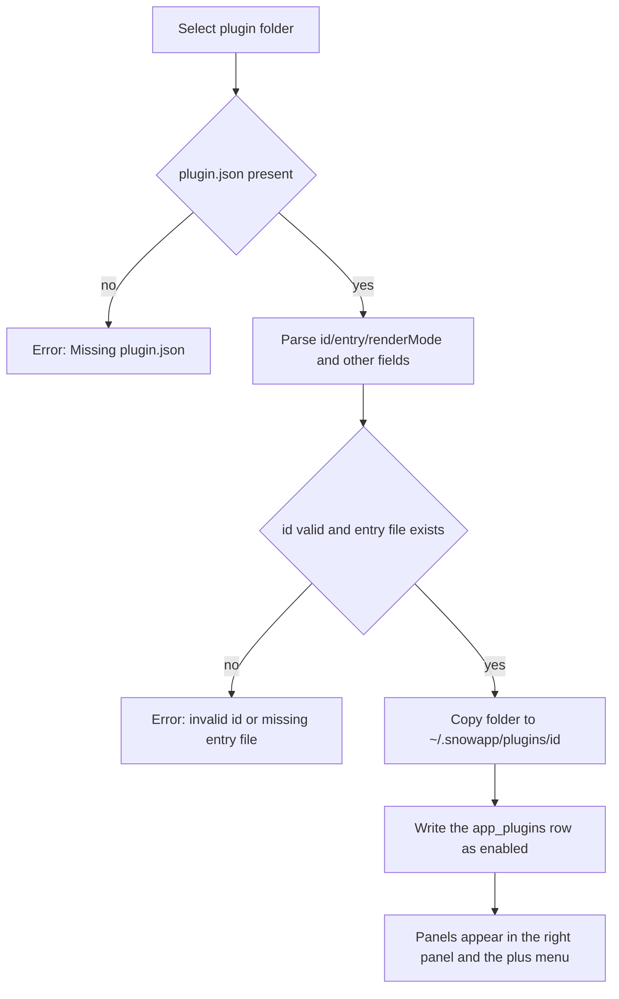

# 24-Plugin Development and Installation (Plugins)

> Applies to: Snow App desktop (Windows / macOS / Linux). A plugin is a **local folder** package that contributes custom tabs to the right panel; this guide covers both installing/removing plugins and authoring one.

## Goal

- Install a plugin from a local folder and open the panels it provides;
- write a `plugin.json` manifest plus an entry module that reads metadata, writes application data through `api.write`, stores private settings, and declares privacy scopes;
- let the AI **install, toggle, reload, and uninstall plugins automatically** through the `plugins` scope of the `config` tool, without opening any settings UI.

## Prerequisites

- The plugin folder must contain `plugin.json` and the entry file declared in the manifest (`entry`, default `index.js`); a missing entry file fails the install.
- Plugins run as **local code**: with `renderMode: "esm"` the entry runs as an ES module inside the main renderer process with the same DOM and network access as the page, while `renderMode: "iframe"` runs the entry in a separate sandboxed document that can only reach the bridged API. Install only plugins you trust.
- Application data access is "read plus controlled write": reads go through `api.metadata` and writes through `api.write`, where each write action's `scope` decides whether a `privacy` declaration is required (see the writable-capabilities section below).
- Installation copies at most **128 MB** per plugin folder and skips `.git` and `node_modules`.
- One text file may be read up to 8 MB, one binary asset up to 16 MB.

## Entry Point

The **Plugins** button at the bottom of the sidebar (with an installed-count badge) opens the plugin management page — a main-content view (view id `plugins`), not a settings page, and it has no settings page id. The page has two top-level tabs, whose small counters show the total entry count (panel plugins + client scripts) and the number of metadata domains:

| Tab                  | Contents                                                                                                                                                                                                                           |
| -------------------- | ---------------------------------------------------------------------------------------------------------------------------------------------------------------------------------------------------------------------------------- |
| **Plugin list**      | The main management area; it carries two sub-tabs with counters, **Panel plugins** and **Script plugins** — the former covers the folder-installed plugins described in the rest of this guide, the latter holds client UI scripts |
| **Metadata catalog** | The app metadata domains plugins can read together with the write actions a plugin declares                                                                                                                                        |

Under the **Panel plugins** sub-tab the toolbar offers **Install from folder** and **Refresh**; each row shows the plugin version, author and render mode, and a plugin that declares privacy scopes lists every requested data domain as an amber tag (localized, e.g. "API keys", "Messages") followed by the manifest `note`. The **Metadata catalog** tab shows "Reading" and "Writable" sub-tabs: it groups all 34 domains with a one-line summary, the required privacy declaration, live-versus-polled behavior and accepted parameters, with keyword search, while the Writable sub-tab lists every write action with its required `scope` and declaration state. The per-row "Metadata n/34" and "Write n/201" links mark that plugin's declared (readable/writable) and undeclared (denied) domains and actions, so users can audit the `privacy` declaration. The page is management-only; open panels from the plus menu's Plugins group in the top bar or the right-panel plugin entry.

## Script plugins (client UI scripts)

The **Plugin list → Script plugins** sub-tab manages **client UI scripts injected into the Snow desktop window itself**; they are a different kind of extension from the panel plugins on the sibling **Panel plugins** sub-tab — same management page, but separate storage, execution model, and capability boundary:

| Dimension      | Panel plugins (Plugin list → Panel plugins)                                                                                   | Client UI scripts (Plugin list → Script plugins)                                                                                                                                         |
| -------------- | ----------------------------------------------------------------------------------------------------------------------------- | ---------------------------------------------------------------------------------------------------------------------------------------------------------------------------------------- |
| Shape          | A local folder package: `plugin.json` plus an entry file (`entry`)                                                            | A single Tampermonkey-compatible file with a `// ==UserScript==` header                                                                                                                  |
| Execution      | `renderMode: "esm"` runs as an ES module in the main renderer; `renderMode: "iframe"` runs in a sandboxed document            | A **dedicated isolated world** by default (sandboxed mode, no `window.snow`); declaring `@snow-sandbox false` or `@grant unsafeWindow` moves it to the main world (full-permission mode) |
| What it can do | Contribute right-panel tabs and read/write app data through `api.metadata` / `api.write` (gated by the `privacy` declaration) | Customize the UI through the anchor and slot contract and call the `GM_*` and `snow` APIs (gated by script scope and execution mode)                                                     |
| UI entry       | The plus menu's Plugins group and the right-panel tab system                                                                  | No panel of its own; it acts on existing UI elements                                                                                                                                     |
| Storage        | `~/.snowapp/plugins/<pluginId>/` plus the `app_plugins` table                                                                 | `~/.snowapp/browser-script/{script_id}.user.js` plus the `userscripts` table (`target` is `client` or `all`)                                                                             |
| Install routes | **Install from folder**, the `config` tool's `plugins` scope                                                                  | **New script** / **Import file** / **Install URL** (https direct link) / **Build with AI**, the `config` tool's `userscripts` scope                                                      |

Inside the sub-tab you can **create** a script (the modal editor prefills the client-script template), **import a file**, or **install from a URL**; while the list is empty its empty state also offers a **Build with AI** request box (describe what you want, the page closes, a new conversation starts and auto-sends the request, and the AI loads the `snow-app-docs` skill to locate the built-in docs and writes a `.user.js` following the client-script rules in 22-Userscripts before installing and enabling it); every script row can be enabled / disabled / edited / deleted. Both creating and editing use the very same large modal editor as **Settings → Browser settings → Userscripts** (`Modal` plus the line-numbered, highlighted `FileViewerContent`; the virtual file name is `<script name>.user.js` when editing — saving writes the database, re-matches and takes effect immediately, while closing the modal cancels). A script that keeps failing is auto-disabled after 5 consecutive errors. The directive table, the GM / `snow` API list, the anchor and slot contract, and a minimal example live in [22-Userscripts](22-userscripts.md) under "Client scripts (desktop window)".

> Both entry points share the single `userscripts` table: the Script plugins sub-tab shows only scripts whose `target` is `client` or `all`, while the browser settings Userscripts list shows only `browser` and `all`; the metadata header's `@snow-target` or `@match snow://client/<view>` decides the home.

## Steps

### 1. Install a plugin

1. Click **Install from folder** and pick the plugin folder (the level that contains `plugin.json`) in the system directory picker.
2. The backend reads and validates the manifest, copies the folder to `~/.snowapp/plugins/<pluginId>/` (on Windows `C:\Users\<user>\.snowapp\plugins\<pluginId>\`), writes the app database row, and enables it by default.
3. Installing a plugin with the same `id` again **replaces it in place**: the folder is overwritten with the new content while the saved enabled state is kept.



### 2. Manage installed plugins

Each row shows the name, version, author, render mode, and install path, plus:

- **Enable switch**: takes effect immediately; a disabled plugin contributes no panels, and an already open panel reports that the plugin is disabled.
- **Reload manifest**: re-parses `plugin.json` after manual edits inside the installed folder (an `id` that no longer matches the record is rejected).
- **Show in folder**: reveals `installPath`.
- **Uninstall**: after a confirmation it deletes the database row and **removes the plugin folder** (irreversible).

### 3. Open plugin panels

Every panel declared in `panels` appears in the **plus menu** group of the top bar and in the right-panel tab system; clicking it opens a right-panel tab, and several panels can be open at once. Panel titles are resolved from `panels[].title` using the current UI language.

### 4. Author a plugin

Minimal folder layout:

```text
my-plugin/
  plugin.json
  index.js
  locales/
    zh-CN.json
  style.css
```

Sample `plugin.json`:

```json
{
  "id": "com.example.hello",
  "name": { "default": "Hello", "zh-CN": "你好" },
  "description": { "default": "Demo panel", "zh-CN": "示例面板" },
  "version": "1.0.0",
  "author": "You",
  "license": "MIT",
  "icon": "lucide:Sparkles",
  "renderMode": "esm",
  "entry": "index.js",
  "panels": [
    {
      "id": "main",
      "title": { "default": "Hello", "zh-CN": "你好" },
      "icon": "lucide:Sparkles"
    }
  ],
  "locales": { "zh-CN": "locales/zh-CN.json" },
  "styles": ["style.css"],
  "privacy": {
    "scopes": ["apiKeys"],
    "note": "Reads API profiles to list models."
  }
}
```

Field reference (actual parsed semantics):

| Field                             | Type                       | Required | Default        | Constraints and notes                                                                                                                                                                 |
| --------------------------------- | -------------------------- | -------- | -------------- | ------------------------------------------------------------------------------------------------------------------------------------------------------------------------------------- |
| `id`                              | string                     | yes      | —              | Letters, digits, `.`, `-`, `_` only, at most 96 characters, must not start with `.`; it is also the install folder name and the database key                                          |
| `name`                            | string or localized object | no       | `id`           | Object keys support `default`, `zh-CN`, `zh-TW`, `en`; other keys are kept as-is                                                                                                      |
| `description`                     | string or localized object | no       | `name.default` | Same as `name`                                                                                                                                                                        |
| `version`                         | string                     | no       | `1.0.0`        | Display only                                                                                                                                                                          |
| `author` / `homepage` / `license` | string                     | no       | empty          | Display only                                                                                                                                                                          |
| `icon`                            | string                     | no       | empty          | `lucide:IconName` uses a built-in icon; any other value is read as a **relative** path inside the plugin folder; `http(s):` and `data:` prefixes are not resolved as assets           |
| `renderMode`                      | `esm` or `iframe`          | no       | `esm`          | Case-insensitive; invalid values fall back to `esm`                                                                                                                                   |
| `entry`                           | string                     | no       | `index.js`     | Path relative to the plugin folder, **must exist** or the install fails                                                                                                               |
| `panels`                          | array                      | no       | `[]`           | Each item requires `id`; `title` (or its `name` alias) defaults to `id`; `entry` defaults to the top-level `entry`; `icon` defaults to the plugin icon; `widthHint` is passed through |
| `locales`                         | object                     | no       | `{}`           | Maps a locale tag to the relative path of its message file                                                                                                                            |
| `styles`                          | string array               | no       | `[]`           | CSS file paths injected while the panel is mounted and removed on unmount                                                                                                             |
| `privacy`                         | array or object            | no       | `[]`           | The array form lists sensitive scopes; the object form reads `scopes` (also accepts `domains`) and `note`; `permissions` is accepted as an alternative key                            |
| `privacyNote`                     | string                     | no       | empty          | Only the `note` of an object-form `privacy` is read and displayed                                                                                                                     |
| `minAppVersion`                   | string                     | no       | empty          | Currently stored and displayed only; **no version gating**                                                                                                                            |

### 5. Write the entry module (`renderMode: "esm"`)

The entry is imported dynamically as an ES module; pick one of the export shapes:

```javascript
// Shape 1: default-export a React component (props: api / locale / panelId / panel / pluginId / isActive / inputText)
// inputText is the current raw chat-input content (keeps @@file:...@@ tag markers) and updates as you type
export default function Panel({ api, isActive }) {
  const { React } = window.SnowAppPlugin;
  const [count, setCount] = React.useState(0);
  return React.createElement(
    "button",
    { onClick: () => setCount(count + 1) },
    api.t("clicked", {
      defaultValue: "Clicked {{count}} times",
      values: { count },
    }),
  );
}

// Shape 2: export mount(container, api) returning a cleanup function or { unmount }
export function mount(container, api) {
  container.textContent = api.name;
  return () => {
    container.replaceChildren();
  };
}
```

Before mounting, the host injects a global `window.SnowAppPlugin`:

| Member                    | Description                                                       |
| ------------------------- | ----------------------------------------------------------------- |
| `React` / `createElement` | The host React instance, so plugins never bundle their own copy   |
| `icons`                   | The lucide icon namespace (also reachable as `api.ui.icon(name)`) |
| `api`                     | The same runtime API object passed to `mount(container, api)`     |
| `locale`                  | Current UI language (`en` / `zh-CN` / `zh-TW`)                    |
| `plugin`                  | `{ id, version, installPath }`                                    |

With `renderMode: "iframe"` those globals are not injected: the entry runs inside a sandboxed document and reaches the bridge as `window.SnowPlugin`, exposing `runtime: "iframe"`, `plugin: {id, name, version}`, `locale`, `t`, `metadata`, `write`, `storage`, `assets`, `on`, and `log` with the same semantics as the table below (an iframe may only request the four capabilities `metadata`, `write`, `storage`, and `assets`; for writes it only has `api.write.run` and `api.write.domains`, without the per-domain sugar).

### 6. Runtime API

| API                                                                      | Description                                                                                                                                                                                                                    |
| ------------------------------------------------------------------------ | ------------------------------------------------------------------------------------------------------------------------------------------------------------------------------------------------------------------------------ |
| `api.id` / `api.version` / `api.name` / `api.installPath` / `api.locale` | Plugin identity and current language                                                                                                                                                                                           |
| `api.t(key, { defaultValue, values })`                                   | Message lookup; a missing `key` falls back to `defaultValue` then to the key itself; `{{name}}` placeholders are interpolated from `values`                                                                                    |
| `api.metadata.get(domain \| domain[], { params })`                       | Collects metadata domains, returning `{ generatedAt, domains, denied, withheld, unknown }`                                                                                                                                     |
| `api.metadata.subscribe(domain, listener, { params, intervalMs })`       | Subscribes: `live` domains re-emit on runtime snapshot changes (200 ms debounce) and other domains poll every `intervalMs` (minimum 1000 ms); without an interval only the initial value is emitted; returns `{ unsubscribe }` |
| `api.metadata.domains()`                                                 | Lists domains with authorization state: `{ id, scope, granted, live, sensitiveFields }`                                                                                                                                        |
| `api.write.<domain>.<action>(params)`                                    | Calls one write action (ESM only); identical to `api.write.run("<domain>.<action>", params)`                                                                                                                                   |
| `api.write.run(actionId, params)`                                        | Calls a write action by id and returns `{ ok, action, data, denied, error }` (see the writable-capabilities section)                                                                                                           |
| `api.write.domains()`                                                    | Lists write actions and declaration state: `{ id, granted, actions: [{ id, scope, granted, summary }] }`                                                                                                                       |
| `api.storage.get / set / remove / all`                                   | Plugin-private persistence (the `app_plugin_values` table), values are strings                                                                                                                                                 |
| `api.storage.getJson / setJson`                                          | JSON convenience wrappers over the same storage                                                                                                                                                                                |
| `api.assets.resolve(relativePath)`                                       | Reads an asset such as an image from the plugin folder and returns a data URL; `null` on failure                                                                                                                               |
| `api.ui.React` / `api.ui.icon(name)`                                     | Equivalent to `window.SnowAppPlugin.React` / icon lookup                                                                                                                                                                       |
| `api.log(...args)`                                                       | Logging prefixed with `[plugin:<id>]`                                                                                                                                                                                          |

Frequent `params` keys: `projectId`, `projectPath`, `directoryId`, `conversationId` (defaulting to the active project or conversation) plus domain-specific pagination and filters.

The `runtime` domain is the live data source: `conversation` is the full snapshot of the focused conversation (`conversationId`, `sessionKey`, `title`, `directoryId`, `isStreaming`, `isPaused`, `isAborting`, `streamTokenCount`, `streamElapsedMs`, `streamTtftMs`, `streamStartedAt`, `runTtftMs`, `lastRunDurationMs`, `streamingConversationIds`, ...), while `streamingSessions` lists every running conversation (including pending new-chat slots) with `sessionKey`, `conversationId`, `title`, `directoryId`, `isStreaming`, `isPaused`, `isAborting`, `messageCount`, `tokenCount`, `elapsedMs`, `ttftMs`, `runTtftMs`, `startedAt`, `lastRunDurationMs`, and `runTokenUsage`. `startedAt` is the wall-clock anchor of the current run, so live wall-clock duration is `Date.now() - startedAt` and live speed is `tokenCount / elapsedMs`, matching the stream metrics bar above the input box. `chatInput` carries the live input-area data (published by the input area while it is mounted; the last published value is kept when it is unmounted): `inputText` is the current raw chat-input content (keeping `@@file:...@@` / `@@image:...@@` tag markers, an empty string means nothing has been typed, updated as you type), `conversationId` is the conversation the input area is bound to (`null` for a fresh-chat input area), `maxContextTokens` is the context window limit of the API profile in effect for that conversation, and `isLoadingApiConfig` is the API config loading state. Together with `conversation.tokenUsage` (already normalized by Rust; cache reads are a subset of input) this reproduces the token usage ring next to the input box: `total = inputTokens + outputTokens` and the ratio is `min(total / maxContextTokens, 1)` (falling back to a full ring keyed on `total` when `maxContextTokens` is absent); treat `isLoadingApiConfig === true` as the placeholder ring so a still-loading config is not misread as a full window.

### 7. Available metadata domains and privacy declarations

A **domain-level** sensitive domain that is not declared in `privacy` comes back in `denied` as `{ reason: "privacy-declaration-missing", scope }` and is absent from `domains`. There are 34 domains: **see the [plugin metadata domain reference](../3-reference/6-plugin-metadata-domains.md) for the accepted parameters, every returned field, and typical uses of each domain**; the table below is the declaration overview:

| Domains                                                                                                                                                                                              | Domain-level privacy scope  | Notes                                                                                                                                                         |
| ---------------------------------------------------------------------------------------------------------------------------------------------------------------------------------------------------- | --------------------------- | ------------------------------------------------------------------------------------------------------------------------------------------------------------- |
| `app`, `theme`, `settings`, `apiProfiles`, `mcp`, `subAgents`, `hooks`, `skills`, `lsp`, `permissions`, `codebase`, `projects`, `scheduledTasks`, `runtime`, `panels`, `ide`, `imageLibrary`, `pets` | —                           | These 18 domains need no declaration; `theme`, `settings`, `apiProfiles`, `mcp`, `subAgents`, and `scheduledTasks` still withhold individual sensitive fields |
| `privacy`                                                                                                                                                                                            | `privacyConfig`             | Privacy filtering settings                                                                                                                                    |
| `systemPrompts`                                                                                                                                                                                      | `systemPrompts`             | System prompts                                                                                                                                                |
| `customHeaders`                                                                                                                                                                                      | `customHeaders`             | Custom-header schemes                                                                                                                                         |
| `personalization`                                                                                                                                                                                    | `personalization`           | Global ROLE rules                                                                                                                                             |
| `conversations`, `messages`                                                                                                                                                                          | `conversations`, `messages` | Conversations and messages                                                                                                                                    |
| `memos`, `memory`                                                                                                                                                                                    | `memos`, `memory`           | Memos and project memory                                                                                                                                      |
| `logs`, `usage`, `git`, `ssh`, `userscripts`, `remoteControl`, `plugins`                                                                                                                             | same-named scopes           | Logs, usage, Git, SSH, userscripts, remote control, plugin inventory                                                                                          |
| `browser`                                                                                                                                                                                            | `browserData`               | Browser passwords, bookmarks, downloads, import sources                                                                                                       |

Field-level sensitive names (`apiKey`, `visionApiKey`, `secret`, `password`, `token`, `credentials`, and similar) are withheld by name and the removed paths are listed in `withheld[domain]`. Object-form example: `"privacy": { "scopes": ["apiKeys", "privacyConfig"], "note": "why you need it" }`. Use `api.metadata.domains()` inside a panel to check whether a domain is granted.

The [plugin metadata domain reference](../3-reference/6-plugin-metadata-domains.md) holds the full field list per domain, the live-versus-polled difference, a requirement-to-domain map, and copy-ready examples: locate the domain for your requirement there before writing a panel, then read its parameters and fields, and you avoid most trial and error.

### 8. Writable capabilities (`api.write`)

`api.metadata` reads and `api.write` writes, and both share the same privacy rule: when a write action has a non-null `scope`, the plugin must declare that scope in the `plugin.json` `privacy` list, otherwise the call is denied.

#### 8.1 Call shapes and response

```javascript
// Call by action id (works in both ESM and iframe)
const created = await api.write.run("memos.create", {
  directoryId: "local:/path/to/project",
  content: "Buy milk",
});

// ESM panels also have per-domain sugar, identical to the line above
const same = await api.write.memos.create({
  directoryId: "local:/path/to/project",
  content: "Buy milk",
});

// List every write action with its declaration state
const domains = api.write.domains();
// [{ id, granted, actions: [{ id, scope, granted, summary }] }]
```

- ESM runtime: `api.write.<domain>.<action>(params)` equals `api.write.run("<domain>.<action>", params)`, and `api.write.domains()` returns the per-domain action list (`scope` is `null` for a public action).
- iframe runtime: the bridge exposes only `api.write.run` and `api.write.domains`; the per-domain sugar does not exist there.
- A write **never throws** and always returns the same shape:

| Field    | Type    | Description                                                                                                                     |
| -------- | ------- | ------------------------------------------------------------------------------------------------------------------------------- |
| `ok`     | boolean | Whether the action ran successfully                                                                                             |
| `action` | string  | The action id of this call (`domain.action`)                                                                                    |
| `data`   | unknown | The return value on success; `null` when the action returns nothing                                                             |
| `denied` | object  | `{ reason, scope? }` when the call was denied, see 8.2                                                                          |
| `error`  | string  | Failure message; for invalid parameters it names the offending parameter, and such failures carry only `ok: false` plus `error` |

#### 8.2 Failures and `denied` reasons

| `denied.reason`             | Meaning and handling                                                                                                                   |
| --------------------------- | -------------------------------------------------------------------------------------------------------------------------------------- |
| `write-declaration-missing` | The action needs the `scope` reported in `denied.scope`, but `privacy` does not declare it; declare it, then reinstall or run `rescan` |
| `unknown-action`            | The action id does not exist (typo or version drift); list the available actions with `api.write.domains()` first                      |
| `unsupported-runtime`       | The current runtime does not allow this action (reserved value; neither runtime returns it today)                                      |

Missing or mistyped parameters and backend failures produce only `ok: false` plus `error`, never `denied`; that makes `api.write` as directly awaitable as the read API, with no try/catch required.

#### 8.3 Declaration rules and sensitive scopes

- An action whose `scope` is `null` is **public** and callable without any declaration (60 of the 201 actions).
- A sensitive write action shares its scope with reading that same area: writing a memo needs `memos`, writing a file needs `filesystem`, and calling an MCP tool needs `mcpSecrets`.
- Six sensitive scopes exist purely for writes (the original 21 are unchanged, 27 scopes in total):

| New sensitive scope | Covered write actions                                                                                   |
| ------------------- | ------------------------------------------------------------------------------------------------------- |
| `terminal`          | Create, write to, resize, and close terminal sessions                                                   |
| `filesystem`        | Write, rename, delete, and bulk-delete local files                                                      |
| `window`            | Minimize, maximize, close, hide to tray, pin on top, reload, reset window state                         |
| `storage`           | Storage directories, database repair and optimization, cleanup, migration and rollback, memory trimming |
| `updater`           | Check for, download, and install app updates                                                            |
| `toolApproval`      | Global and project approved-tool lists plus sensitive-command rules                                     |

The full definition of all 27 sensitive scopes lives in the [plugin metadata domain reference](../3-reference/6-plugin-metadata-domains.md); `messages` serves reads only and has no write action.

#### 8.4 Write action cheat sheet: content and projects (38)

| Domain           | Declaration      | Action ids                                                                                                                                                                                                                          | Behavior                                                                                               |
| ---------------- | ---------------- | ----------------------------------------------------------------------------------------------------------------------------------------------------------------------------------------------------------------------------------- | ------------------------------------------------------------------------------------------------------ |
| `memos`          | `memos`          | `memos.create`, `memos.updateContent`, `memos.updateStatus`, `memos.remove`                                                                                                                                                         | Create a memo, edit its text, mark it done or pending, delete it                                       |
| `memory`         | `memory`         | `memory.create`, `memory.update`, `memory.remove`                                                                                                                                                                                   | Save, update, and delete project memories                                                              |
| `scheduledTasks` | `scheduledTasks` | `scheduledTasks.create`, `scheduledTasks.update`, `scheduledTasks.setPaused`, `scheduledTasks.runNow`, `scheduledTasks.remove`                                                                                                      | Create a task, change its run config, pause/resume, run now, delete it                                 |
| `imageLibrary`   | —                | `imageLibrary.createAlbum`, `imageLibrary.renameAlbum`, `imageLibrary.removeAlbum`, `imageLibrary.reorderAlbums`, `imageLibrary.assignImage`, `imageLibrary.setAlbumCover`, `imageLibrary.importImages`, `imageLibrary.removeImage` | Album create/rename/delete/reorder, move an image into an album, set a cover, import and delete images |
| `conversations`  | `conversations`  | `conversations.rename`, `conversations.setEmoji`, `conversations.setStatus`, `conversations.archive`, `conversations.restore`, `conversations.remove`                                                                               | Rename, set an emoji, change status, archive, restore, and delete conversations                        |
| `projects`       | —                | `projects.create`, `projects.addDirectory`, `projects.activate`, `projects.reorder`, `projects.relink`, `projects.undoRelink`                                                                                                       | Create a project folder, add an existing one, activate, reorder, relink a moved path, undo a relink    |
| `collections`    | —                | `collections.create`, `collections.rename`, `collections.remove`, `collections.moveMember`, `collections.removeMember`, `collections.reorderMembers`                                                                                | Create, rename, and delete groups plus move members in, out, and into order                            |

#### 8.5 Write action cheat sheet: system and UI (9)

| Domain        | Declaration     | Action ids                                                                                             | Behavior                                                                                  |
| ------------- | --------------- | ------------------------------------------------------------------------------------------------------ | ----------------------------------------------------------------------------------------- |
| `ide`         | —               | `ide.open`                                                                                             | Open a project in an external IDE                                                         |
| `system`      | —               | `system.notify`, `system.writeClipboardText`, `system.showItemInFolder`, `system.openStorageDirectory` | System notification, clipboard text, reveal in the file manager, open a storage directory |
| `nav`         | —               | `nav.openSettings`                                                                                     | Open a settings page                                                                      |
| `chatInput`   | —               | `chatInput.insertText`                                                                                 | Append text to the chat input                                                             |
| `chatInput`   | `conversations` | `chatInput.sendMessage`                                                                                | Send a message to the active conversation                                                 |
| `pluginsSelf` | —               | `pluginsSelf.openPanel`                                                                                | Open one of this plugin's own panels                                                      |

#### 8.6 Write action cheat sheet: app configuration (62)

| Domain                 | Declaration       | Action ids                                                                                                                                                                                                          | Behavior                                                                                                   |
| ---------------------- | ----------------- | ------------------------------------------------------------------------------------------------------------------------------------------------------------------------------------------------------------------- | ---------------------------------------------------------------------------------------------------------- |
| `apiProfiles`          | `apiKeys`         | `apiProfiles.upsert`, `apiProfiles.remove`, `apiProfiles.reorder`                                                                                                                                                   | Save, delete, and reorder API profiles                                                                     |
| `systemPrompts`        | `systemPrompts`   | `systemPrompts.upsert`, `systemPrompts.remove`                                                                                                                                                                      | Save and delete system prompts                                                                             |
| `customHeaders`        | `customHeaders`   | `customHeaders.upsert`, `customHeaders.remove`                                                                                                                                                                      | Save and delete custom-header schemes                                                                      |
| `customCommands`       | —                 | `customCommands.upsert`, `customCommands.remove`                                                                                                                                                                    | Save and delete custom commands                                                                            |
| `mcp`                  | `mcpSecrets`      | `mcp.upsert`, `mcp.remove`, `mcp.upsertProject`, `mcp.removeProject`, `mcp.setToolEnabled`, `mcp.setToolsEnabled`, `mcp.setProjectServerEnabled`, `mcp.setProjectToolEnabled`                                       | Add and delete MCP servers and project servers, toggle servers and tools                                   |
| `lsp`                  | —                 | `lsp.upsert`, `lsp.remove`, `lsp.upsertProject`, `lsp.removeProject`                                                                                                                                                | Save and delete LSP servers and project-level configs                                                      |
| `subAgents`            | `subAgents`       | `subAgents.upsert`, `subAgents.remove`                                                                                                                                                                              | Save and delete sub-agents                                                                                 |
| `hooks`                | —                 | `hooks.upsert`, `hooks.remove`                                                                                                                                                                                      | Save and delete hook configs                                                                               |
| `skills`               | —                 | `skills.setEnabled`, `skills.setProjectEnabled`, `skills.installGithub`, `skills.uninstallGithub`                                                                                                                   | Toggle skills globally and per project, install from and uninstall on GitHub                               |
| `userscripts`          | `userscripts`     | `userscripts.create`, `userscripts.update`, `userscripts.remove`, `userscripts.setEnabled`, `userscripts.install`                                                                                                   | Create, update, delete, toggle, and install userscripts                                                    |
| `appSettings`          | —                 | `appSettings.setLiteMode`, `appSettings.setAutoFormat`, `appSettings.setImageLibraryDir`, `appSettings.setSystemSetting`                                                                                            | Lite mode, auto format, image-library directory, and single system settings                                |
| `theme`                | `privacyConfig`   | `theme.setSettings`, `theme.setBackgroundColor`                                                                                                                                                                     | Save theme settings and the theme background color                                                         |
| `keyboardShortcuts`    | —                 | `keyboardShortcuts.set`                                                                                                                                                                                             | Save keyboard shortcuts                                                                                    |
| `privacy`              | `privacyConfig`   | `privacy.set`                                                                                                                                                                                                       | Save privacy filter settings                                                                               |
| `personalization`      | `personalization` | `personalization.saveRole`                                                                                                                                                                                          | Save the global role rules                                                                                 |
| `codebase`             | —                 | `codebase.setProjectEnabled`, `codebase.setProjectAgentReview`, `codebase.setProjectReranking`, `codebase.startIndex`, `codebase.pauseIndex`, `codebase.resumeIndex`, `codebase.cancelIndex`, `codebase.clearIndex` | Toggle project indexing with its three overrides, start/pause/resume/cancel index sessions, clear an index |
| `usage`                | `usage`           | `usage.removeRecords`                                                                                                                                                                                               | Delete usage records                                                                                       |
| `logs`                 | `logs`            | `logs.clear`                                                                                                                                                                                                        | Clear the application logs                                                                                 |
| `pets`                 | —                 | `pets.installZip`, `pets.uninstall`, `pets.setEnabled`, `pets.setActive`, `pets.setScale`                                                                                                                           | Install, uninstall, show or hide, select, and scale a pet                                                  |
| `requests`             | —                 | `requests.setLogging`, `requests.setExpiry`                                                                                                                                                                         | Request-logging switch and expiry                                                                          |
| `conversationSettings` | `conversations`   | `conversationSettings.setModes`, `conversationSettings.setRuntime`                                                                                                                                                  | Per-conversation mode and runtime overrides                                                                |

#### 8.7 Write action cheat sheet: administration and operations (92)

| Domain          | Declaration     | Action ids                                                                                                                                                                                                                                                                                                                                                                                                                                                                                                                                                                                                                      | Behavior                                                                                                                                                                                                                                                                                |
| --------------- | --------------- | ------------------------------------------------------------------------------------------------------------------------------------------------------------------------------------------------------------------------------------------------------------------------------------------------------------------------------------------------------------------------------------------------------------------------------------------------------------------------------------------------------------------------------------------------------------------------------------------------------------------------------- | --------------------------------------------------------------------------------------------------------------------------------------------------------------------------------------------------------------------------------------------------------------------------------------- |
| `browserData`   | `browserData`   | `browserData.passwordSave`, `browserData.passwordDelete`, `browserData.passwordDeleteBatch`, `browserData.bookmarkAdd`, `browserData.bookmarkUpdate`, `browserData.bookmarkDelete`, `browserData.bookmarkDeleteBatch`, `browserData.importPasswords`, `browserData.importCookies`, `browserData.importBookmarks`, `browserData.cookieDelete`, `browserData.clearCache`, `browserData.clearCookies`, `browserData.routeSet`, `browserData.routeClear`, `browserData.storageSave`, `browserData.storageRestore`, `browserData.deviceEmulate`, `browserData.dialogRespond`, `browserData.cdpCommand`, `browserData.cancelDownload` | Save, delete, and bulk-delete passwords and bookmarks, import passwords, cookies, and bookmarks from a local browser, delete cookies, clear the cache, set and clear route rules, save and restore login state, emulate a device, answer a dialog, run a CDP command, cancel a download |
| `ssh`           | `ssh`           | `ssh.saveCredential`, `ssh.deleteCredential`, `ssh.writeFile`, `ssh.deleteEntry`, `ssh.deleteEntries`, `ssh.renameEntry`, `ssh.executeCommand`, `ssh.upsertDraft`, `ssh.deleteDraft`, `ssh.disconnect`                                                                                                                                                                                                                                                                                                                                                                                                                          | Save and delete SSH credentials, write remote files, delete single and multiple remote entries, rename entries, run remote commands, save and delete remote drafts, close a session                                                                                                     |
| `remoteControl` | `remoteControl` | `remoteControl.setEnabled`, `remoteControl.setPort`, `remoteControl.setFixedToken`, `remoteControl.saveTunnelConfig`, `remoteControl.connectTunnel`, `remoteControl.disconnectTunnel`, `remoteControl.removeTunnelConfig`                                                                                                                                                                                                                                                                                                                                                                                                       | Toggle remote control, set its port, pin or clear a token, save, connect, disconnect, and remove the tunnel config                                                                                                                                                                      |
| `storage`       | `storage`       | `storage.setDir`, `storage.repair`, `storage.optimize`, `storage.scanCleanup`, `storage.deleteCleanupData`, `storage.prepareMigration`, `storage.commitMigration`, `storage.rollbackMigration`, `storage.optimizeMemory`                                                                                                                                                                                                                                                                                                                                                                                                        | Storage directories, database repair and optimization, cleanup scan and deletion, migration prepare/commit/rollback, memory trimming                                                                                                                                                    |
| `checkpoints`   | `checkpoints`   | `checkpoints.create`, `checkpoints.restore`, `checkpoints.restoreMany`, `checkpoints.remove`                                                                                                                                                                                                                                                                                                                                                                                                                                                                                                                                    | Create, restore, restore several in order, and delete checkpoints                                                                                                                                                                                                                       |
| `filesystem`    | `filesystem`    | `filesystem.writeFile`, `filesystem.rename`, `filesystem.delete`, `filesystem.deleteBatch`                                                                                                                                                                                                                                                                                                                                                                                                                                                                                                                                      | Write, rename, delete, and bulk-delete local files                                                                                                                                                                                                                                      |
| `terminal`      | `terminal`      | `terminal.create`, `terminal.write`, `terminal.resize`, `terminal.kill`                                                                                                                                                                                                                                                                                                                                                                                                                                                                                                                                                         | Create a terminal session, write input, resize, and close it                                                                                                                                                                                                                            |
| `window`        | `window`        | `window.minimize`, `window.toggleMaximize`, `window.close`, `window.hideToTray`, `window.setAlwaysOnTop`, `window.reload`, `window.clearState`                                                                                                                                                                                                                                                                                                                                                                                                                                                                                  | Minimize, toggle maximize, close, hide to tray, pin on top, reload, and reset the window state                                                                                                                                                                                          |
| `updater`       | `updater`       | `updater.check`, `updater.download`, `updater.install`                                                                                                                                                                                                                                                                                                                                                                                                                                                                                                                                                                          | Check for updates, download the update, and install it                                                                                                                                                                                                                                  |
| `mcpTools`      | `mcpSecrets`    | `mcpTools.call`, `mcpTools.abort`, `mcpTools.writeStdin`                                                                                                                                                                                                                                                                                                                                                                                                                                                                                                                                                                        | Call an MCP tool, abort a running tool call, and send input to a tool session                                                                                                                                                                                                           |
| `toolApproval`  | `toolApproval`  | `toolApproval.setGlobal`, `toolApproval.setProject`, `toolApproval.setProjectMany`, `toolApproval.sensitiveCommandUpsert`, `toolApproval.sensitiveCommandDelete`, `toolApproval.sensitiveCommandReset`, `toolApproval.sensitiveCommandUpsertProject`, `toolApproval.sensitiveCommandDeleteProject`, `toolApproval.sensitiveCommandSetProjectEnabled`                                                                                                                                                                                                                                                                            | Replace the global approved-tool list, approve or revoke project tools singly and in bulk, and add, update, delete, and reset sensitive-command rules                                                                                                                                   |
| `pluginsAdmin`  | `plugins`       | `pluginsAdmin.install`, `pluginsAdmin.rescan`, `pluginsAdmin.setEnabled`, `pluginsAdmin.remove`                                                                                                                                                                                                                                                                                                                                                                                                                                                                                                                                 | Install, rescan, toggle, and uninstall plugins                                                                                                                                                                                                                                          |
| `team`          | `git`           | `team.configureIdentity`, `team.upsert`, `team.remove`, `team.fileSave`, `team.mediaSave`, `team.mediaDelete`, `team.sync`                                                                                                                                                                                                                                                                                                                                                                                                                                                                                                      | Set the team git identity, add and delete records, save message attachments and note images, delete media, and sync                                                                                                                                                                     |

#### 8.8 User-visible surfaces

- The "Write X/Y" badge on every Plugins page row: X counts the write actions the plugin has declared, Y is the total (201); an action counts as writable as soon as its scope is declared.
- The "Writable" sub-tab of the Metadata catalog tab: it lists each `domain.action` with its required `scope` ("Public" for scope-less actions) and declaration state ("Writable" / "Not declared"), with the same keyword search as the metadata section.
- Both surfaces render the same `api.write.domains()` data, so a panel can use it to check its own declaration state.

### 9. Localization and styles

- Message files are **flat JSON** (`{"key": "text"}`) with free file and key names; when `api.t` misses, it falls back to `defaultValue` and then to the key.
- `locales` picks a file by exact language match, then case-insensitive match, then primary language (`zh` / `en`), then `default`, then the first entry.
- CSS files listed in `styles` are injected as `<style data-snow-plugin="<id>">` in the document head and removed when the panel unmounts; prefix your selectors to avoid affecting the app UI.
- A panel may override the plugin icon with `panels[].icon` (again `lucide:Name` or a relative asset path).

### 10. Let the AI install a plugin (the `plugins` scope)

The AI does not need the page; it can write files and install them:

```text
# 1) write the plugin folder to disk with the filesystem server
filesystem-create ./my-plugin/plugin.json
filesystem-create ./my-plugin/index.js

# 2) install (key "new"; the real id comes from plugin.json)
config-set scope=plugins key="new" value={sourceDir: "/abs/path/my-plugin"}
#   value={sourcePath: "/abs/path/my-plugin/plugin.json"} works as well

# 3) inspect / toggle / reload the manifest
config-list scope=plugins
config-get  scope=plugins key=com.example.hello
config-set  scope=plugins key=com.example.hello value={enabled: false}
config-set  scope=plugins key=com.example.hello value={rescan: true}

# 4) uninstall (user confirmation required; deleteFiles defaults to true and removes the folder too)
config-delete scope=plugins key=com.example.hello confirmed=true
config-delete scope=plugins key=com.example.hello value={deleteFiles: false} confirmed=true
```

Key points:

- `sourceDir` and `sourcePath` accept absolute paths, `~/` paths, and paths relative to the current working directory; a file path resolves to its parent folder.
- The scope reuses exactly the same storage layer as the UI, so folder copying, skipped entries, the database row, and the default-enabled state behave identically; the panel host does **not** auto-refresh its list, it re-reads when the page or a panel opens.
- Uninstalling is destructive: `config-delete` requires user confirmation first and then `confirmed: true`.

## Verification

- `config-list scope=plugins` includes the new plugin with `enabled: true`, and `pluginsDirectory` points at `~/.snowapp/plugins`.
- The install folder holds `plugin.json` and the entry file, and its name equals the `id` from `plugin.json`.
- The page lists the plugin, the plus menu shows its panels, and opening one renders without a load error.
- For granted domains `denied` from `api.metadata.get` is empty.
- For granted write actions `api.write.run` returns `ok: true`; without the declaration it returns `denied.reason = "write-declaration-missing"` plus the required `scope`, and `api.write.domains()` lists every action with its declaration state.
- The counters and the list under **Plugin list → Script plugins** cover only scripts whose `target` is `client` or `all`; a `client` script never appears in the **Settings → Browser settings → Userscripts** list.

## Troubleshooting and recovery

| Symptom                                                                                | Cause and fix                                                                                                                                                    |
| -------------------------------------------------------------------------------------- | ---------------------------------------------------------------------------------------------------------------------------------------------------------------- |
| `Missing plugin.json in '...'`                                                         | The selected folder has no manifest; pick the level that contains `plugin.json`                                                                                  |
| `Plugin id is required and may only contain letters, digits, dot, dash and underscore` | `id` is missing or contains invalid characters (spaces, CJK, a leading dot)                                                                                      |
| `Plugin entry file 'index.js' is missing`                                              | The `entry` file does not exist; confirm the file was written before copying                                                                                     |
| `Plugin directory is too large to install (limit 128 MB)`                              | The folder is too big; although `node_modules` and `.git` are skipped, other large files must be cleaned up                                                      |
| `Plugin manifest id 'x' does not match 'y'`                                            | The manifest `id` was changed before a reload; restore it or install under the new id (uninstall the old record first)                                           |
| The panel reports an invalid entry                                                     | The entry exports neither a default React component nor `mount(container, api)` / `render(...)`                                                                  |
| `denied` contains `privacy-declaration-missing`                                        | Declare the domain in `plugin.json` `privacy`, then reload the manifest (reinstall or `rescan`)                                                                  |
| Nothing changes after hand-editing the install folder                                  | Click **Reload manifest** or run `config-set ... value={rescan: true}`; use **Refresh** to reload the list itself                                                |
| Keep the source after uninstalling                                                     | Uninstall with `value={deleteFiles: false}` (or back up `~/.snowapp/plugins/<id>/` first); the folder is not deleted                                             |
| A client script is missing from browser settings                                       | Expected: a script with `@snow-target client` is managed under **Plugins → Plugin list → Script plugins** only, while the browser list shows `browser` and `all` |
| `api.write` returns `denied.reason = "write-declaration-missing"`                      | The write action needs the `scope` shown in `denied.scope`; declare it in the `plugin.json` `privacy` list, then reinstall or `rescan`                           |
| `api.write` returns `denied.reason = "unknown-action"`                                 | The action id is misspelled or absent from this version; list the available actions with `api.write.domains()`                                                   |
| `api.write` returns `ok: false` without `denied`                                       | Parameter validation or the backend call failed; fix the argument named in `error`                                                                               |

## Source anchors

- `native/src/storage/plugins.rs`: manifest parsing, folder copying, install/reload/toggle/uninstall
- `native/src/storage/models.rs::PluginRecord`, `native/src/storage/database.rs`: the `app_plugins` / `app_plugin_values` tables
- `native/src/exports/storage/plugins.rs`: napi exports
- `src/main/ipc/handlers/pluginHandlers.ts`: the `plugins:*` IPC channels
- `src/renderer/plugins/pluginStore.ts`, `src/renderer/plugins/manifest.ts`, `src/preload/types/plugins.ts`: renderer view model and parsing
- `src/renderer/plugins/pluginRuntime.ts`, `src/renderer/plugins/pluginApi.ts`, `src/renderer/plugins/pluginIframeBridge.js`: ESM and iframe runtime assembly plus the API
- `src/renderer/plugins/metadata/domains.ts`, `src/renderer/plugins/metadata/index.ts`: metadata domains and privacy redaction
- `src/renderer/plugins/writes/index.ts::executeWrite`, `::describeWriteDomains`, `::WRITE_ACTION_IDS`: write execution, privacy-declaration checks, and the action list
- `src/renderer/plugins/writes/domains/content.ts`, `system.ts`, `config.ts`, `admin.ts`: the 201 write action definitions (grouped as sections 8.4 to 8.7 here)
- `src/renderer/components/sidebar/PluginsPanel.tsx`: the two top-level tabs (Plugin list / Metadata catalog), the list sub-tabs (Panel plugins / Script plugins), their counters, and the Panel plugins toolbar
- `src/renderer/components/sidebar/PluginMetadataCatalog.tsx`: the Metadata catalog tab (Reading / Writable) and the badge data
- `src/renderer/components/sidebar/PluginScriptsSection.tsx`, `src/renderer/userscripts/clientScriptStore.ts`: the Script plugins sub-tab UI and the client-script state source
- `native/src/storage/userscripts.rs::parse_meta`: client-script metadata (`target` / `view_json` / `surface_json` / `scope` / `sandbox`)
- `src/renderer/components/rightPanel/PluginPanelContent.tsx`, `src/renderer/components/sidebar/PluginsPanel.tsx`: panel host and management page
- `native/src/mcp/servers/config/plugins_scope.rs`, `native/src/mcp/servers/config/mod.rs`: the `plugins` scope of the `config` tool
- Install folder and data locations: [Data storage locations](../3-reference/4-data-storage-locations.md); `config` scope fields: [Built-in tools reference](../3-reference/2-builtin-tools-reference.md)
