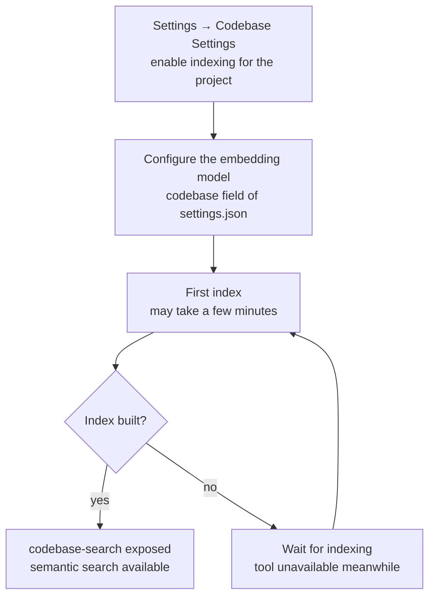

# 7-Codebase Index & Symbol Location

Snow App provides codebase semantic search (the `codebase` server) and code
symbol location (the `codelens` server) to help the agent understand and
navigate code quickly.

## 1. Codebase semantic search (codebase)

### 1.1 Enable and index

`codebase-search` is **only exposed when the project has codebase indexing
enabled and an index has been built**. Enable indexing for the project in
**Settings → Codebase Settings** (`app-control-openSettings
page=codebase-settings`) and configure the embedding model (see the
`codebase` field of `settings.json`; structure is documented in
`3-config-file-field-reference`). The first index may take a few minutes.



### 1.2 Tool

| Tool              | Purpose                                  |
| ----------------- | ---------------------------------------- |
| `codebase-search` | Semantic search over the embedding index |

Parameters: `query` (natural-language query text, required), `topN` (result
cap, default 10, max 50).

### 1.3 Example

```text
codebase-search query="how is config backslash escaping handled" topN=10
→ returns semantically related code snippets

codebase-search query="retry logic" topN=5
→ returns semantically related code snippets
```

### 1.4 Choosing between grep and codebase

| Scenario                                                  | Use                                     |
| --------------------------------------------------------- | --------------------------------------- |
| Exact keywords, regex, path-limited search                | `grep-search` (faster, precise)         |
| Semantic/intent queries ("find the login handling logic") | `codebase-search` (understands meaning) |

## 2. Code symbol location (codelens)

The `codelens` server performs lightweight static analysis (oxc /
tree-sitter based) for symbol resolution and reference lookup without
running a full LSP.

### 2.1 Tools

| Tool                       | Purpose                                                   |
| -------------------------- | --------------------------------------------------------- |
| `codelens-find_definition` | Find a symbol's definition location                       |
| `codelens-find_references` | Find a symbol's references within the file                |
| `codelens-file_outline`    | Get a file's symbol outline (functions/classes/variables) |

### 2.2 Examples

```text
# Understand file structure
codelens-file_outline filePath=src/main/app/bootstrap.ts
→ top-level symbol list

# Jump to definition (pair with filesystem-read)
codelens-find_definition filePath=src/main/native/types.ts line=414 column=20
→ symbol name + definition location
```

### 2.3 Notes

- `find_definition`/`find_references` locate symbols by **line + column**:
  use `filesystem-read` to find the target position first.

### 2.4 About LSP (lsp-config)

Snow App's `lsp` server consumes **external language servers** (rust-analyzer /
gopls / pyright ...) for semantics-based **diagnostics** (`lsp-diagnostics`)
and **hover** (`lsp-hover`). `codelens` remains the built-in static analysis
(symbol navigation); the two are complementary.

Configuration is persisted in the app database table `lsp_server_configs`
(**DB-backed, no config file**):

- **Agent config**: `config-set scope=lsp-config key=servers value={...}`
  (full replacement, deep-validated; takes effect immediately, no restart).
- **User config**: Settings → LSP settings (`lsp-settings` page).
- The legacy `~/.snow/lsp-config.json` (reserved-era file) is imported once on
  first start (source=legacy); never read afterwards.

**Tools are off by default:** enable the LSP domain in project MCP settings and verify that the language server is enabled, installed and stack/capability-matched. Global/project per-tool disabling and sub-agent whitelists still apply. Turning on an installed language server does not expose every tool to every request. SSH/remote projects are unsupported.

Common tools include `lsp-diagnostics` (file diagnostics), `lsp-hover` (types/docs), `lsp-goto{kind}` (definition/type-definition/implementation), references, symbols, rename, call/type hierarchies and the two workspace tools. The old standalone definition/type-definition/implementation tools are merged into `lsp-goto`; see [built-in tools](../3-reference/2-builtin-tools-reference.md) for full parameters.

Project configurations override global configurations for the same language; Global/Project scopes are managed separately in LSP settings. These are parameter examples only: replace paths with real absolute local paths and first check tool visibility.

```text
lsp-diagnostics filePath=/absolute/project/src/main.rs
lsp-goto filePath=/absolute/project/src/main.rs line=12 column=4 kind=definition
lsp-workspace-symbols query=TargetName workspaceRoot=/absolute/project
lsp-workspace-diagnostics workspaceRoot=/absolute/project
lsp-hover symbol=TargetName workspaceRoot=/absolute/project
```

For partial or ambiguous results, address warnings, narrow scope and verify coordinates instead of assuming uniqueness. Preview rename edits with `dryRun=true` first.

### 2.5 LSP preference and troubleshooting (2026-09-26)

- **Check actual tools first:** main and sub-agent requests use final `ToolSnapshot` data for the LSP section and analysis list. Global/project tool switches, installation/capabilities and sub-agent whitelists all matter. Disabled grep/read/codebase tools are not an unconditional baseline either.
- **Choose scope deliberately:** `lsp-workspace-symbols` (Workspace Symbol Search), `lsp-workspace-diagnostics` and symbol-only addressing accept optional `workspaceRoot`. Supply an existing absolute local directory, not a relative path, file or SSH path. When omitted, the current project root is used; without a reliable root, supply one explicitly. This does not search every other project or elevate permissions.
- **Read completeness first:** partial, warnings, unsupportedOperations, incomplete and `partial_symbol_search` indicate coverage gaps. An empty list does not prove a clean project; a single candidate does not establish uniqueness. `requiresExplicitCoordinates` means inspect the declaration and provide `filePath/line/column`; ordinary ranges are not safe rename coordinates.
- **Running is not ready:** a running badge describes process/session state; initialization, indexing or diagnostic builds may still take time. Refresh stale snapshots. Neither completed prompt prewarming nor instantaneous first calls are guaranteed.
- **Document/diagnostic freshness:** `ensure_open` compares full text each time, updates send didChange, and workspace requests close deleted documents. Diagnostics no longer read/write persistent result caches; old tables/data are not deleted. Re-diagnosis cost is preferred to stale results after dependency/configuration changes.
- **Retain fallbacks:** CodeLens remains for uncovered languages/extensions/operations and incomplete scans. It may forward to an authorized available LSP; failure returns marked static analysis (`lspFallback`) without bypassing a sub-agent whitelist.

Labels are `全局符号搜索` / `全域符號搜尋` / `Workspace Symbol Search`; the tool ID remains `lsp-workspace-symbols`. <!-- docs-check: allow-cjk -->

Collapsing large UI results reduces rendering work without removing warnings or changing completeness. See [LSP design §0](../4-architecture-and-development/7-lsp-external-language-server-design.md) for pending acceptance scenarios.

**Troubleshooting** (check in order when LSP is not working):

| Symptom                                        | Check                                                                           | Fix                                                                                                                                   |
| ---------------------------------------------- | ------------------------------------------------------------------------------- | ------------------------------------------------------------------------------------------------------------------------------------- |
| `lsp-*` tools missing                          | Config exists and enabled (`config-get scope=lsp-config key=servers`)           | `config-set scope=lsp-config key=servers value={...}`; enable in Settings → LSP settings                                              |
| Error "not found or cannot start"              | Command in PATH (`which <command>` / ❌ not-installed badge)                    | Install per the `installCommand` hint; enable in Settings after install                                                               |
| Error "no LSP server configured for x"         | File extension in the server's `fileExtensions`                                 | Add the extension (e.g. missing `.tsx`); confirm the project language matches the server                                              |
| Project has no programming language / mismatch | Project has matching language files (no Language Servers section in the prompt) | Language detection = project markers (Cargo.toml etc.) + extension scan; no match → not injected nor exposed                          |
| SSH remote project                             | `ssh://` path                                                                   | LSP is local-only; SSH projects never expose lsp-* tools                                                                              |
| `crashed; restarts on next use`                | Session crashed (≥2 consecutive restarts error out)                             | Check installation/configuration and startup backoff; do not loop during cooldown                                                                         |
| Dig deeper                                     | App logs                                                                        | `config-get scope=logs` reads `~/.snow/log` (main-process logs); in dev, native `[lsp]`-prefixed fallback logs appear in the terminal |

**Logging**: LSP fallback/failure reasons are written to the **app log table
(`app_logs`)** — same source as the System Logs panel; filter by `module=lsp` to
locate them (prompt-injection failure, codelens forwarding failure, scope-check
failure, project-root resolution failure are all recorded as level/warn with error
details). They are also printed to native stderr (visible in the dev terminal).
`~/.snow/log` holds main-process file logs (readable via `config-get scope=logs`);
the two complement each other.

### 2.6 Batch diagnostics and safe rename

The 11 semantic labels match across both i18n families and all three locales, with unchanged tool IDs; see the [tool reference](../3-reference/2-builtin-tools-reference.md). Semantic work **MUST** use the corresponding visible LSP tool when it supports the target language/operation. Check languages, capabilities and health per tool, not a global language list. Do not loop during startup backoff; explain unmet conditions and use visible fallbacks.

These are parameter examples, not execution records. Replace paths with real absolute local files:

```json
{ "filePath": "/absolute/project/src/a.ts" }
```

```json
{ "filePaths": ["/absolute/project/src/a.ts", "/absolute/project/src/b.ts"] }
```

Put every batch file in the list and do not also provide a nonempty `filePath`. The list strictly contains 1..30 nonempty path strings; wrong types, empty arrays/entries and oversized lists are rejected, not silently truncated. A legacy empty `filePath:""` placeholder only means omitted. Validate count before physical-file deduplication, preserving first occurrence in the original request.

Single-file results stay top-level. Batches return `batch:true`, `fileCount/requestedCount/duplicateCount`, status, per-file results and summary (`completedFiles/partialFiles/failedFiles/errorCount/warningCount`). Read completed/partial/failed totals before expanding file warnings and truncation. `error:null` is not an error; empty diagnostics do not prove complete success. Target file-task concurrency is 3 without changing result order; one server may still serialize work.

For rename, first use `dryRun=true`, inspect edits, then pass the returned `previewId` with `dryRun=false` through normal approval. The capability has a 5-minute TTL, at most 32 per session, is single-use and content-bound. Do not paste its raw value into reports. Changed files, expiry, missing/consumed capabilities or `requiresNewPreview` require another preview; the UI never applies automatically. Multi-file writes are not transactional: inspect `appliedFiles/failedFile/error/failedFileMayBeModified`, never claim rollback, and do not replay a capability when files may already have changed.

Concurrency-3 scheduling and related interfaces are under integration. These instructions do not claim builds, fixtures or live acceptance passed; see [LSP design §0.6–0.8](../4-architecture-and-development/7-lsp-external-language-server-design.md).

## 3. Typical workflow

```text
1. Confirm scope/access → current tools, project root; explicit workspaceRoot if needed
2. Understand/locate    → visible supported LSP; visible CodeLens / raw reads for gaps
3. Check completeness  → warnings / partial / candidate coordinates; text matches are literal evidence
4. Formally verify     → project builds/tests, not just empty diagnostics or a running badge
```
