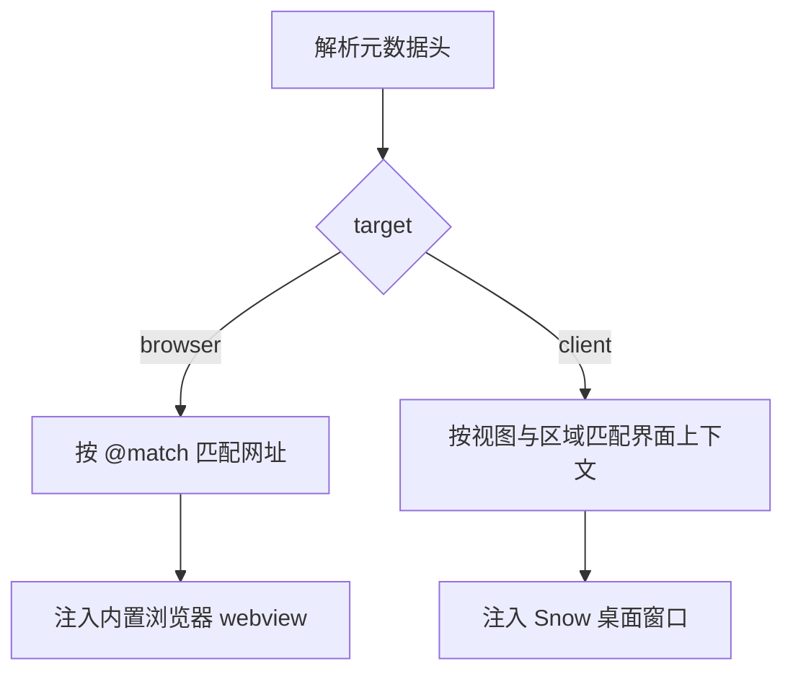
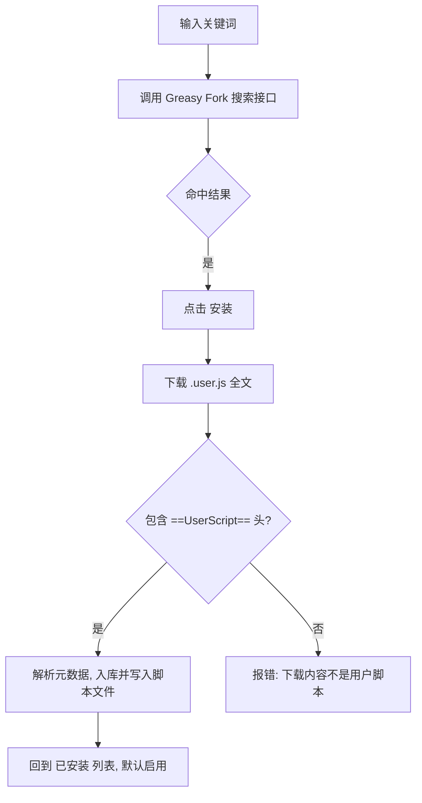

# 22-油猴脚本（Userscripts）

> 适用：Tampermonkey 兼容的用户脚本，分**两类**——注入内置浏览器 webview 页面的**浏览器脚本**（入口：`设置 → 浏览器设置 → 油猴脚本`），以及注入 **Snow 桌面窗口本身**、用来定制客户端界面的**客户端 UI 脚本**（入口：`插件 → 插件列表 → 脚本插件`）。两类脚本都与 [浏览器自动化](6-浏览器自动化.md) 中 AI Agent 操控的 `browser` MCP 工具是**独立能力**：它们不会注入 AI `browser` 工具创建的实例。

## 两类脚本

两类脚本共用同一套元数据解析、`GM_*` 实现与存储位置，差别只在注入目标与管理入口：

| 维度         | 浏览器脚本                         | 客户端 UI 脚本                                                             |
| ------------ | ---------------------------------- | -------------------------------------------------------------------------- |
| 注入对象     | 内置浏览器 webview 里的网页        | Snow 主窗口渲染进程（客户端界面本身）                                      |
| 管理入口     | 设置 → 浏览器设置 → 油猴脚本       | 插件页面 → 插件列表 → 脚本插件                                             |
| 匹配依据     | `@match` / `@include` 网址规则     | 视图（`@snow-view`）与区域（`@snow-surface`）指令                          |
| 作用域声明   | 默认，无需额外指令                 | 元数据头写 `@snow-target client`，或 `@match snow://client/<view>`         |
| 执行环境     | 页面主世界（等同该网页自身的脚本） | 默认每个脚本一个隔离世界（沙箱档），声明后改在**主世界**执行（完全权限档） |
| 界面改动范围 | 只影响被注入的网页                 | 影响 Snow 客户端界面本身                                                   |

`userscripts` 表新增的 `target` 字段（`browser` / `client` / `all`）决定脚本归属，脚本文件仍在 `~/.snowapp/browser-script/{script_id}.user.js`：



浏览器设置里的「油猴脚本」列表只显示浏览器脚本（`browser`，以及两侧都生效的 `all`）；插件页面的「插件列表 → 脚本插件」小标签只管理 `client` 与 `all`。历史脚本没有 `@snow-*` 指令，`target` 默认 `browser`，升级后行为不变。

## 浏览器脚本（内置浏览器）

### 目标

在 Snow 内置浏览器中运行 Tampermonkey 兼容的用户脚本：修改页面 DOM、绕过部分跨域限制、注册右键菜单命令、持久化设置（`GM_*` 值）、下载文件等。脚本按 `@match`/`@include` 规则自动注入匹配的页面。

### 前置条件

- 脚本文件必须包含完整的 `// ==UserScript==` ... `// ==/UserScript==` 元数据头（`@name` 与至少一条 `@match` 或 `@include` 必填，见下文元数据表）。
- 从 Greasy Fork 搜索安装时，需要网络可访问 `https://api.greasyfork.org`，且下载地址必须为 `https://`。
- 脚本以**主世界（页面 `window`）**执行，可访问页面全部对象，等价于直接运行网页脚本，请只安装可信来源的脚本。

### 入口

打开 **设置 → 浏览器设置**（设置页 id：`browser-settings`，agent 可用 `app-control-openSettings page=browser-settings` 打开），切换到 **油猴脚本** Tab。该 Tab 分「已安装」与「搜索下载」两个次级 Tab，**只列出浏览器脚本**；客户端 UI 脚本在插件页面的「插件列表 → 脚本插件」小标签管理，见下文「客户端脚本（桌面窗口）」。

> 注意：与 [17-浏览器设置密码与数据导入](17-浏览器设置密码与数据导入.md) 中的起始页、密码管理同属一个设置面板（`BrowserSettingsPanel`），只是不同 Tab。

### 操作步骤

#### 1. 新建脚本

点击 **新建脚本**，编辑器会预填一个最小模板：

```javascript
// ==UserScript==
// @name         My Script
// @namespace    snow-app
// @version      1.0
// @description  Describe what this script does
// @author       You
// @match        https://example.com/*
// @run-at       document-idle
// @grant        none
// ==/UserScript==

console.log("Hello from userscript!");
```

保存后写入应用数据库与脚本文件，并在内置浏览器匹配页面时自动注入（无需重启应用）。

#### 2. 编辑 / 启用 / 禁用 / 删除

「已安装」列表展示名称、描述、版本、匹配规则摘要与运行时机，每行支持：

- **启用开关**：立即生效，禁用后不再注入（下次导航即停止匹配）。
- **编辑**：以代码编辑器打开完整源码（含元数据头），保存后重写文件与元数据。
- **删除**：二次确认后删除数据库记录与磁盘脚本文件（不可恢复）。
- **刷新**：重新从数据库与磁盘加载列表（手动改动 `~/.snowapp/browser-script/` 后同步用）。

#### 3. 从 Greasy Fork 搜索安装

「搜索下载」Tab 调用 Greasy Fork 搜索接口（按安装量排序），结果含名称、描述、评分、安装量与详情链接：



已安装的脚本（按名称去重）在列表中显示为「已安装」且按钮不可再点。搜索接口不返回总数，分页依赖 `hasMore`（本页结果数是否达到请求条数）判断是否还有下一页。

#### 4. 让 AI 帮你安装（config 工具 `userscripts` 域）

除了 UI 操作，可以直接让 AI 通过 `config` 工具管理用户脚本，无需打开设置页：

```text
# 推荐流程：先把完整源码写成文件，再让后端读取文件安装（避免在工具参数里传超大字符串）
filesystem-create 写入 ./scripts/demo.user.js（完整 // ==UserScript== 内容）
config-set scope=userscripts key="new" value={sourcePath: "/abs/path/demo.user.js"}

# 小脚本可直接内联
config-set scope=userscripts key="new" value={raw: "// ==UserScript==\n// @name Demo\n// @match https://example.com/*\n// ==/UserScript==\nconsole.log('hi');"}

# 更新已有脚本
config-set scope=userscripts key="<scriptId>" value={sourcePath: "..." }  // 或 {raw: "..."}

# 启用/禁用
config-set scope=userscripts key="<scriptId>" value={enabled: false}

# 读写 GM_* 持久化值
config-set scope=userscripts key="<scriptId>" value={values: {"k": "v"}}
config-set scope=userscripts key="<scriptId>" value={deleteValues: ["k"]}
config-get scope=userscripts key="<scriptId>"   // 返回元数据 + 完整源码 + GM 值

# 卸载（删除数据库记录 + 磁盘文件）
config-delete scope=userscripts key="<scriptId>" confirmed=true
```

`key` 为脚本 `scriptId`（列表接口返回的 UUID），`"new"` 表示新建。详见 [内置工具参考](../3-参考手册/2-内置工具参考.md) 的 `config` 工具 `userscripts` 域。

### 元数据字段

下表是两类脚本共用的通用字段；客户端脚本专属的 `@snow-*` 指令见「客户端脚本（桌面窗口）」的元数据小节。

解析器只识别 `// @` 开头的行，键名转小写匹配；`@name:zh-CN` 等本地化变体在缺失裸 `@name` 时按应用语言回退选择（精确标签 → 主语言 → 首个可用值）。

| 字段                          | 必填                   | 默认值          | 说明                                                                                        |
| ----------------------------- | ---------------------- | --------------- | ------------------------------------------------------------------------------------------- |
| `@name`                       | 是（除非有本地化变体） | —               | 脚本名；支持 `@name:zh-CN` / `@name:en` 等本地化变体                                        |
| `@match` / `@include`         | 至少一个               | —               | 匹配规则，可多条；均为空时匹配**所有**网址                                                  |
| `@version`                    | 否                     | `1.0`           | 版本号                                                                                      |
| `@description`                | 否                     | 空              | 描述                                                                                        |
| `@namespace`                  | 否                     | 空              | 命名空间                                                                                    |
| `@author`                     | 否                     | 空              | 作者                                                                                        |
| `@run-at`                     | 否                     | `document-idle` | `document-start` / `document-end` / `document-idle`                                         |
| `@noframes`                   | 否                     | `true`          | 为真时脚本不在 `iframe` 子框架中执行                                                        |
| `@grant`                      | 否                     | 空              | 声明使用的 `GM_*` API，可多条；仅用于展示，不影响实际可用 API                               |
| `@exclude` / `@exclude-match` | 否                     | 空              | 排除规则，优先级高于 `@match`/`@include`                                                    |
| `@require`                    | 否                     | 空              | 外部 JS 依赖 URL，异步预热后内联注入（首次导航可能尚未就绪，下次导航生效）                  |
| `@resource`                   | 否                     | 空              | 外部资源，形如 `@resource <name> <url>`，供 `GM_getResourceText` / `GM_getResourceURL` 读取 |

**通配符规则**（`@match`）：`*` 匹配任意非 `/` 字符；主机部分支持 `*.example.com`（含子域）、`*example.com`（后缀匹配）、`*`（任意主机）；协议支持 `*://`（任意协议）；路径中 `*` 匹配任意字符，`/*` 匹配该路径下全部内容。`@include`/`@exclude` 使用同样的通配符语义，但可不含协议（此时按子串锚定匹配）。

### GM_* API 支持矩阵

本节描述注入内置浏览器页面的脚本会用到的 `GM_*` 实现；客户端脚本可用的子集与 `snow` 扩展 API 见「客户端脚本（桌面窗口）」的 API 清单。

脚本在主世界执行前，对应脚本的 `GM_*` API 会先挂载到 `window`（每个脚本独立闭包上下文，`GM_getValue`/`GM_setValue` 等操作只影响当前脚本自己的持久化命名空间）。

| API                                                                | 说明                                                                                                                                                                          |
| ------------------------------------------------------------------ | ----------------------------------------------------------------------------------------------------------------------------------------------------------------------------- |
| `GM_getValue` / `GM_setValue` / `GM_deleteValue` / `GM_listValues` | 持久化键值存储，存入数据库 `userscript_values` 表（按 `scriptId` + `key` 唯一）；`GM_setValue` 同时向其他标签页广播变更（本标签页不触发自己的监听器，对齐 Tampermonkey 语义） |
| `GM_addValueChangeListener` / `GM_removeValueChangeListener`       | 监听 `GM_setValue`/`GM_deleteValue` 变更                                                                                                                                      |
| `GM_getTab` / `GM_saveTab` / `GM_getTabs`                          | 会话级（按 webContents）内存存储，进程重启即清空                                                                                                                              |
| `GM_xmlhttpRequest`                                                | 经主进程发起请求，**绕过页面 CORS 限制**；支持 `text`/`json`/`arraybuffer`/`blob`（二进制以 base64 回传）；仅允许 `http(s)` URL，超时 30 秒                                   |
| `GM_notification`                                                  | 创建系统通知，支持 `onclick` / `ondone` 回调（点击与失败事件回传给脚本）                                                                                                      |
| `GM_setClipboard`                                                  | 写入系统剪贴板                                                                                                                                                                |
| `GM_addStyle`                                                      | 向页面注入 `<style>` 节点                                                                                                                                                     |
| `GM_addElement`                                                    | 创建并挂载 DOM 元素                                                                                                                                                           |
| `GM_registerMenuCommand` / `GM_unregisterMenuCommand`              | 注册**页面右键菜单**命令，点击时执行对应回调（幂等：同名命令复用同一 id）                                                                                                     |
| `GM_openInTab`                                                     | 在内置浏览器新开标签页打开 URL（`active:false` 为后台标签）                                                                                                                   |
| `GM_download`                                                      | 发起下载，支持 `onload`/`onerror`/`onprogress`；允许 `http(s)`/`blob:`/`data:` URL                                                                                            |
| `GM_getResourceText` / `GM_getResourceURL`                         | 读取 `@resource` 声明的外部资源内容 / 生成 data URL                                                                                                                           |
| `GM_log`                                                           | 等价 `console.log`                                                                                                                                                            |
| `GM_cookie.list` / `GM_cookie.set` / `GM_cookie.delete`            | 操作当前 Electron session 的 Cookie（Tampermonkey beta API）                                                                                                                  |
| `GM_info`                                                          | 只读元信息（`script.name` / `version` / `description` / `scriptMetaStr` / `scriptHandler` / `version`）                                                                       |

**未完整支持的差异**：

- `window.prompt()` 在 Electron 中不受支持，脚本调用会被替换为同步返回默认值（控制台打印警告），依赖用户输入交互的脚本该分支会直接取默认值继续执行。
- 多个脚本同时匹配同一页面时，共享同一份 `window.GM_*` 单例（指向**最后** `prepare` 的脚本上下文），与 Tampermonkey 的按脚本隔离略有差异，但各脚本的 `GM_*` 持久化值仍按 `scriptId` 独立存储。
- `@require` 内容异步预热：首次导航若依赖尚未下载完成，会以占位注释替代，**下次导航**才内联生效。

## 客户端脚本（桌面窗口）

客户端 UI 脚本注入 **Snow 桌面窗口本身**（主窗口渲染进程），用来定制客户端界面：隐藏或调整界面区域、往输入区增加按钮、跟随视图切换做提示、注入自有样式等。它只影响 Snow 客户端，不改变内置浏览器里网页的行为。

### 入口与管理

打开侧边栏底部的 **插件** 页面（主内容视图 id `plugins`），依次进入 **插件列表** → **脚本插件**：页面顶部是两个顶层标签页 **插件列表** / **元数据清单**，进入「插件列表」后还有 **面板插件** / **脚本插件** 两个次级小标签（各带数量角标），客户端脚本在后者里管理。小标签内自上而下是操作栏（**新建脚本** / **导入文件** / **刷新**）、从链接安装输入框与脚本列表；列表为空时中央显示空状态（图标 + 说明 + **让 AI 制作** 需求框），两个小标签的版面一致。列表每行显示脚本名、版本（含作者与运行时机）与作用域标签，并提供**启用开关**、**编辑**、**删除**：

| 方式         | 操作                                                                                                                                                                                                                                                                                                    |
| ------------ | ------------------------------------------------------------------------------------------------------------------------------------------------------------------------------------------------------------------------------------------------------------------------------------------------------- |
| 新建脚本     | 点 **新建脚本** 打开大号弹窗编辑器（与「设置 → 浏览器设置 → 油猴脚本」完全一致：`Modal` + 带行号与高亮的 `FileViewerContent`），内容预填客户端脚本模板（含 `@snow-target client`、锚点与插槽用法示例）                                                                                                  |
| 编辑脚本     | 点行内铅笔按钮打开同一个编辑器，虚拟文件名为 `<脚本名>.user.js`；**保存**即写库、重新匹配并立即生效，关闭弹窗等于取消                                                                                                                                                                                   |
| 导入本地文件 | 点 **导入文件**，在系统文件框里选中 `.user.js`，内容载入同一编辑器（虚拟文件名取所选文件名）后再保存                                                                                                                                                                                                    |
| 从链接安装   | 在输入框填入 `.user.js` 的 **https** 直链，点 **从链接安装**（与内置浏览器安装同一实现，只接受 `https://`）                                                                                                                                                                                             |
| 让 AI 制作   | 在空状态的需求框里描述需求（Enter 发送、Shift+Enter 换行），点 **让 AI 制作**：关闭插件页面并新建会话自动发送需求，AI 先加载 `snow-app-docs` 技能定位内置文档、读本文档的客户端脚本章节，然后写出 `.user.js`，再用 `config-set` 的 `userscripts` 域安装并启用；该入口与面板插件一致，只在列表为空时出现 |
| 刷新         | 重新从数据库与磁盘加载列表（手动改动 `~/.snowapp/browser-script/` 后同步用）                                                                                                                                                                                                                            |
| 交给 AI 安装 | 已有脚本文件时，用 `config` 工具的 `userscripts` 域安装，见下文                                                                                                                                                                                                                                         |

列表每行的作用域标签由元数据头推导：`沙箱档` / `完全权限` / `常驻` / `视图:<id>` / `区域:<name>`，便于在启用前核对脚本能做什么。

### 元数据（`@snow-*` 指令）

客户端指令全部**可选**，写在常规的 `// ==UserScript==` 头里，键名大小写不敏感（`snow_target` 等下划线写法等价）；头部没有任何客户端指令时 `target` 默认 `browser`，与升级前行为一致。

| 指令                          | 默认值          | 取值与说明                                                                                                                                      |
| ----------------------------- | --------------- | ----------------------------------------------------------------------------------------------------------------------------------------------- |
| `@snow-target`                | `browser`       | `client` = 只注入桌面窗口；`browser` = 只注入内置浏览器；`all` = 两侧都注入                                                                     |
| `@match snow://client/<view>` | —               | 兼容写法：等价于客户端脚本并限定视图；`snow://client` 或 `snow://client/*` 表示全部视图（该模式不进网址匹配规则）                               |
| `@snow-view`                  | 全部视图        | 限定生效的主内容视图 id，逗号 / 空格 / 分号分隔、可多条，例如 `chat, plugins`；`*` 或省略表示全部                                               |
| `@snow-surface`               | 全部区域        | 限定生效的界面区域，取值 `main` / `topbar` / `sidebar` / `right-panel` / `chat` / `settings`；多个值任一命中即注入（`main`、`topbar` 始终存在） |
| `@snow-scope`                 | 空              | `global` = 常驻脚本，应用启动即执行，随视图切换不卸载；留空则跟随视图进入 / 离开                                                                |
| `@snow-sandbox`               | `true`          | `false` = 切到完全权限档（主世界执行）；`@grant unsafeWindow` 具有同等效果                                                                      |
| `@run-at`                     | `document-idle` | 语义沿用浏览器脚本；匹配到但应用首屏未就绪时，非 `document-start` 脚本会等应用就绪后再注入                                                      |

主内容视图 id 与界面一致，例如 `chat`、`team`、`memo`、`memory`、`plugins`、`browser-settings`、`system-logs`；完整清单见应用的主内容视图定义。

### 两档执行模型

| 档位           | 触发条件                                                     | 能力边界                                                                                                                                                                                                                     |
| -------------- | ------------------------------------------------------------ | ---------------------------------------------------------------------------------------------------------------------------------------------------------------------------------------------------------------------------- |
| 沙箱档（默认） | 未声明 `@snow-sandbox false`，也未声明 `@grant unsafeWindow` | 每个脚本运行在**独立的隔离世界**（`worldId` 从 1000 起），与界面共享 DOM / CSS（可直接用原生 DOM API 定制界面），但拿不到 `window.snow`：文件、终端、MCP、会话等 IPC 全部不可见；`GM_*` 与 `snow` API 通过白名单桥调用主进程 |
| 完全权限档     | `@snow-sandbox false` 或 `@grant unsafeWindow`               | 改在**主世界**执行，能力等同本地代码（可访问 `window.snow`、`unsafeWindow`），风险自负；面板里会显示琥珀色 `完全权限` 标签                                                                                                   |

隔离世界还意味着多个脚本互不干扰：各自的 `GM_*` 不会互相覆盖，某个脚本出错也不会影响别人的世界。

### 直接操作 DOM（像 Chrome 油猴一样）

隔离世界只是 JS 环境的隔离，**DOM 与页面完全共享**：脚本可以直接使用浏览器原生 API 修改界面任意位置，不需要任何宿主封装——`document.querySelector` / `querySelectorAll`、`createElement` / `append` / `remove`、`MutationObserver`、`addEventListener`、`element.style` / `classList`、`element.click()` 等全部可用，`GM_addStyle` 注入的样式作用于整个窗口。

只有两件事必须走宿主提供的 `snow` API（见下方清单）：**读应用内部状态**（`snow.context` / `snow.on`，脚本世界看不到 React 状态）与**触发应用动作**（`snow.client.*`，跨世界派发的 `CustomEvent` 无法可靠携带 `detail`，宿主会在主世界代为派发）。

React 重渲染会重建节点（消息列表还有虚拟化滚动），脚本挂上去的节点可能被移除或替换——和常规 SPA 油猴脚本一样，用 `MutationObserver` 侦听并重新挂载即可：

```javascript
const decorate = () => {
  document
    .querySelectorAll('[data-snow-anchor="chat.message"]')
    .forEach((el) => {
      if (el.dataset.snowMessageRole !== "assistant") return;
      if (el.querySelector(".my-badge")) return;
      const badge = document.createElement("span");
      badge.className = "my-badge";
      badge.textContent = "custom";
      el.append(badge);
    });
};
const observer = new MutationObserver(decorate);
observer.observe(document.body, { childList: true, subtree: true });
decorate();
snow.onCleanup(() => observer.disconnect());
```

### API 清单

`GM_*` 与浏览器脚本共用同一套实现，同时提供 `window.GM.xxx` 形式：

| API                                                                | 说明                                                                                                         |
| ------------------------------------------------------------------ | ------------------------------------------------------------------------------------------------------------ |
| `GM_info`                                                          | 只读元信息（`script.name` / `version` / `description` / `scriptMetaStr` / `scriptHandler` 与 `sandboxMode`） |
| `GM_getValue` / `GM_setValue` / `GM_deleteValue` / `GM_listValues` | 持久化键值存储（数据库 `userscript_values` 表，按 `scriptId` 隔离）                                          |
| `GM_addValueChangeListener` / `GM_removeValueChangeListener`       | 监听本脚本命名空间的值变更                                                                                   |
| `GM_getTab` / `GM_saveTab` / `GM_getTabs`                          | 会话级内存存储                                                                                               |
| `GM_addStyle` / `GM_addElement`                                    | 注入样式 / 创建并挂载元素（卸载时宿主会移除 `GM_addStyle` 注入的样式）                                       |
| `GM_log` / `GM_setClipboard` / `GM_notification`                   | 日志、剪贴板、系统通知（通知支持 `onclick` / `ondone`）                                                      |
| `GM_xmlhttpRequest` / `GM_download`                                | 经主进程发起请求 / 下载（`GM_xmlhttpRequest` 绕过 CORS，仅 `http(s)`，超时 30 秒）                           |
| `GM_registerMenuCommand` / `GM_unregisterMenuCommand`              | 注册脚本命令，可在「脚本插件」列表里手动触发                                                                 |

`snow` 扩展 API 为客户端脚本专属，只覆盖 DOM 做不到的事：

| API                                 | 说明                                                                                                                                                                                                         |
| ----------------------------------- | ------------------------------------------------------------------------------------------------------------------------------------------------------------------------------------------------------------ |
| `snow.context`                      | 当前上下文的只读快照：`view` / `surfaces` / `tabs` / `theme` / `locale` / `projectId` / `conversationId` / `isStreaming` / `appReady`                                                                        |
| `snow.on(event, fn)`                | 订阅 `context`（上下文变化）、`view-enter`（进入匹配视图）、`view-leave`（离开视图 / 卸载）、`conversation-change`（会话切换）、`stream-start` / `stream-end`（流式开始 / 结束）、`theme-change`（主题变化） |
| `snow.anchor(name)`                 | 按锚点取只读元素，等价于 `document.querySelector('[data-snow-anchor="..."]')`                                                                                                                                |
| `snow.slot(name)`                   | 取可写挂载点（记录以便卸载时清空），等价于 `document.querySelector('[data-snow-slot="..."]')`                                                                                                                |
| `snow.onCleanup(fn)`                | 注册清理回调，脚本卸载时执行                                                                                                                                                                                 |
| `snow.isSandbox`                    | 当前是否处于沙箱档                                                                                                                                                                                           |
| `snow.style(css)` / `snow.log(...)` | 注入样式 / 写日志（分别等价 `GM_addStyle` / `GM_log`）                                                                                                                                                       |
| `snow.client.insertInputText(text)` | 往聊天输入框插入文本                                                                                                                                                                                         |
| `snow.client.sendMessage(text)`     | 向当前会话直接发送一条消息                                                                                                                                                                                   |
| `snow.client.openView(viewId)`      | 切换主内容视图                                                                                                                                                                                               |
| `snow.client.openSettings(viewId?)` | 打开设置（侧栏切到设置列表，同时切到指定设置视图）                                                                                                                                                           |

### 稳定契约：锚点与插槽

界面关键位置带稳定的 `data-snow-anchor` / `data-snow-slot` 属性，脚本用 `document.querySelector('[data-snow-anchor="..."]')` 即可选中；**请只依赖这些钩子**，不要依赖内部 class 或 DOM 层级，否则界面重构会让脚本失效。

| 类型             | 属性               | 取值                                                                                                                                                                                                                                                                                                                                           |
| ---------------- | ------------------ | ---------------------------------------------------------------------------------------------------------------------------------------------------------------------------------------------------------------------------------------------------------------------------------------------------------------------------------------------- |
| 锚点（只读）     | `data-snow-anchor` | `app.root`（应用外壳）、`topbar`、`sidebar`、`sidebar.nav`（侧栏功能入口区）、`sidebar.footer`、`main.view`（容器同时带 `data-snow-view="<视图 id>"`）、`chat.messages`（消息滚动容器）、`chat.message`（单条消息，带 `data-snow-message-id` / `data-snow-message-role`）、`chat.input`、`rightPanel`、`rightPanel.tabs`、`rightPanel.content` |
| 插槽（可写挂载） | `data-snow-slot`   | `topbar.actions`、`sidebar.nav.actions`、`sidebar.footer.actions`、`chat.input.actions`、`chat.message.actions`（单条消息的操作按钮行）                                                                                                                                                                                                        |

用法示例：`snow.slot("chat.input.actions").append(node)` 等价于 `document.querySelector('[data-snow-slot="chat.input.actions"]').append(node)`；`snow.anchor("chat.input")` 等价于按 `data-snow-anchor` 查询。

脚本卸载（停用 / 视图离开 / 重新加载）时，宿主会清空脚本用过的插槽、执行 `snow.onCleanup` 注册的回调，并移除 `GM_addStyle` 注入的样式，所以插槽里 append 的节点不必自己清理；直接改过其它位置的节点请在自己的 cleanup 回调里还原（配合 `snow.onCleanup`）。

### 最小示例

下面这个脚本隐藏右栏标签栏、在输入区插入「续写」按钮，并给每个 AI 回复追加标记（节点被 React 重建时由 `MutationObserver` 自动重挂）：

```javascript
// ==UserScript==
// @name         右栏折叠 + 一键续写 + 回复标记
// @version      1.1.0
// @snow-target  client
// @snow-view    chat
// @run-at       document-idle
// @grant        GM_addStyle
// ==/UserScript==

// 直接改样式：隐藏右栏标签栏
GM_addStyle(
  '[data-snow-anchor="rightPanel.tabs"] { display: none !important; }',
);

// 直接用原生 DOM API 往插槽加按钮
const slot = snow.slot("chat.input.actions");
if (slot) {
  const button = document.createElement("button");
  button.textContent = "续写";
  button.onclick = () => snow.client.insertInputText("继续");
  slot.append(button);
  snow.onCleanup(() => button.remove());
}

// 给每个 AI 回复追加标记；列表虚拟化会重建节点，用 MutationObserver 重挂
const decorate = () => {
  document
    .querySelectorAll('[data-snow-anchor="chat.message"]')
    .forEach((el) => {
      if (el.dataset.snowMessageRole !== "assistant") return;
      if (el.querySelector(".demo-mark")) return;
      const mark = document.createElement("span");
      mark.className = "demo-mark";
      mark.textContent = "✓";
      el.append(mark);
      snow.onCleanup(() => mark.remove());
    });
};
const observer = new MutationObserver(decorate);
observer.observe(document.body, { childList: true, subtree: true });
decorate();
snow.onCleanup(() => observer.disconnect());
```

保存后立即生效；把 `@snow-view` 改写成 `*` 或整行删掉，脚本就对所有视图生效。

### 让 AI 安装客户端脚本

`config` 工具的 `userscripts` 域与浏览器脚本共用，只要元数据头写了 `@snow-target client`，装出来的就是客户端脚本，随后能在「插件列表 → 脚本插件」里看到、编辑与启停（标签页里的 **让 AI 制作** 走的是同一条链路，只是由 AI 从需求直接生成脚本）：

```text
# 1) 先把完整源码写成文件（元数据头含 @snow-target client）
filesystem-create 写入 ./scripts/my-client.user.js
# 2) 安装（key 用 "new"）
config-set scope=userscripts key="new" value={sourcePath: "/abs/path/my-client.user.js"}
# 3) 启停 / 卸载
config-set scope=userscripts key="<scriptId>" value={enabled: false}
config-delete scope=userscripts key="<scriptId>" confirmed=true
```

AI 安装 / 启停 / 删除后会广播变更，界面列表自动刷新。Greasy Fork 搜索安装仍只服务浏览器脚本。

### 失败与自动禁用

脚本抛错（含 `snow.onCleanup` 回调抛错）会上报主进程，列表里显示 `错误 n 次` 标签；**连续失败 5 次会自动禁用**并广播给界面，避免坏脚本反复破坏界面。自动禁用后在对应行给出「连续出错已自动禁用：…」提示，脚本被禁用后不再注入，修好脚本再手动启用即可。

## 验证

浏览器脚本：

1. 新建/安装脚本后，切换到内置浏览器打开一条命中 `@match` 的页面；
2. 打开开发者工具控制台查看脚本输出（`console.log` / `GM_log`），或观察脚本预期的 DOM 变化；
3. 若脚本声明了 `GM_registerMenuCommand`，在页面上右键应能看到对应菜单项。

客户端脚本：

1. 在「插件 → 插件列表 → 脚本插件」里启用脚本，切到它声明的视图（如 `chat`）或区域，观察界面变化（样式、插槽里新增的控件）；
2. 脚本报错会在主窗口控制台打印 `[Snow Client Script]` 前缀的日志，并在列表里累加 `错误 n 次`；
3. 停用脚本后，脚本注入的样式、用过的插槽内容与 `snow.onCleanup` 回调应立即清理。

浏览器脚本按 `@run-at` 时机注入：`document-start` 在页面任何脚本执行前运行（用于劫持媒体流、提前注入 UI 等场景），`document-end` 在 `DOMContentLoaded` 后，`document-idle`（默认）在 `DOMContentLoaded` 后的下一帧。

## 常见问题与恢复

| 现象                                           | 排查                                                                                                              |
| ---------------------------------------------- | ----------------------------------------------------------------------------------------------------------------- |
| 脚本未生效                                     | 确认启用开关已打开；检查 `@match`/`@include` 是否真的匹配当前 URL；确认 `@noframes` 场景（页面本身是 iframe 时）  |
| `@require` 依赖第一次没生效                    | 属正常现象，异步预热未完成，重新导航一次                                                                          |
| `GM_xmlhttpRequest` 报错                       | 确认 URL 是 `http(s)` 协议，且没有超过 30 秒超时                                                                  |
| 手动改过 `~/.snowapp/browser-script/` 下的文件 | 点「刷新」重新加载元数据；数据库元数据与文件内容不一致时，以重新编辑保存为准                                      |
| 删除脚本                                       | UI 与 `config-delete` 都需二次确认，删除后数据库记录与磁盘文件一并移除，不可恢复                                  |
| 客户端脚本不生效                               | 先看「插件列表 → 脚本插件」里的作用域标签：视图 / 区域是否包含当前界面，开关是否已被「连续失败自动禁用」关闭      |
| 沙箱档脚本读不到 `window.snow`                 | 属预期行为；确实需要应用特权时声明 `@snow-sandbox false` 或 `@grant unsafeWindow`，面板会显示 `完全权限` 琥珀标签 |
| 切换视图后自定义样式 / 按钮消失                | 非 `global` 脚本随视图离开而卸载，属预期；常驻请加 `@snow-scope global`，或在 `snow.on('view-enter', ...)` 里重建 |
| 脚本改过的节点在 React 重渲染后消失            | 预期现象；用 `MutationObserver` 侦听并重新挂载（见「直接操作 DOM」小节），插槽内 append 的节点不受影响            |
| 停用客户端脚本后界面没还原                     | 宿主只清理 `GM_addStyle` 样式、脚本用过的插槽与 `snow.onCleanup` 回调；直接改过的其它节点需脚本自己在回调里还原   |

## 安全边界

- 脚本运行在**页面主世界**，可读写页面全部 `window`/DOM/Cookie，风险等同于直接运行该网页的脚本；只安装可信来源（尤其注意 `@grant` 声明与实际行为的差异）。
- `GM_*` 持久化值以明文字符串存于应用数据库 `userscript_values` 表，备份/分享数据库时注意脱敏。
- `GM_cookie` 与 `GM_setValue` 等操作依赖当前 OS 用户与 Electron session，不具备跨机迁移能力。
- 客户端脚本默认（沙箱档）运行在**隔离世界**，拿不到 `window.snow` 等应用特权 IPC；声明 `@snow-sandbox false` 或 `@grant unsafeWindow` 后改在主世界执行，能力等同本地代码（可读写应用数据、调用工具），启用前请核对面板上的 `完全权限` 琥珀标签。
- 客户端脚本与浏览器脚本同库存储：元数据存 `userscripts` 表（`target` 区分），`GM_*` 值以明文存 `userscript_values` 表，脚本文件在 `~/.snowapp/browser-script/`。
- 数据库、脚本文件的完整存储位置见 [数据存储位置](../3-参考手册/4-数据存储位置.md)。

## 实现锚点

- 元数据解析与数据库/文件存储：`native/src/storage/userscripts.rs::parse_meta`、`native/src/storage/userscripts.rs::create_userscript`
- 脚本文件目录：`~/.snowapp/browser-script/{script_id}.user.js`（`native/src/storage/userscripts.rs::browser_script_dir`）
- 注入引擎（webview preload，主世界执行 + GM shim）：`src/preload/userscriptEngine.ts::injectUserscripts`
- 主进程同步匹配缓存（`document-start` 语义，`sendSync` 无 IO 匹配）：`src/main/app/userscriptSyncStore.ts::initUserscriptSyncStore`
- GM_* IPC 桥（存储/网络/通知/剪贴板/Cookie/下载/菜单）：`src/main/ipc/handlers/userscriptHandlers.ts::registerUserscriptHandlers`
- Greasy Fork 搜索/安装：`src/main/ipc/handlers/userscriptHandlers.ts`（`userscripts:search` / `userscripts:install`）
- 设置页 UI：`src/renderer/components/sidebar/browserSettings/UserscriptsSection.tsx`（嵌入 `BrowserSettingsPanel.tsx` 的「油猴脚本」Tab）
- AI 工具入口：`native/src/mcp/servers/config/userscripts_scope.rs::set_userscript`
- 客户端脚本宿主（主窗口 preload：隔离世界注入、GM / snow shim、锚点与插槽、cleanup）：`src/preload/clientScriptHost.ts`
- 客户端上下文匹配与推送：`src/main/app/userscriptSyncStore.ts::matchesClientContext`、`::collectClientScripts`、`::applyClientScripts`、`::setClientScriptContext`
- 客户端脚本 IPC（上下文发布 / 重新应用 / 错误上报与自动禁用 / 命令执行）：`src/main/ipc/handlers/userscriptHandlers.ts::registerUserscriptHandlers`
- 渲染层上下文桥与界面操作（`openView`）：`src/renderer/userscripts/ClientScriptBridge.tsx`
- 「插件列表 → 脚本插件」小标签（新建 / 导入 / 从链接安装 / **让 AI 制作** 入口 + 弹窗编辑器）：`src/renderer/components/sidebar/PluginScriptsSection.tsx`（状态源 `src/renderer/userscripts/clientScriptStore.ts`；弹窗编辑器复用 `src/renderer/components/common/Modal.tsx` 与 `src/renderer/components/rightPanel/FileViewerContent.tsx` 的 `virtualSource`，AI 需求由 `src/renderer/components/mainContent/chatMessages/components/ChatConversationContext.tsx::useChatConversationContext` 的 `buildFromContent` 新建会话发送）
- 客户端元数据指令解析与 `target` / `view_json` / `surface_json` / `scope` / `sandbox` 列：`native/src/storage/userscripts.rs::parse_meta`
- 稳定契约宿主侧：`app.root`（`src/renderer/App.tsx`）、`topbar` / `topbar.actions`（`src/renderer/components/TopBar.tsx`）、`sidebar`（`src/renderer/components/Sidebar.tsx`）、`sidebar.nav` / `sidebar.nav.actions` / `sidebar.footer` / `sidebar.footer.actions`（`src/renderer/components/sidebar/MainSidebarContent.tsx`）、`main.view` + `data-snow-view`（`src/renderer/components/MainContent.tsx`）、`chat.messages` / `chat.input` / `chat.input.actions`（`src/renderer/components/mainContent/ChatContent.tsx`）、`chat.message` + `chat.message.actions`（`src/renderer/components/mainContent/chatMessages/components/VirtualizedMessage.tsx`、`UserMessageActions.tsx`、`AiResponseActions.tsx`）、`rightPanel` / `rightPanel.tabs` / `rightPanel.content`（`src/renderer/components/RightPanel.tsx`）
