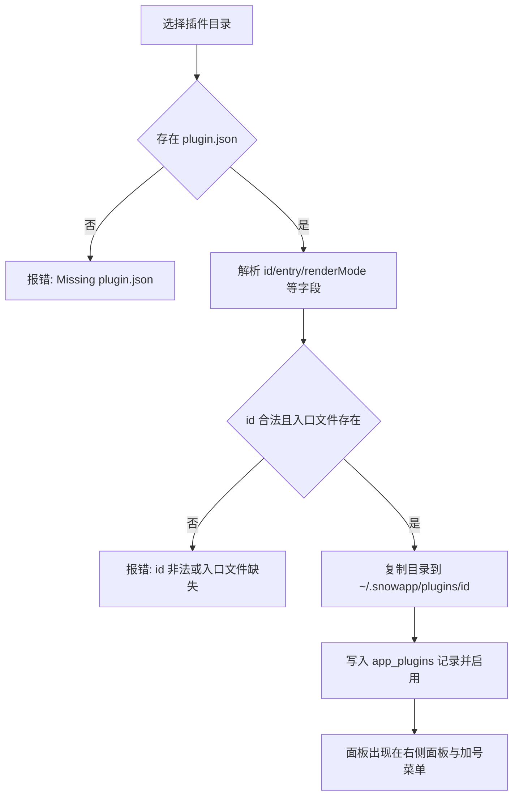

# 24-插件开发与安装（Plugins）

> 适用：Snow App 桌面端（Windows / macOS / Linux）。插件是**本地目录形式**的扩展包，为右侧面板提供自定义标签页；本文同时覆盖「安装与卸载」和「自己写一个插件」。

## 目标

- 从本地目录安装插件，并在右侧面板打开它提供的面板；
- 会写 `plugin.json` 清单与入口模块，能读取元数据、通过 `api.write` 写入应用数据、保存插件私有设置并声明隐私域；
- 让 AI 通过 `config` 工具的 `plugins` 域**自动完成安装、启停、重载与卸载**，不必打开设置界面。

## 前置条件

- 插件目录必须包含 `plugin.json` 与清单里声明的入口文件（`entry`，默认 `index.js`），入口文件缺失会直接安装失败。
- 插件以**本地代码**运行：`renderMode: "esm"` 的入口在主窗口渲染进程里作为 ES 模块执行，拥有与页面相同的 DOM 与网络能力；`renderMode: "iframe"` 的入口在独立沙箱文档中运行，只能通过桥访问受限 API。请只安装可信来源的插件。
- 插件对应用数据是「只读 + 受控写入」：读取走 `api.metadata`，写入走 `api.write`，写动作按其 `scope` 决定是否需要在 `privacy` 中声明（见「可写能力」一节）。
- 安装时目录总大小上限 **128 MB**，并会跳过 `.git` 与 `node_modules`。
- 单个文本文件读取上限 8 MB，单个二进制资源上限 16 MB。

## 入口

侧边栏底部的 **插件** 按钮（带已安装数量角标）打开插件管理页面——它是主内容区的一个视图（视图 id `plugins`），不是设置页，也没有独立设置页 id。页面顶部有两个顶层标签页，标题旁的小数字分别是条目总数（面板插件 + 客户端脚本）与元数据域总数：

| 标签页         | 内容                                                                                                                                          |
| -------------- | --------------------------------------------------------------------------------------------------------------------------------------------- |
| **插件列表**   | 插件管理主区域；内部还有 **面板插件** / **脚本插件** 两个次级小标签（各带数量角标），前者是本文其余章节介绍的本目录插件，后者是客户端 UI 脚本 |
| **元数据清单** | 插件可读的应用元数据域与可写动作清单                                                                                                          |

「面板插件」小标签下的工具栏提供 **从目录安装** 与 **刷新** 两个动作；每行显示插件的版本、作者与渲染模式，声明了隐私数据域的插件会用琥珀色标签逐个列出所申请的数据（文案跟随界面语言，如「API 密钥」「会话消息」），并在下方展示清单里的 `note` 说明。**元数据清单** 标签页以「可读元数据 / 可写能力」两个子标签并列展示：按分组列出全部 34 个域及一句话说明、隐私声明要求、实时/轮询与可用参数，支持关键词搜索；可写能力按动作给出所需 `scope` 与声明状态。每个插件行上的「可读元数据 n/34」与「可写能力 n/201」入口用同一份清单标出该插件已声明（可读/可写）与未声明（调用会被拒绝）的域与动作，方便用户核对 `privacy` 声明。该页面只做管理，打开面板请用顶栏加号菜单的「插件」分组或右侧面板的插件入口。

## 脚本插件（客户端 UI 脚本）

「插件列表 → 脚本插件」小标签管理的是**注入 Snow 桌面窗口本身**的客户端 UI 脚本，和同一层的「面板插件」是两类不同形态的扩展——共用同一个管理页面，但存储、运行方式与能力边界完全独立：

| 维度     | 面板插件（插件列表 → 面板插件）                                                             | 客户端 UI 脚本（插件列表 → 脚本插件）                                                                                                          |
| -------- | ------------------------------------------------------------------------------------------- | ---------------------------------------------------------------------------------------------------------------------------------------------- |
| 形态     | 本地目录包：`plugin.json` + 入口文件（`entry`）                                             | 单文件 Tampermonkey 兼容脚本（`// ==UserScript==` 元数据头）                                                                                   |
| 运行方式 | `renderMode: "esm"` 的主窗口渲染进程 ES 模块；`renderMode: "iframe"` 的沙箱文档             | 默认运行在**独立隔离世界**（沙箱档，拿不到 `window.snow`）；声明 `@snow-sandbox false` 或 `@grant unsafeWindow` 后改在主世界执行（完全权限档） |
| 能做什么 | 提供右侧面板标签页，通过 `api.metadata` / `api.write` 读写应用数据（受 `privacy` 声明约束） | 用锚点 / 插槽契约定制界面，调用 `GM_*` 与 `snow` API（受作用域与沙箱档约束）                                                                   |
| 界面入口 | 加号菜单「插件」分组、右侧面板标签体系                                                      | 无独立面板，直接作用于界面元素                                                                                                                 |
| 存储位置 | `~/.snowapp/plugins/<pluginId>/` + `app_plugins` 表                                         | `~/.snowapp/browser-script/{script_id}.user.js` + `userscripts` 表（`target` 为 `client` / `all`）                                             |
| 安装方式 | **从目录安装**、`config` 工具的 `plugins` 域                                                | **新建脚本** / **导入文件** / **从链接安装**（https 直链）/ **让 AI 制作**、`config` 工具的 `userscripts` 域                                   |

该小标签内可**新建**（弹窗编辑器预填客户端脚本模板）、**导入文件**、**从链接安装**，列表为空时还会在空状态里给出 **让 AI 制作** 需求框（描述需求后关闭插件页面并新建会话自动发送；AI 先加载 `snow-app-docs` 技能定位内置文档，再按 22 号文档的客户端脚本规范写出 `.user.js` 并安装启用），并对每个脚本启用 / 停用 / 编辑 / 删除。新建与编辑都用与「设置 → 浏览器设置 → 油猴脚本」同一个大号弹窗编辑器（`Modal` + 带行号与高亮的 `FileViewerContent`，编辑时虚拟文件名为 `<脚本名>.user.js`；保存即写库、重新匹配并立即生效，关闭弹窗即取消），连续出错 5 次的脚本会被自动禁用。指令表、GM / `snow` API 清单、锚点与插槽契约、最小示例见 [22-油猴脚本](22-油猴脚本.md) 的「客户端脚本（桌面窗口）」。

> 两个入口共用同一张 `userscripts` 表：脚本插件小标签只显示 `target` 为 `client` / `all` 的脚本，浏览器设置里的「油猴脚本」列表只显示 `browser` 与 `all`；按元数据头里的 `@snow-target` 或 `@match snow://client/<view>` 决定归属。

## 操作步骤

### 1. 安装插件

1. 点击 **从目录安装**，在系统目录选择框里选中插件目录（包含 `plugin.json` 的那一层）。
2. 后端读取并校验清单，把目录复制到 `~/.snowapp/plugins/<pluginId>/`（Windows 为 `C:\Users\<用户名>\.snowapp\plugins\<pluginId>\`），写入应用数据库并**默认启用**。
3. 同名插件（`id` 相同）重复安装是**原地替换**：目录被新内容覆盖，已保存的启用状态保留。



### 2. 管理已安装插件

列表每行显示名称、版本、作者、渲染模式与安装路径，并提供：

- **启用开关**：立即生效；禁用后其面板不再出现在加号菜单，已打开的面板会提示「插件已禁用」。
- **重新读取清单**：手工修改过安装目录里的 `plugin.json` 后用它重新解析（清单 `id` 与记录不一致会报错）。
- **在文件夹中显示**：定位到 `installPath`。
- **卸载**：二次确认后删除数据库记录并**删除插件目录**（不可恢复）。

### 3. 打开插件面板

插件在 `panels` 里声明的每个面板都会出现在顶栏 **加号菜单** 的「插件」分组与右侧面板标签体系中；点击即以右侧面板标签打开，多个面板可同时打开。面板标题按当前界面语言从 `panels[].title` 解析。

### 4. 编写一个插件

最小目录结构：

```text
my-plugin/
  plugin.json
  index.js
  locales/
    zh-CN.json
  style.css
```

`plugin.json` 示例：

```json
{
  "id": "com.example.hello",
  "name": { "default": "Hello", "zh-CN": "你好" },
  "description": { "default": "Demo panel", "zh-CN": "示例面板" },
  "version": "1.0.0",
  "author": "You",
  "license": "MIT",
  "icon": "lucide:Sparkles",
  "renderMode": "esm",
  "entry": "index.js",
  "panels": [
    {
      "id": "main",
      "title": { "default": "Hello", "zh-CN": "你好" },
      "icon": "lucide:Sparkles"
    }
  ],
  "locales": { "zh-CN": "locales/zh-CN.json" },
  "styles": ["style.css"],
  "privacy": {
    "scopes": ["apiKeys"],
    "note": "只读取 API 档案用于展示模型列表。"
  }
}
```

字段说明（均为解析后的实际语义）：

| 字段                              | 类型               | 必填 | 默认值         | 约束与说明                                                                                                                       |
| --------------------------------- | ------------------ | ---- | -------------- | -------------------------------------------------------------------------------------------------------------------------------- |
| `id`                              | 字符串             | 是   | —              | 仅字母、数字、`.`、`-`、`_`，最长 96 字符，不能以 `.` 开头；同时是安装目录名与数据库主键                                         |
| `name`                            | 字符串或本地化对象 | 否   | `id`           | 对象键支持 `default`、`zh-CN`、`zh-TW`、`en`，其余键原样保留                                                                     |
| `description`                     | 字符串或本地化对象 | 否   | `name.default` | 同上                                                                                                                             |
| `version`                         | 字符串             | 否   | `1.0.0`        | 仅展示                                                                                                                           |
| `author` / `homepage` / `license` | 字符串             | 否   | 空             | 仅展示                                                                                                                           |
| `icon`                            | 字符串             | 否   | 空             | `lucide:IconName` 用内置图标；其它值按插件目录内**相对路径**读取为图片；`http(s):` 与 `data:` 前缀不作为资源解析                 |
| `renderMode`                      | `esm` 或 `iframe`  | 否   | `esm`          | 大小写不敏感，非法值回退 `esm`                                                                                                   |
| `entry`                           | 字符串             | 否   | `index.js`     | 相对插件目录的路径，**必须存在**，否则安装失败                                                                                   |
| `panels`                          | 数组               | 否   | `[]`           | 每项 `id` 必填；`title`（也接受 `name`）缺省为 `id`；`entry` 缺省沿用顶层 `entry`；`icon` 缺省沿用插件图标；`widthHint` 原样透传 |
| `locales`                         | 对象               | 否   | `{}`           | 语言标签到语言包文件相对路径的映射                                                                                               |
| `styles`                          | 字符串数组         | 否   | `[]`           | CSS 文件相对路径，面板挂载时注入、卸载时移除                                                                                     |
| `privacy`                         | 数组或对象         | 否   | `[]`           | 数组形式为敏感域列表；对象形式取 `scopes`（也接受 `domains`）与 `note`；也接受 `permissions` 作为键名                            |
| `privacyNote`                     | 字符串             | 否   | 空             | 只有 `privacy` 用对象形式时的 `note` 会被读取并展示                                                                              |
| `minAppVersion`                   | 字符串             | 否   | 空             | 当前仅记录与展示，**不做版本拦截**                                                                                               |

### 5. 写入口模块（`renderMode: "esm"`）

入口会被当作 ES 模块动态导入，可任选一种导出方式：

```javascript
// 方式一：默认导出 React 组件（注入 props: api / locale / panelId / panel / pluginId / isActive / inputText）
// inputText 为输入框当前原始内容（保留 @@file:...@@ 等标签标记），随输入实时更新
export default function Panel({ api, isActive }) {
  const { React } = window.SnowAppPlugin;
  const [count, setCount] = React.useState(0);
  return React.createElement(
    "button",
    { onClick: () => setCount(count + 1) },
    api.t("clicked", {
      defaultValue: "已点击 {{count}} 次",
      values: { count },
    }),
  );
}

// 方式二：导出 mount(container, api)，返回清理函数或 { unmount }
export function mount(container, api) {
  container.textContent = api.name;
  return () => {
    container.replaceChildren();
  };
}
```

挂载前宿主会注入全局对象 `window.SnowAppPlugin`：

| 成员                      | 说明                                                   |
| ------------------------- | ------------------------------------------------------ |
| `React` / `createElement` | 宿主 React 实例，避免插件自带副本                      |
| `icons`                   | lucide 图标命名空间（也可用 `api.ui.icon(name)`）      |
| `api`                     | 与 `mount(container, api)` 收到的同一个运行时 API 对象 |
| `locale`                  | 当前界面语言（`en` / `zh-CN` / `zh-TW`）               |
| `plugin`                  | `{ id, version, installPath }`                         |

`renderMode: "iframe"` 时不注入上述全局对象，入口在沙箱文档中通过 `window.SnowPlugin` 访问桥接 API，字段为 `runtime: "iframe"`、`plugin: {id, name, version}`、`locale`、`t`、`metadata`、`write`、`storage`、`assets`、`on`、`log`，语义与下表一致（iframe 只能请求 `metadata`、`write`、`storage`、`assets` 四类能力，其中写入只有 `api.write.run` 与 `api.write.domains`，没有按域展开的语法糖）。

### 6. 运行时 API

| API                                                                      | 说明                                                                                                                                        |
| ------------------------------------------------------------------------ | ------------------------------------------------------------------------------------------------------------------------------------------- |
| `api.id` / `api.version` / `api.name` / `api.installPath` / `api.locale` | 插件标识与当前语言                                                                                                                          |
| `api.t(key, { defaultValue, values })`                                   | 语言包取词，`key` 缺失时回退 `defaultValue` 或键名；`{{name}}` 按 `values` 插值                                                             |
| `api.metadata.get(domain \| domain[], { params })`                       | 采集元数据域，返回 `{ generatedAt, domains, denied, withheld, unknown }`                                                                    |
| `api.metadata.subscribe(domain, listener, { params, intervalMs })`       | 订阅：`live` 域随运行时快照变化（200 ms 防抖）推送，其余域按 `intervalMs`（最小 1000 ms）轮询；不传间隔只推一次初值；返回 `{ unsubscribe }` |
| `api.metadata.domains()`                                                 | 列出域清单与授权状态：`{ id, scope, granted, live, sensitiveFields }`                                                                       |
| `api.write.<domain>.<action>(params)`                                    | 调用一个写动作（仅 ESM），等价于 `api.write.run("<domain>.<action>", params)`                                                               |
| `api.write.run(actionId, params)`                                        | 按动作 id 调用写动作，返回 `{ ok, action, data, denied, error }`（见「可写能力」）                                                          |
| `api.write.domains()`                                                    | 列出写动作与声明状态：`{ id, granted, actions: [{ id, scope, granted, summary }] }`                                                         |
| `api.storage.get / set / remove / all`                                   | 插件私有持久化（应用数据库 `app_plugin_values` 表），值为字符串                                                                             |
| `api.storage.getJson / setJson`                                          | 上述接口的 JSON 便捷封装                                                                                                                    |
| `api.assets.resolve(relativePath)`                                       | 按相对路径读取插件目录内的图片等资源，返回 data URL；失败返回 `null`                                                                        |
| `api.ui.React` / `api.ui.icon(name)`                                     | 与 `window.SnowAppPlugin.React` / 图标查找等价                                                                                              |
| `api.log(...args)`                                                       | 带 `[plugin:<id>]` 前缀的日志                                                                                                               |

`params` 常用键：`projectId`、`projectPath`、`directoryId`、`conversationId`（缺省取当前激活项目/会话），以及各域自己的分页与过滤参数。

`runtime` 域是实时数据源：`conversation` 是焦点会话的完整快照，含 `conversationId`、`sessionKey`、`title`、`directoryId`、`isStreaming`、`isPaused`、`isAborting`、`streamTokenCount`、`streamElapsedMs`、`streamTtftMs`、`streamStartedAt`、`runTtftMs`、`lastRunDurationMs`、`streamingConversationIds` 等；`streamingSessions` 列出所有正在运行的会话（含新会话槽位），每项含 `sessionKey`、`conversationId`、`title`、`directoryId`、`isStreaming`、`isPaused`、`isAborting`、`messageCount`、`tokenCount`、`elapsedMs`、`ttftMs`、`runTtftMs`、`startedAt`、`lastRunDurationMs`、`runTokenUsage`。`startedAt` 是本轮 run 的墙钟起点，实时墙钟时长按 `Date.now() - startedAt` 计算，实时速度按 `tokenCount / elapsedMs` 计算，与输入框上方的流式指标条同源。`chatInput` 是输入区的实时数据（由输入区在挂载期间发布，输入区未挂载时保留最后一次发布值）：`inputText` 是输入框当前原始内容（保留 `@@file:...@@`、`@@image:...@@` 等标签标记，空串表示未输入，随输入实时变化），`conversationId` 是输入区当前绑定的会话（null = 新会话输入区），`maxContextTokens` 是会话生效 API 档案的上下文窗口上限，`isLoadingApiConfig` 是 API 配置加载态。配合 `conversation.tokenUsage`（Rust 已归一化，cache read 是 input 的子集）即可复刻输入框右侧的 Token 用量环：`total = inputTokens + outputTokens`，占比按 `min(total / maxContextTokens, 1)` 计算（`maxContextTokens` 为空时退回以 total 为分母的满环口径），`isLoadingApiConfig` 为 `true` 时按占位环处理，避免把加载中的配置误判为满容量。

### 7. 可读取的元数据域与隐私声明

未在 `privacy` 中声明的**整域敏感域**在 `denied` 中返回 `{ reason: "privacy-declaration-missing", scope }`，`domains` 里不会出现该域。可用域共 34 个：**每个域的可用参数、返回字段与典型用途见 [插件元数据域参考](../3-参考手册/6-插件元数据域参考.md)**；下表先给出声明要求总览：

| 域                                                                                                                                                                                                   | 整域隐私域                  | 说明                                                                                                                      |
| ---------------------------------------------------------------------------------------------------------------------------------------------------------------------------------------------------- | --------------------------- | ------------------------------------------------------------------------------------------------------------------------- |
| `app`、`theme`、`settings`、`apiProfiles`、`mcp`、`subAgents`、`hooks`、`skills`、`lsp`、`permissions`、`codebase`、`projects`、`scheduledTasks`、`runtime`、`panels`、`ide`、`imageLibrary`、`pets` | —                           | 这 18 个域无需声明即可读取；`theme`、`settings`、`apiProfiles`、`mcp`、`subAgents`、`scheduledTasks` 仍会剥离个别敏感字段 |
| `privacy`                                                                                                                                                                                            | `privacyConfig`             | 隐私过滤设置                                                                                                              |
| `systemPrompts`                                                                                                                                                                                      | `systemPrompts`             | 系统提示词                                                                                                                |
| `customHeaders`                                                                                                                                                                                      | `customHeaders`             | 自定义请求头方案                                                                                                          |
| `personalization`                                                                                                                                                                                    | `personalization`           | 全局 ROLE 规则                                                                                                            |
| `conversations`、`messages`                                                                                                                                                                          | `conversations`、`messages` | 会话与消息                                                                                                                |
| `memos`、`memory`                                                                                                                                                                                    | `memos`、`memory`           | 备忘录与项目记忆                                                                                                          |
| `logs`、`usage`、`git`、`ssh`、`userscripts`、`remoteControl`、`plugins`                                                                                                                             | 同名域                      | 日志、用量、Git、SSH、油猴脚本、远控、插件清单                                                                            |
| `browser`                                                                                                                                                                                            | `browserData`               | 浏览器密码、书签、下载与导入源                                                                                            |

字段级敏感字段（`apiKey`、`visionApiKey`、`secret`、`password`、`token`、`credentials` 等）命中名称即按对应域剥离，被剥离的路径记录在 `withheld[domain]` 中。对象形式声明示例：`"privacy": { "scopes": ["apiKeys", "privacyConfig"], "note": "说明用途" }`。`api.metadata.domains()` 可用于在面板里自查某个域是否已授权。

域的完整字段清单、live 域与轮询差异、需求到域的对照表和可直接复制的示例见 [插件元数据域参考](../3-参考手册/6-插件元数据域参考.md)：动手写面板前先按需求找到对应域，再按该域的参数与字段取数，可以省掉大量试错。

### 8. 可写能力（`api.write`）

`api.metadata` 负责读，`api.write` 负责写，两者共用同一套隐私声明规则：写动作的 `scope` 非空时，必须在 `plugin.json` 的 `privacy` 中声明，否则调用会被拒绝。

#### 8.1 调用形态与返回结构

```javascript
// 按动作 id 调用（ESM 与 iframe 都可用）
const created = await api.write.run("memos.create", {
  directoryId: "local:/path/to/project",
  content: "买牛奶",
});

// ESM 面板还有按域展开的语法糖，等价于上一行
const same = await api.write.memos.create({
  directoryId: "local:/path/to/project",
  content: "买牛奶",
});

// 列出全部写动作与声明状态
const domains = api.write.domains();
// [{ id, granted, actions: [{ id, scope, granted, summary }] }]
```

- ESM 运行时：`api.write.<domain>.<action>(params)` 与 `api.write.run("<domain>.<action>", params)` 等价，`api.write.domains()` 返回按域分组的动作清单（`scope` 为 `null` 表示公开动作）。
- iframe 运行时：桥只暴露 `api.write.run` 与 `api.write.domains`，没有按域展开的语法糖。
- 写入**不会抛异常**，始终返回同一结构：

| 字段     | 类型    | 说明                                                                        |
| -------- | ------- | --------------------------------------------------------------------------- |
| `ok`     | boolean | 是否执行成功                                                                |
| `action` | string  | 本次调用的动作 id（`domain.action`）                                        |
| `data`   | unknown | 成功时的返回值；动作无返回值时为 `null`                                     |
| `denied` | object  | 被拒绝时的 `{ reason, scope? }`，见 8.2                                     |
| `error`  | string  | 失败说明；参数非法时指出哪个参数不合法，这类失败只有 `ok: false` 与 `error` |

#### 8.2 失败与 `denied` 判定

| `denied.reason`             | 含义与处理                                                                           |
| --------------------------- | ------------------------------------------------------------------------------------ |
| `write-declaration-missing` | 动作需要 `scope`（由 `denied.scope` 给出）但 `privacy` 未声明；声明后重装或 `rescan` |
| `unknown-action`            | 动作 id 不存在（拼写错误或跨版本差异）；先用 `api.write.domains()` 核对现有动作      |
| `unsupported-runtime`       | 当前运行时不允许该动作（预留值，当前两种运行时都不返回）                             |

参数缺失或类型不符、后端调用失败时只有 `ok: false` 与 `error`，没有 `denied`；因此 `api.write` 可以像读接口一样直接 `await`，不需要 try/catch。

#### 8.3 声明规则与敏感域

- `scope` 为 `null` 的动作是**公开**动作，无需声明即可调用（201 个动作中有 60 个）。
- 敏感写动作与同域读取共用 `scope`：写备忘录要声明 `memos`，写文件要声明 `filesystem`，调用 MCP 工具要声明 `mcpSecrets`。
- 本次新增 6 个只服务于写入的敏感域（原有 21 个域不变，敏感域共 27 个）：

| 新增敏感域     | 覆盖的写动作                                               |
| -------------- | ---------------------------------------------------------- |
| `terminal`     | 新建、写入、调整尺寸与关闭终端会话                         |
| `filesystem`   | 本地文件写入、重命名、删除与批量删除                       |
| `window`       | 窗口最小化、最大化、关闭、隐藏到托盘、置顶、重载与状态重置 |
| `storage`      | 存储目录、数据库修复与优化、清理、迁移与回滚、内存整理     |
| `updater`      | 检查、下载与安装应用更新                                   |
| `toolApproval` | 全局与项目免审批工具清单、敏感命令规则                     |

27 个敏感域的完整定义见 [插件元数据域参考](../3-参考手册/6-插件元数据域参考.md)；其中 `messages` 只服务于读取，没有任何写动作。

#### 8.4 写动作速查表：内容与项目（38 个）

| 域               | 声明             | 动作 id                                                                                                                                                                                                                             | 说明                                                       |
| ---------------- | ---------------- | ----------------------------------------------------------------------------------------------------------------------------------------------------------------------------------------------------------------------------------- | ---------------------------------------------------------- |
| `memos`          | `memos`          | `memos.create`、`memos.updateContent`、`memos.updateStatus`、`memos.remove`                                                                                                                                                         | 新建、修改内容、标记完成或待办、删除备忘录                 |
| `memory`         | `memory`         | `memory.create`、`memory.update`、`memory.remove`                                                                                                                                                                                   | 写入、更新与删除项目记忆                                   |
| `scheduledTasks` | `scheduledTasks` | `scheduledTasks.create`、`scheduledTasks.update`、`scheduledTasks.setPaused`、`scheduledTasks.runNow`、`scheduledTasks.remove`                                                                                                      | 新建、改运行配置、暂停或恢复、立即运行、删除定时任务       |
| `imageLibrary`   | —                | `imageLibrary.createAlbum`、`imageLibrary.renameAlbum`、`imageLibrary.removeAlbum`、`imageLibrary.reorderAlbums`、`imageLibrary.assignImage`、`imageLibrary.setAlbumCover`、`imageLibrary.importImages`、`imageLibrary.removeImage` | 相册增删改与排序、图片归入相册、设置封面、导入与删除图片   |
| `conversations`  | `conversations`  | `conversations.rename`、`conversations.setEmoji`、`conversations.setStatus`、`conversations.archive`、`conversations.restore`、`conversations.remove`                                                                               | 重命名、设 Emoji、改状态、归档、恢复与删除会话             |
| `projects`       | —                | `projects.create`、`projects.addDirectory`、`projects.activate`、`projects.reorder`、`projects.relink`、`projects.undoRelink`                                                                                                       | 新建项目目录、添加已有目录、激活、排序、迁移位置与撤销迁移 |
| `collections`    | —                | `collections.create`、`collections.rename`、`collections.remove`、`collections.moveMember`、`collections.removeMember`、`collections.reorderMembers`                                                                                | 项目合集增删改、移入或移出成员、合集内排序                 |

#### 8.5 写动作速查表：系统与界面（9 个）

| 域            | 声明            | 动作 id                                                                                                | 说明                                                   |
| ------------- | --------------- | ------------------------------------------------------------------------------------------------------ | ------------------------------------------------------ |
| `ide`         | —               | `ide.open`                                                                                             | 在外部 IDE 中打开项目                                  |
| `system`      | —               | `system.notify`、`system.writeClipboardText`、`system.showItemInFolder`、`system.openStorageDirectory` | 系统通知、写入剪贴板、在文件管理器中显示、打开存储目录 |
| `nav`         | —               | `nav.openSettings`                                                                                     | 打开指定设置页面                                       |
| `chatInput`   | —               | `chatInput.insertText`                                                                                 | 向输入框追加文本                                       |
| `chatInput`   | `conversations` | `chatInput.sendMessage`                                                                                | 向当前会话发送消息                                     |
| `pluginsSelf` | —               | `pluginsSelf.openPanel`                                                                                | 打开本插件自己的面板                                   |

#### 8.6 写动作速查表：应用配置（62 个）

| 域                     | 声明              | 动作 id                                                                                                                                                                                                             | 说明                                                          |
| ---------------------- | ----------------- | ------------------------------------------------------------------------------------------------------------------------------------------------------------------------------------------------------------------- | ------------------------------------------------------------- |
| `apiProfiles`          | `apiKeys`         | `apiProfiles.upsert`、`apiProfiles.remove`、`apiProfiles.reorder`                                                                                                                                                   | 保存、删除与排序 API 档案                                     |
| `systemPrompts`        | `systemPrompts`   | `systemPrompts.upsert`、`systemPrompts.remove`                                                                                                                                                                      | 保存与删除系统提示词                                          |
| `customHeaders`        | `customHeaders`   | `customHeaders.upsert`、`customHeaders.remove`                                                                                                                                                                      | 保存与删除请求头方案                                          |
| `customCommands`       | —                 | `customCommands.upsert`、`customCommands.remove`                                                                                                                                                                    | 保存与删除自定义命令                                          |
| `mcp`                  | `mcpSecrets`      | `mcp.upsert`、`mcp.remove`、`mcp.upsertProject`、`mcp.removeProject`、`mcp.setToolEnabled`、`mcp.setToolsEnabled`、`mcp.setProjectServerEnabled`、`mcp.setProjectToolEnabled`                                       | MCP 服务器与项目级服务器增删、服务器与工具启停                |
| `lsp`                  | —                 | `lsp.upsert`、`lsp.remove`、`lsp.upsertProject`、`lsp.removeProject`                                                                                                                                                | 保存与删除 LSP 服务器及项目级配置                             |
| `subAgents`            | `subAgents`       | `subAgents.upsert`、`subAgents.remove`                                                                                                                                                                              | 保存与删除子代理                                              |
| `hooks`                | —                 | `hooks.upsert`、`hooks.remove`                                                                                                                                                                                      | 保存与删除 Hook 配置                                          |
| `skills`               | —                 | `skills.setEnabled`、`skills.setProjectEnabled`、`skills.installGithub`、`skills.uninstallGithub`                                                                                                                   | 技能启停、项目级启停、从 GitHub 安装与卸载                    |
| `userscripts`          | `userscripts`     | `userscripts.create`、`userscripts.update`、`userscripts.remove`、`userscripts.setEnabled`、`userscripts.install`                                                                                                   | 用户脚本增删改、启停与安装                                    |
| `appSettings`          | —                 | `appSettings.setLiteMode`、`appSettings.setAutoFormat`、`appSettings.setImageLibraryDir`、`appSettings.setSystemSetting`                                                                                            | 精简模式、自动格式化、图库目录与单项系统设置                  |
| `theme`                | `privacyConfig`   | `theme.setSettings`、`theme.setBackgroundColor`                                                                                                                                                                     | 保存主题设置与主题背景色                                      |
| `keyboardShortcuts`    | —                 | `keyboardShortcuts.set`                                                                                                                                                                                             | 保存快捷键设置                                                |
| `privacy`              | `privacyConfig`   | `privacy.set`                                                                                                                                                                                                       | 保存隐私过滤设置                                              |
| `personalization`      | `personalization` | `personalization.saveRole`                                                                                                                                                                                          | 保存全局角色规则                                              |
| `codebase`             | —                 | `codebase.setProjectEnabled`、`codebase.setProjectAgentReview`、`codebase.setProjectReranking`、`codebase.startIndex`、`codebase.pauseIndex`、`codebase.resumeIndex`、`codebase.cancelIndex`、`codebase.clearIndex` | 项目索引开关与三项覆盖、索引会话开始/暂停/恢复/取消、清空索引 |
| `usage`                | `usage`           | `usage.removeRecords`                                                                                                                                                                                               | 删除用量记录                                                  |
| `logs`                 | `logs`            | `logs.clear`                                                                                                                                                                                                        | 清空应用日志                                                  |
| `pets`                 | —                 | `pets.installZip`、`pets.uninstall`、`pets.setEnabled`、`pets.setActive`、`pets.setScale`                                                                                                                           | 安装、卸载、显示或收起、选择与缩放宠物                        |
| `requests`             | —                 | `requests.setLogging`、`requests.setExpiry`                                                                                                                                                                         | 请求日志开关与到期时间                                        |
| `conversationSettings` | `conversations`   | `conversationSettings.setModes`、`conversationSettings.setRuntime`                                                                                                                                                  | 会话模式与运行参数的会话级覆盖                                |

#### 8.7 写动作速查表：管理与运维（92 个）

| 域              | 声明            | 动作 id                                                                                                                                                                                                                                                                                                                                                                                                                                                                                                                                                                                                                         | 说明                                                                                                                                                      |
| --------------- | --------------- | ------------------------------------------------------------------------------------------------------------------------------------------------------------------------------------------------------------------------------------------------------------------------------------------------------------------------------------------------------------------------------------------------------------------------------------------------------------------------------------------------------------------------------------------------------------------------------------------------------------------------------- | --------------------------------------------------------------------------------------------------------------------------------------------------------- |
| `browserData`   | `browserData`   | `browserData.passwordSave`、`browserData.passwordDelete`、`browserData.passwordDeleteBatch`、`browserData.bookmarkAdd`、`browserData.bookmarkUpdate`、`browserData.bookmarkDelete`、`browserData.bookmarkDeleteBatch`、`browserData.importPasswords`、`browserData.importCookies`、`browserData.importBookmarks`、`browserData.cookieDelete`、`browserData.clearCache`、`browserData.clearCookies`、`browserData.routeSet`、`browserData.routeClear`、`browserData.storageSave`、`browserData.storageRestore`、`browserData.deviceEmulate`、`browserData.dialogRespond`、`browserData.cdpCommand`、`browserData.cancelDownload` | 密码与书签增删改及批量删除、导入密码与 Cookie 与书签、删除 Cookie、清理缓存、路由规则设置与清除、登录态保存与恢复、设备模拟、弹窗应答、CDP 命令、取消下载 |
| `ssh`           | `ssh`           | `ssh.saveCredential`、`ssh.deleteCredential`、`ssh.writeFile`、`ssh.deleteEntry`、`ssh.deleteEntries`、`ssh.renameEntry`、`ssh.executeCommand`、`ssh.upsertDraft`、`ssh.deleteDraft`、`ssh.disconnect`                                                                                                                                                                                                                                                                                                                                                                                                                          | SSH 凭据保存与删除、远端文件写入、条目删除与批量删除、重命名、执行远端命令、草稿保存与删除、断开会话                                                      |
| `remoteControl` | `remoteControl` | `remoteControl.setEnabled`、`remoteControl.setPort`、`remoteControl.setFixedToken`、`remoteControl.saveTunnelConfig`、`remoteControl.connectTunnel`、`remoteControl.disconnectTunnel`、`remoteControl.removeTunnelConfig`                                                                                                                                                                                                                                                                                                                                                                                                       | 远控开关、端口、固定令牌、隧道配置保存、连接、断开与移除                                                                                                  |
| `storage`       | `storage`       | `storage.setDir`、`storage.repair`、`storage.optimize`、`storage.scanCleanup`、`storage.deleteCleanupData`、`storage.prepareMigration`、`storage.commitMigration`、`storage.rollbackMigration`、`storage.optimizeMemory`                                                                                                                                                                                                                                                                                                                                                                                                        | 存储目录、数据库修复与优化、清理扫描与删除、迁移准备/提交/回滚、内存整理                                                                                  |
| `checkpoints`   | `checkpoints`   | `checkpoints.create`、`checkpoints.restore`、`checkpoints.restoreMany`、`checkpoints.remove`                                                                                                                                                                                                                                                                                                                                                                                                                                                                                                                                    | 新建、恢复、按顺序批量恢复与删除检查点                                                                                                                    |
| `filesystem`    | `filesystem`    | `filesystem.writeFile`、`filesystem.rename`、`filesystem.delete`、`filesystem.deleteBatch`                                                                                                                                                                                                                                                                                                                                                                                                                                                                                                                                      | 本地文件写入、重命名、删除与批量删除                                                                                                                      |
| `terminal`      | `terminal`      | `terminal.create`、`terminal.write`、`terminal.resize`、`terminal.kill`                                                                                                                                                                                                                                                                                                                                                                                                                                                                                                                                                         | 新建终端会话、写入内容、调整尺寸与关闭                                                                                                                    |
| `window`        | `window`        | `window.minimize`、`window.toggleMaximize`、`window.close`、`window.hideToTray`、`window.setAlwaysOnTop`、`window.reload`、`window.clearState`                                                                                                                                                                                                                                                                                                                                                                                                                                                                                  | 最小化、切换最大化、关闭、隐藏到托盘、置顶、重载与重置窗口状态                                                                                            |
| `updater`       | `updater`       | `updater.check`、`updater.download`、`updater.install`                                                                                                                                                                                                                                                                                                                                                                                                                                                                                                                                                                          | 检查更新、下载更新与安装更新                                                                                                                              |
| `mcpTools`      | `mcpSecrets`    | `mcpTools.call`、`mcpTools.abort`、`mcpTools.writeStdin`                                                                                                                                                                                                                                                                                                                                                                                                                                                                                                                                                                        | 调用 MCP 工具、中止运行中的工具调用、向工具会话写入输入                                                                                                   |
| `toolApproval`  | `toolApproval`  | `toolApproval.setGlobal`、`toolApproval.setProject`、`toolApproval.setProjectMany`、`toolApproval.sensitiveCommandUpsert`、`toolApproval.sensitiveCommandDelete`、`toolApproval.sensitiveCommandReset`、`toolApproval.sensitiveCommandUpsertProject`、`toolApproval.sensitiveCommandDeleteProject`、`toolApproval.sensitiveCommandSetProjectEnabled`                                                                                                                                                                                                                                                                            | 覆盖全局免审批工具、项目工具授权与批量授权、敏感命令规则增删改与重置                                                                                      |
| `pluginsAdmin`  | `plugins`       | `pluginsAdmin.install`、`pluginsAdmin.rescan`、`pluginsAdmin.setEnabled`、`pluginsAdmin.remove`                                                                                                                                                                                                                                                                                                                                                                                                                                                                                                                                 | 安装、重新扫描、启停与卸载插件                                                                                                                            |
| `team`          | `git`           | `team.configureIdentity`、`team.upsert`、`team.remove`、`team.fileSave`、`team.mediaSave`、`team.mediaDelete`、`team.sync`                                                                                                                                                                                                                                                                                                                                                                                                                                                                                                      | 设置团队 Git 身份、团队记录增删、消息附件与笔记图片保存、媒体删除、同步                                                                                   |

#### 8.8 用户侧可见性

- 插件页面每行的「可写能力 X/Y」徽章：X 是该插件已声明可写动作数，Y 是动作总数（201）；只要声明的 scope 覆盖到动作就计入 X。
- 「元数据清单」标签页的「可写能力」子标签：逐个动作列出 `domain.action`、所需 `scope`（公开动作显示「公开」）与声明状态（「可写」/「未声明」），并支持与元数据相同的关键词搜索。
- 两个入口由同一份 `api.write.domains()` 数据生成，面板里也可以用它自查当前声明状态。

### 9. 本地化与样式

- 语言包是**扁平 JSON**（`{"key": "文案"}`），文件名与键名自定；`api.t` 取不到时按 `defaultValue`、键名依次回退。
- `locales` 按当前语言精确匹配 → 同语言小写匹配 → 主语言（`zh` / `en`）匹配 → `default` → 首个条目的顺序挑选文件。
- `styles` 里的 CSS 以 `<style data-snow-plugin="<id>">` 注入文档头，面板卸载时移除；选择器建议加插件前缀避免影响应用界面。
- 面板图标可用 `panels[].icon` 单独覆盖插件图标（同样是 `lucide:Name` 或相对路径）。

### 10. 让 AI 自动安装插件（`config` 工具的 `plugins` 域）

不必打开插件页面，AI 可以直接写文件并安装：

```text
# 1) 先把插件目录写到磁盘（filesystem 工具）
filesystem-create ./my-plugin/plugin.json
filesystem-create ./my-plugin/index.js

# 2) 安装（key 用 "new"，真实 id 以 plugin.json 为准）
config-set scope=plugins key="new" value={sourceDir: "/abs/path/my-plugin"}
#   也接受 value={sourcePath: "/abs/path/my-plugin/plugin.json"}

# 3) 查看 / 启停 / 重载清单
config-list scope=plugins
config-get  scope=plugins key=com.example.hello
config-set  scope=plugins key=com.example.hello value={enabled: false}
config-set  scope=plugins key=com.example.hello value={rescan: true}

# 4) 卸载（需用户确认；deleteFiles 缺省 true，连目录一起删）
config-delete scope=plugins key=com.example.hello confirmed=true
config-delete scope=plugins key=com.example.hello value={deleteFiles: false} confirmed=true
```

要点：

- `sourceDir` 与 `sourcePath` 都接受绝对路径、`~/` 路径与相对当前工作目录的路径；传文件路径时取其所在目录。
- 安装使用与 UI 完全相同的存储层，因此复制目录、跳过清单、注册数据库、默认启用等行为一致；**面板宿主不会自动刷新列表**，打开插件页面或面板时会重新读取。
- 卸载是破坏性操作：`config-delete` 要求先经用户确认再携带 `confirmed: true`。

## 验证

- `config-list scope=plugins` 返回 `items` 中包含新插件、`enabled` 为 `true`，`pluginsDirectory` 指向 `~/.snowapp/plugins`。
- 安装目录内存在 `plugin.json` 与入口文件，目录名为 `plugin.json` 里的 `id`。
- 插件页面列表出现该插件；顶栏加号菜单的「插件」分组出现其面板，点击后右侧面板打开且无加载错误。
- 面板需要元数据的域已授权时 `api.metadata.get` 的 `denied` 为空。
- 面板需要写入的动作已授权时 `api.write.run` 返回 `ok: true`；未声明时返回 `denied.reason = "write-declaration-missing"` 与所需 `scope`，`api.write.domains()` 能列出全部动作及声明状态。
- 「插件列表 → 脚本插件」的计数与列表只包含 `target` 为 `client` / `all` 的脚本，同样是 `client` 的脚本不会出现在「设置 → 浏览器设置 → 油猴脚本」列表里。

## 常见问题与恢复

| 现象                                                                                   | 原因与处理                                                                                                      |
| -------------------------------------------------------------------------------------- | --------------------------------------------------------------------------------------------------------------- |
| `Missing plugin.json in '...'`                                                         | 选中的目录不含清单文件；请选择包含 `plugin.json` 的那一层                                                       |
| `Plugin id is required and may only contain letters, digits, dot, dash and underscore` | `id` 缺失或含非法字符（如空格、中文、以 `.` 开头）                                                              |
| `Plugin entry file 'index.js' is missing`                                              | `entry` 指向的文件不存在（复制前先确认文件已写入）                                                              |
| `Plugin directory is too large to install (limit 128 MB)`                              | 目录过大；`node_modules` 与 `.git` 虽被跳过，仍需自行清理其它大文件                                             |
| `Plugin manifest id 'x' does not match 'y'`                                            | 重新读取清单时 `plugin.json` 的 `id` 被改过；改回原 id 或按新 id 重新安装（旧记录需卸载）                       |
| 面板提示入口无效                                                                       | 入口未导出默认 React 组件，也未导出 `mount(container, api)` / `render(...)`                                     |
| `denied` 中出现 `privacy-declaration-missing`                                          | 在 `plugin.json` 的 `privacy` 中声明对应敏感域后重新读取清单（可重装或 `rescan`）                               |
| 手工改了安装目录后界面没变                                                             | 点 **重新读取清单** 或 `config-set ... value={rescan: true}`；列表本身可用 **刷新** 重载                        |
| 卸载后想保留源码                                                                       | 用 `value={deleteFiles: false}` 卸载（或先备份 `~/.snowapp/plugins/<id>/`），目录不会被删除                     |
| 客户端脚本在浏览器设置里找不到                                                         | 属预期：`@snow-target client` 的脚本只在「插件 → 插件列表 → 脚本插件」管理，浏览器列表只显示 `browser` 与 `all` |
| `api.write` 返回 `denied.reason = "write-declaration-missing"`                         | 该写动作需要 `scope`（见 `denied.scope`）；在 `plugin.json` 的 `privacy` 中声明后重装或 `rescan`                |
| `api.write` 返回 `denied.reason = "unknown-action"`                                    | 动作 id 拼写错误或该版本没有这个动作；用 `api.write.domains()` 列出可用动作                                     |
| `api.write` 返回 `ok: false` 但没有 `denied`                                           | 参数校验或后端调用失败；按 `error` 里指出的参数名修正入参                                                       |

## 实现锚点

- `native/src/storage/plugins.rs`：清单解析、目录复制、安装/重载/启停/卸载
- `native/src/storage/models.rs::PluginRecord`、`native/src/storage/database.rs`：`app_plugins` / `app_plugin_values` 表
- `native/src/exports/storage/plugins.rs`：napi 导出
- `src/main/ipc/handlers/pluginHandlers.ts`：`plugins:*` IPC 通道
- `src/renderer/plugins/pluginStore.ts`、`src/renderer/plugins/manifest.ts`、`src/preload/types/plugins.ts`：渲染层视图模型与解析
- `src/renderer/plugins/pluginRuntime.ts`、`src/renderer/plugins/pluginApi.ts`、`src/renderer/plugins/pluginIframeBridge.js`：ESM / iframe 两种运行时装配与 API
- `src/renderer/plugins/metadata/domains.ts`、`src/renderer/plugins/metadata/index.ts`：元数据域与隐私剥离
- `src/renderer/plugins/writes/index.ts::executeWrite`、`::describeWriteDomains`、`::WRITE_ACTION_IDS`：写动作执行、隐私声明校验与动作清单
- `src/renderer/plugins/writes/domains/content.ts`、`system.ts`、`config.ts`、`admin.ts`：201 个写动作定义（分组对应本文 8.4 至 8.7）
- `src/renderer/components/sidebar/PluginsPanel.tsx`：两个顶层标签页（插件列表 / 元数据清单）与「插件列表」内的次级小标签（面板插件 / 脚本插件）、计数与「面板插件」工具栏
- `src/renderer/components/sidebar/PluginMetadataCatalog.tsx`：元数据清单标签页（可读元数据 / 可写能力）与徽章数据
- `src/renderer/components/sidebar/PluginScriptsSection.tsx`、`src/renderer/userscripts/clientScriptStore.ts`：「插件列表 → 脚本插件」小标签 UI 与客户端脚本状态源
- `native/src/storage/userscripts.rs::parse_meta`：客户端脚本元数据（`target` / `view_json` / `surface_json` / `scope` / `sandbox`）
- `src/renderer/components/rightPanel/PluginPanelContent.tsx`、`src/renderer/components/sidebar/PluginsPanel.tsx`：面板宿主与管理页面
- `native/src/mcp/servers/config/plugins_scope.rs`、`native/src/mcp/servers/config/mod.rs`：`config` 工具的 `plugins` 域
- 安装目录与数据位置见 [数据存储位置](../3-参考手册/4-数据存储位置.md)；`config` 域字段见 [内置工具参考](../3-参考手册/2-内置工具参考.md)
