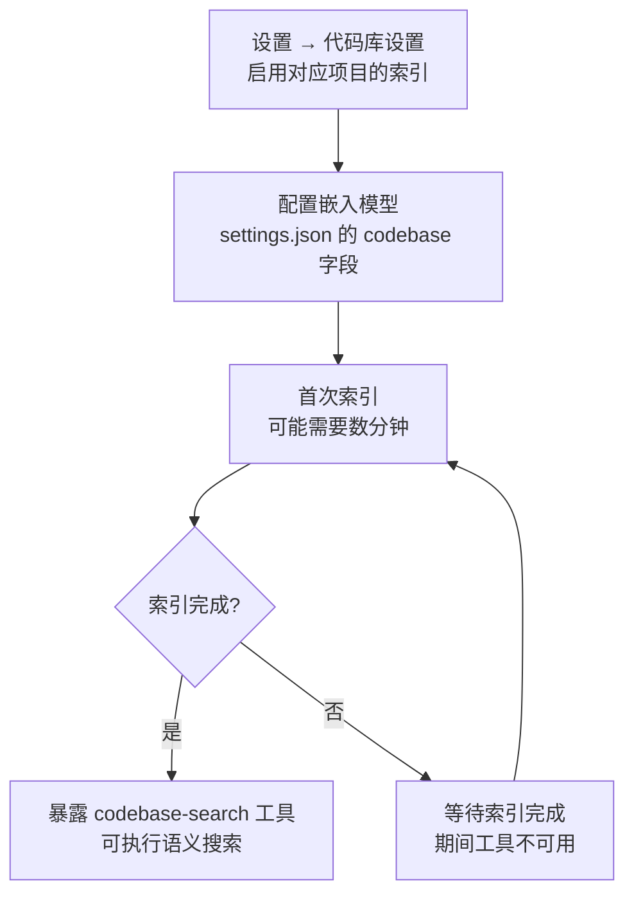

# 7-代码库索引与符号定位（Codebase Index & Symbol Location）

Snow App 提供代码库语义搜索（`codebase` 服务器）与代码符号定位
（`codelens` 服务器）两类内置能力，帮助 Agent 快速理解、定位代码。

## 1. 代码库语义搜索（codebase）

### 1.1 启用与索引

`codebase-search` 仅在**项目启用了代码库索引且已建立索引后**暴露。
在 **设置 → 代码库设置**（`app-control-openSettings page=codebase-settings`）
启用对应项目的索引，并配置嵌入模型（见 `settings.json` 的 `codebase`
字段，`3-配置文件字段参考` 有结构说明）。首次索引可能需要数分钟。



### 1.2 工具

| 工具              | 用途                   |
| ----------------- | ---------------------- |
| `codebase-search` | 基于嵌入索引的语义搜索 |

参数：`query`（自然语言查询文本，必填）、`topN`（结果数上限，默认 10、
最大 50）。

### 1.3 使用示例

```text
codebase-search query="如何处理配置文件反斜杠转义" topN=10
→ 按语义相似度返回相关代码片段

codebase-search query="retry logic" topN=5
→ 按语义相似度返回相关代码片段
```

### 1.4 与 grep 的取舍

| 场景                                  | 用哪个                        |
| ------------------------------------- | ----------------------------- |
| 关键词精确匹配、正则、按路径限定      | `grep-search`（更快更准）     |
| 语义/意图查询（"查找处理登录的逻辑"） | `codebase-search`（理解含义） |

## 2. 代码符号定位（codelens）

`codelens` 服务器基于 oxc / tree-sitter 提供轻量静态分析（符号解析、
引用定位），无需运行完整 LSP。

### 2.1 工具

| 工具                       | 用途                               |
| -------------------------- | ---------------------------------- |
| `codelens-find_definition` | 查找符号定义位置                   |
| `codelens-find_references` | 查找符号在文件内的引用位置         |
| `codelens-file_outline`    | 获取文件符号大纲（函数/类/变量等） |

### 2.2 使用示例

```text
# 理解文件结构
codelens-file_outline filePath=src/main/app/bootstrap.ts
→ 顶层符号列表（函数/类/常量）

# 跳转定义（配合 filesystem-read 使用）
codelens-find_definition filePath=src/main/native/types.ts line=414 column=20
→ 符号名 + 定义位置
```

### 2.3 注意事项

- `find_definition`/`find_references` 的定位基于**行号 + 列号**，先用
  `filesystem-read` 确定目标符号的位置再调用。

### 2.4 关于 LSP（lsp-config）

Snow App 的 `lsp` 服务器消费**外部语言服务器**（rust-analyzer / gopls /
pyright 等）提供基于真实语义分析的**诊断**（`lsp-diagnostics`）与**悬停**
（`lsp-hover`）。`codelens` 仍是内置静态分析（符号导航），两者互补。

配置持久化在应用数据库 `lsp_server_configs` 表（**DB-backed，无配置文件**）：

- **agent 配置**：`config-set scope=lsp-config key=servers value={...}`（全量
  替换，深度校验；立即生效，无需重启）。
- **用户配置**：设置 → LSP 设置（`lsp-settings` 页面）。
- 旧 `~/.snow/lsp-config.json`（预留期文件）会在首次启动时一次性迁移导入
  （source=legacy），此后不再读取。

**工具默认不开启**：先在项目 MCP 设置启用 LSP 域，并确认语言服务器 enabled、命令已安装、技术栈与能力匹配。全局/项目的单工具禁用和子代理白名单仍优先；安装后仅打开语言服务器开关，不等于所有请求都能看到全部工具。SSH/远程项目不支持 LSP。

常用工具为 `lsp-diagnostics`（文件诊断）、`lsp-hover`（类型/文档）、`lsp-goto{kind}`（定义/类型定义/实现）、`lsp-references`、`lsp-symbols`、`lsp-rename`、调用/类型层级以及两个工作区工具。旧 definition/type-definition/implementation 独立工具已合并为 `lsp-goto`，完整参数见 [内置工具参考](../3-参考手册/2-内置工具参考.md)。

项目级配置按同语言覆盖全局；LSP 设置页的全局/项目 scope 分开管理。下列仅是参数示例，路径须换成真实绝对本地路径，调用前确认对应工具可见：

```text
lsp-diagnostics filePath=/absolute/project/src/main.rs
lsp-goto filePath=/absolute/project/src/main.rs line=12 column=4 kind=definition
lsp-workspace-symbols query=TargetName workspaceRoot=/absolute/project
lsp-workspace-diagnostics workspaceRoot=/absolute/project
lsp-hover symbol=TargetName workspaceRoot=/absolute/project
```

如果有 partial 或歧义，先处理警告、缩小范围并核实坐标，不继续假定唯一。重命名先使用 `dryRun=true` 检查 edits。

### 2.5 LSP 优先行为与排查（2026-09-26）

- **先看实际工具列表**：主请求和子代理都以最终 `ToolSnapshot` 生成 LSP 章节与分析清单；全局/项目工具开关、安装/能力条件和子代理白名单都会影响它。禁用的 grep/read/codebase 也不会作为固定底行出现。
- **选择正确范围**：`lsp-workspace-symbols`（全局符号搜索）和 `lsp-workspace-diagnostics` 支持可选 `workspaceRoot`；symbol-only 寻址也可使用。填写存在的绝对本地目录，不能是相对路径、文件或 SSH；省略时使用当前项目根，无可靠根时须显式补充。它不会搜索所有其他项目或提升权限。
- **先读完整性提示**：卡片的 partial、warnings、unsupportedOperations、incomplete 或 `partial_symbol_search` 表示有覆盖缺口，不能据空列表断言无问题，也不能据一条候选断言唯一。`requiresExplicitCoordinates` 要求核实声明并传 `filePath/line/column`；普通 range 不是安全重命名坐标。
- **运行不等于就绪**：徽章 running 只描述进程/会话；初始化、索引或诊断构建仍可能等待。过期快照应刷新；不承诺提示词预热已完成或首调用瞬时响应。
- **文件与诊断新鲜度**：每次 `ensure_open` 比对实际全文，更新文件发送 didChange，工作区请求关闭已删除文档。诊断不再读写持久结果缓存，旧表和数据不删除；多做一次诊断的成本优先于误用因依赖/配置变化而失效的旧结果。
- **保留兜底**：未覆盖语言/扩展名/操作或扫描不完整时保留 CodeLens。可用且被授权时可以转发 LSP；失败返回静态分析并标记 `lspFallback`，不绕过子代理白名单。

三语显示名为“全局符号搜索 / 全域符號搜尋 / Workspace Symbol Search”，工具 ID 始终是 `lsp-workspace-symbols`。UI 折叠大结果只减少渲染，不取消警告或改变结果完整性。详细待验收场景见 [LSP 设计 §0](../4-架构与开发/7-LSP外部语言服务器接入设计.md)。

**排查指引**（LSP 未生效/报错时按序检查）：

| 现象                            | 检查项                                                              | 处理                                                                                               |
| ------------------------------- | ------------------------------------------------------------------- | -------------------------------------------------------------------------------------------------- |
| `lsp-*` 工具不出现              | 配置是否存在且 enabled（`config-get scope=lsp-config key=servers`） | `config-set scope=lsp-config key=servers value={...}` 配置；设置 → LSP 设置页开启开关              |
| 错误「未找到或无法启动」        | 命令是否在 PATH（`which <command>` / 设置页 ❌未安装 徽标）         | 按错误附带的 `installCommand` 安装；安装后设置页打开开关                                           |
| 错误「未为语言 x 配置」         | 文件扩展名是否在服务器 `fileExtensions` 中                          | 补扩展名（如 `.tsx` 未配）；确认项目语言与服务器一致                                               |
| 项目无编程语言/语言不匹配       | 项目是否有对应语言文件（提示词无 Language Servers 章节）            | 语言检测=项目标志文件（Cargo.toml 等）+ 扩展名扫描；无匹配不注入不暴露                             |
| SSH 远程项目                    | `ssh://` 路径                                                       | LSP 仅本地项目，SSH 项目不暴露 lsp-* 工具                                                          |
| `crashed; restarts on next use` | 会话崩溃（连续重启 ≥2 次会报错）                                    | 检查服务器安装/配置及启动退避；冷却期不要循环重试                                                              |
| 需要深挖                        | 应用日志                                                            | `config-get scope=logs` 读 `~/.snow/log`（主进程日志）；开发模式 native `[lsp]` 前缀降级日志在终端 |

**日志记录**：LSP 的降级/失败原因写入**应用日志（app_logs 表）**——与系统
日志面板同源，按 `module=lsp` 过滤即可定位（提示词注入失败、codelens 转发
失败、scope 检查失败、项目根解析失败均记录 level/warn + 错误详情）；同时
输出到 native stderr（开发模式终端可见）。`~/.snow/log` 保存主进程文件日志
（`config-get scope=logs` 可读），两者互补。

### 2.6 批量诊断与安全重命名

11 个显示名称按语义统一，两组 i18n 名称及三语同步，工具 ID 不变，清单见 [工具参考](../3-参考手册/2-内置工具参考.md)。语义任务在对应工具可见且支持目标语言/操作时 **MUST** 使用 LSP；逐工具核对语言、能力与健康，不能用全局语言列表代替。启动退避期间不要循环重试；条件不成立时说明原因并使用可见兜底。

以下仅为参数示例，路径须替换为真实绝对本地文件，不是执行记录：

```json
{ "filePath": "/absolute/project/src/a.ts" }
```

```json
{ "filePaths": ["/absolute/project/src/a.ts", "/absolute/project/src/b.ts"] }
```

批量必须用列表包含全部文件，不能同时传非空 `filePath`。列表严格为 1..30 个非空路径字符串；错误类型、空数组/条目及超限拒绝，不静默截断。旧空 `filePath:""` 占位仅兼容为未提供。数量先校验，再按物理文件去重，保持原请求首次出现顺序。

单文件保留顶层结果；批次返回 `batch:true`、`fileCount/requestedCount/duplicateCount`、status、每文件结果及 summary（`completedFiles/partialFiles/failedFiles/errorCount/warningCount`）。先读汇总成功/部分/失败，再展开文件警告和截断；`error:null` 不是错误，空诊断不证明完整成功。文件任务目标并发 3，结果顺序不变，同服务器仍可能串行化。

重命名先 `dryRun=true`，检查 edits 后，按授权流程把返回 `previewId` 传给 `dryRun=false`。凭证 TTL 5 分钟、每会话最多 32 个、单次且绑定内容，不把原值贴入报告。文件变化、过期、缺失/已消费或 `requiresNewPreview` 时重新预览；UI 不会自动 apply。跨文件写入非事务，不能假称回滚：检查 `appliedFiles/failedFile/error/failedFileMayBeModified`，实际文件可能已修改，不重放旧凭证。

并发 3 调度与相关接口仍在整合，以上不声明构建、fixture 或真实运行通过；完整契约见 [LSP 设计 §0.6–0.8](../4-架构与开发/7-LSP外部语言服务器接入设计.md)。

## 3. 典型协作流程

```text
1. 确认范围与权限 → 当前工具列表、项目根；必要时显式 workspaceRoot
2. 理解与定位     → 可见且支持的 LSP；未覆盖时用可见 CodeLens / 原文读取
3. 检查完整性     → warnings / partial / 候选坐标；文本匹配仅作字面证据
4. 正式验证       → 项目构建与测试；不能只凭空诊断或 running 徽章
```
