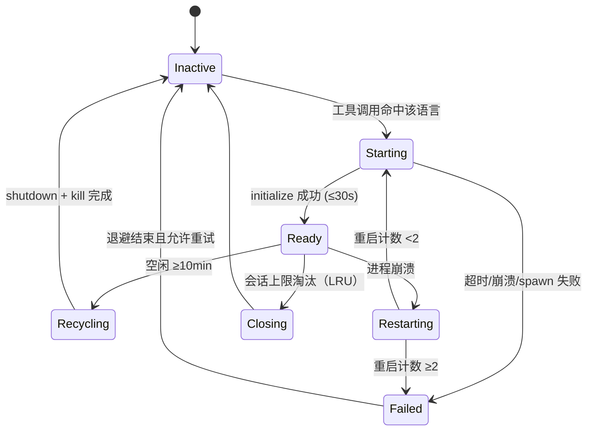
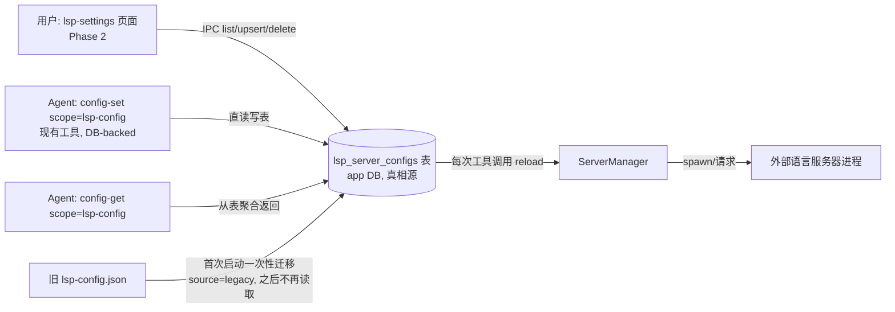
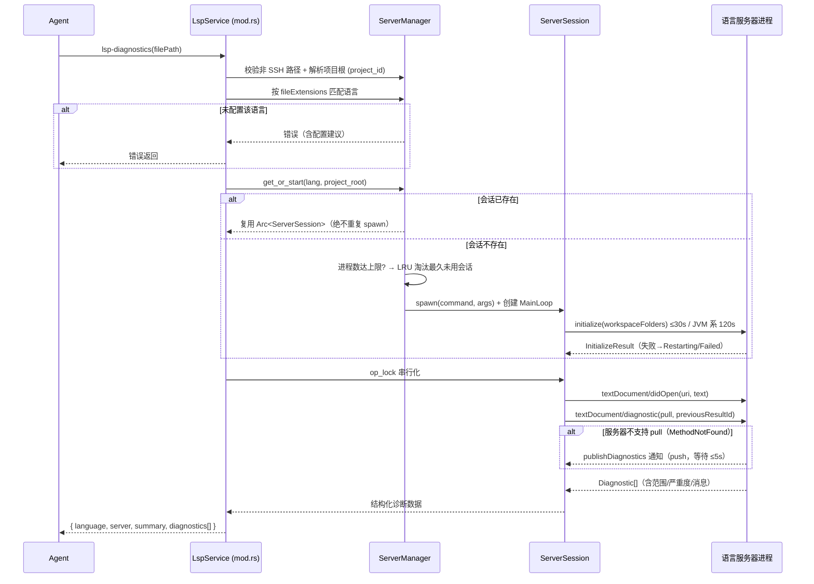

# 7-LSP 外部语言服务器接入设计（lsp MCP 服务）

> 状态：当前行为说明 + 历史设计档案（2026-09-26 修订）
> 对应版本：v0.2.x
> 下文带日期的 Phase、性能实测与早期结构示例是历史记录；与现状冲突时以 §0、§8.10 和当前代码为准。本文不声明本轮构建、测试或运行时验收已通过。

## 0. 当前行为与验收边界（2026-09-26）

### 0.1 请求工具集合是路由文案的事实来源

五个 provider（Chat、Responses、Anthropic、Gemini、Interactions）先解析最终 `allowed_tools`，再把同一列表用于请求 payload 和 `ConversationContextRequest`。`prompt_context.rs::ToolSnapshot` 以纯函数生成 Language Servers 章节、分析工具行和语义路由：

- 最终集合包含全局/项目服务器与工具开关、语言能力及安装/技术栈条件、子代理 `tools_json` 白名单；不能用少数“代表工具”判断整个 LSP 域。
- 每个被推荐工具逐项检查；只有 hover 可见时可以只推荐 hover。grep 描述在最终白名单过滤之后生成；grep 结果提示还与调用阶段当前 scope 和现有 allowed-tools 求交。
- Plan / Goal / WorkFlow 分析清单中的 grep、read、codebase 也按最终集合出现，不再有恒定底行。压缩、禁用工具、轻量请求或收集失败时，不通过独立查询重新广告 LSP 工具。
- 未覆盖语言、扩展名、工具操作，或扫描不完整时保留 CodeLens。隐藏兜底要求三个替代操作均通过 scope 和白名单；CodeLens 内部转发同样不能绕过子代理白名单。
- 不新增跨会话工具快照缓存。可见性不证明服务器进程已启动，更不证明索引 ready；提示词不保证预热完成或瞬时响应。

### 0.2 文档同步、诊断与缓存取舍

`ServerSession::ensure_open` 每次读取受大小限制的磁盘内容，与该会话保存的全文快照比较；首次发送 `didOpen`，内容改变时递增版本并发送 `didChange`，相同内容才复用。相同 mtime/size 不能替代内容检查。工作区请求前同步已打开文件，删除文件发送 `didClose`。

诊断请求**不再读写 `lsp_diagnostic_cache` 持久诊断结果**。本次变更不删除旧表或历史数据；保留存储兼容结构不意味着继续命中旧缓存。单文件指纹不能证明依赖、配置、服务器版本和其他文件均未变化，因此接受更多服务器请求、初始化或构建等待，以避免把过期诊断当作当前结果。会话内内容快照、push URI/文档版本筛选、安装探测和技术栈探测的短 TTL 缓存是不同机制，不应统称为诊断结果缓存；它们也不保证“零错误 = 全项目编译通过”。

### 0.3 工作区根、完整候选与安全寻址

- `lsp-workspace-symbols`、`lsp-workspace-diagnostics` 以及支持 `symbol` 的工具在 symbol-only 寻址时可传可选 `workspaceRoot`：必须是**显式、存在的绝对本地目录**，拒绝相对路径、文件、SSH/远程路径。省略时使用当前项目根；无可靠根时要求调用者补充，不落到进程工作目录猜测。
- 多栈项目枚举选定根内各语言栈根，并检查操作能力。范围指的是选定工作区，不是任意其他项目；显式根也不提升 scope/白名单权限。
- 内部唯一性判断使用完整候选，不使用展示截断后的前 50 条。扫描受限、服务器失败/超时、不支持的操作、结果裁剪等须呈现 `warnings` / `incomplete` / partial 状态；“部分结果中恰好一条”不等于唯一命中。
- 仅唯一且已验证的 `selectionRange` 可作为自动精确寻址依据。Flat `SymbolInformation` 的普通 range 或其他不精确候选只供导航，返回 `requiresExplicitCoordinates`；多候选返回歧义，搜索不完整可返回 `partial_symbol_search`，不静默猜位置或继续重命名。

### 0.4 UI 语义

`lsp-workspace-symbols` 的工具 ID 不变；简中显示“全局符号搜索”，繁中显示“全域符號搜尋”，英文显示“Workspace Symbol Search”。“全局”仍限定在请求工作区内。结果卡片区分 complete / partial / failed，显示 warnings、未支持操作、截断和作用域；展开正文采用懒渲染，不把折叠或空列表等同成功。状态徽章的 running 只表示进程/会话状态，不承诺语言索引 ready；过期快照应显示过期状态，而非继续显示无条件就绪。

### 0.5 验收矩阵（待统一验证，不是通过记录）

| 场景                                           | 应检查的行为                                               |
| ---------------------------------------------- | ---------------------------------------------------------- |
| 四个旧代表工具均禁用，仅 hover 可见            | payload、章节、分析清单和 grep 路由仅推荐可见项            |
| 子代理只允许 grep / CodeLens，或空白名单       | 不广告未授权 LSP，也不经 CodeLens 转发绕过白名单           |
| 压缩 / disable_tools / 收集失败                | 最终工具为空，动态 LSP/分析行不重新出现                    |
| 混合扩展名、缺少替代操作、扫描超预算           | 保留 CodeLens 兜底，作用域不扩张                           |
| 同尺寸文件修改、文件删除、依赖/配置改变        | 文档实际同步，不命中持久诊断缓存；删除文件不留幽灵文档     |
| 有效 workspaceRoot / 相对路径 / SSH / 无项目根 | 有效绝对本地目录按显式范围执行；无效或缺失范围给可行动错误 |
| 超过展示上限的同名候选、一个栈失败             | 唯一性基于完整候选；partial 不得自动 Exact                 |
| Flat 范围、无 selectionRange、重载符号         | 返回候选/显式坐标要求，不猜坐标执行                        |
| 不支持 workspace diagnostics 或全部服务器失败  | 不渲染成“全项目无问题”；显示失败/警告及覆盖边界            |
| 切换项目/全局设置、迟到异步响应、徽章过期      | 设置与状态按 scope 隔离，迟到响应不覆盖新 scope            |
| 三语名称、折叠大结果与警告                     | ID 不变，三语显示名一致，警告不因懒渲染丢失                |

实现锚点：`native/src/mcp/servers/lsp/{prompt_context,session,resolve,detect,manager}.rs`、`native/src/mcp/tools/{collect,call}.rs`、`native/src/api/conversation/context.rs`、`native/src/prompt/tool_hints.rs`。

### 0.6 条件 MUST、逐工具语言能力与启动退避

共享符号修改前的引用检查、符号重命名前的预览，以及源码修改后的文件诊断，在对应工具处于请求最终 `allowed_tools`、且目标语言/工作区操作确实受支持时为 **MUST**；定义定位、类型查询和大纲等调查操作优先使用对应语义工具，不要求每次运行整套工具。禁用、白名单排除、语言/操作未覆盖、能力不支持、启动退避或健康失败时，强制条件不成立：说明局限并使用当前可见的兜底，不扩大权限。grep 仍用于字面检索，文本命中不是语义引用。

语言覆盖、协商能力和健康必须逐工具判断，不能将所有启用语言的并集套到每个工具。配置启用、已安装、栈匹配、运行中、操作可用和索引就绪是不同维度。启动/初始化失败进入受控退避窗口，冷却期不因重复调用立即反复 spawn；先修复安装/配置，再按运行时允许的窗口重试，不把失败伪装为零结果。

11 项名称在 `toolNames.lsp-*` 与 `toolCall.lsp.op.*` 保持一致，三语同步、工具 ID 和历史 key 不删除：文件诊断、类型与文档查询、符号导航、查找引用、文件符号大纲、符号重命名、函数调用关系、类型层次关系、全局符号搜索、工作区诊断、Go依赖漏洞扫描。`goto` 按 kind 可显示定位定义/定位类型定义/查找实现；完整 ID 映射见 [工具参考](../3-参考手册/2-内置工具参考.md)。

### 0.7 严格诊断批次契约

- 单文件传非空字符串 `filePath`；批量传含 **1..30** 个非空路径字符串的 `filePaths`，二者严格互斥。批量须将全部文件放进列表，不能再同时传非空单路径。
- 拒绝错误类型、非字符串条目、空数组、空条目及超限，不静默过滤或截断到 30。旧空 `filePath: ""` 占位兼容为未提供，可与有效列表同传；不允许借此绕过类型/数量校验。数量在去重前检查。
- 按物理文件身份去重，保留原请求中首次出现的顺序，每个去重后文件保留一个结果，包括失败结果。
- 单 `filePath` 保留旧顶层形状；列表请求（即使只有一项）返回 `batch:true`、`fileCount`、`requestedCount`、`duplicateCount`、`status: complete|partial|failed`、`summary`、`files`。三种计数分别为去重后文件数、原请求条目数、物理重复条目数。
- `summary` 包含 `completedFiles`、`partialFiles`、`failedFiles`、`errorCount`、`warningCount`。每个文件保留 `filePath`、`status`、`diagnostics`、`warnings`、`truncated`、`error` 等字段；`error:null` 不是错误。空诊断或零统计不等于完整成功，UI 展示汇总及逐文件警告/截断。
- 文件任务目标有界并发为 **3**（本轮在 `diagnostics.rs` 整合），完成先后不改变结果顺序；同服务器会话锁仍可能串行化，不承诺批量耗时等于单文件。

本节是同步契约，并发调度与相关接口仍在整合；不宣称本轮构建、fixture 或真实运行已通过。

### 0.8 内容绑定的重命名预览凭证

`dryRun=true` 返回冻结编辑以及 `previewId`、`previewExpiresAt`（Unix 毫秒），包括零编辑预览。凭证 TTL **5 分钟**，每会话最多 **32 个**、**单次消费**，绑定目标与涉及文件的实际内容。`dryRun=false` 必须携带凭证并仍通过写入授权；应用冻结结果，不重新请求另一套 rename edits。文件改变、凭证过期/丢失/已消费或会话失效时重新预览。不支持的文件操作在发放可应用凭证前拒绝。UI 不展示凭证原值、不自动调用 apply，无凭证不得宣称可直接应用。

跨文件应用**不是事务**：后续 I/O 失败时，之前文件可能已经写入，不能宣称全部回滚。结构化结果保留 `status: partial|failed`、`applied:false`、`partiallyApplied`、`appliedFiles`、`failedFile`、`error`、`requiresNewPreview`；`failedFileMayBeModified:true` 表示失败文件本身也可能已修改。成功可返回 `previewConsumed:true`。先核对实际文件再重新预览，不重放旧凭证。以上不是运行验收通过声明。

## 1. 背景与动机

### 1.1 历史教训（为什么不自研诊断）

- **v0.1.x ~ v0.1.7**：codelens 内置 `codelens-diagnose` 工具，基于 oxc（TS/JS）+ tree-sitter（其他语言）做静态诊断，含每语言手写语义分析器（`semantic_analyzer/` 10 个文件 ~2100 行）与 ambient globals 补丁（318 行）。
- **v0.1.21（34677584）**：整体移除，共删除 3186 行。原因：单文件静态分析无法理解跨文件语义（imports/模块系统/框架全局），误报结构性无解；10 语言手写分析器维护成本爆炸；不可信诊断对 agent 是负价值。
- **结论**：诊断能力本身有价值（否则不会专门修误报），问题出在「自研实现」路线。正确路线是**消费外部专业语言服务器**（rust-analyzer/gopls/tsc 等由官方/社区维护）。

### 1.2 设计初期缺口（历史）

> 本节记录接入前的背景，不代表当前没有 LSP 运行时或设置页；当前行为见 §0。

- `~/.snow/lsp-config.json`（scope `lsp-config`）是**预留配置域**：字段完整（command/args/fileExtensions/installCommand/initializationOptions）、Rust 侧深度校验已实现（`config/mod.rs:985`），6 语言预置，但**无任何消费方**，写入不改变行为。
- codelens 仅剩符号导航（outline/find_definition/find_references），无诊断/hover/格式化能力。
- `src/`（Electron 层）与 `native/` 无 LSP 客户端运行时。
- 无前端配置页面（`app-control-openSettings` 21 个页面中无 lsp-settings）。
- 持久化为**文件型 scope**；项目内已有更成熟的「服务器配置」范式：`mcp_server_configs` 表 + `sync_mcp_servers_to_db`（config/mod.rs:1156）双轨同步 + mcp-settings 前端页面——本设计照抄该范式（见 §8.5 配置架构）。

### 1.3 业界参照

- **LSAP（lsp-client/LSAP）**：agent 认知编排层，Markdown-First 输出。本设计借鉴其**输出风格**，不引入其协议。
- **claw-code / oh-my-pi / pi-lsp-extension**：懒加载启动、写后自动诊断、进程生命周期管理——本设计采用相同模式。
- **async-lsp（oxalica/async-lsp 0.2.x）**：Rust 首选 LSP 客户端框架（`LspService` trait 同时支持 server/client，stdio 管道，MainLoop，concurrency 中间件）。
- **gopls 官方 MCP（go.dev/gopls/features/mcp）**：gopls 原生提供 MCP server，内部仍走 LSP；启动时以 `os.Getwd()` **锁定 workspace root**。
- **golang/go#78668**：gopls MCP 共享 daemon 因 root 锁定无法服务多项目，官方现状即 **per-project daemon**（每项目一个进程）。这是本设计「会话粒度 = 语言 × 项目」的直接依据。
- **VS Code Multi-Server LSP Pattern**（microsoft/vscode-extension-samples）：**每个 workspace folder 启动一个语言服务器实例**，隔离项目状态与配置——业界标准模式。

## 2. 目标与非目标

### 目标

1. 激活 `lsp-config` 配置域：新增 `lsp` MCP 服务消费 `~/.snow/lsp-config.json`。
2. Phase 1 落地 `lsp-diagnostics` + `lsp-hover` 两个高价值工具。
3. 完整的服务器生命周期管理：懒加载、空闲回收、崩溃重启（限次）、并发上限。
4. 降级友好：未配置/服务器缺失/启动失败时给出明确错误与建议，不破坏现有 codelens 能力。

### 非目标（本期不做）

- 不自研任何语义分析（历史教训）。
- 不实现 LSAP 编排协议（协议未稳定，仅借鉴输出风格）。
- 不做写后自动诊断钩子（侵入 agent 循环，列为 Phase 3 可选）。
- 不做 TCP/pipe 传输（仅 stdio，与 lsp-config 字段语义一致）。

## 3. 架构约束（现状事实，实施必须遵守）

| 约束                                                                                                                                      | 来源                                                                                                                                                                                                       |
| ----------------------------------------------------------------------------------------------------------------------------------------- | ---------------------------------------------------------------------------------------------------------------------------------------------------------------------------------------------------------- |
| `McpService` trait：`id()` / `tools()` / `execute()`（同步）                                                                              | `native/src/mcp/service.rs`                                                                                                                                                                                |
| 异步工具执行：在 `call_mcp_tool`（`native/src/mcp/tools/call.rs`）加 `lsp-` 前缀分支，直接 `.await`（参照 `codelens-` 分支，call.rs:305） | `tools/call.rs`                                                                                                                                                                                            |
| 同步 `execute()` 对 lsp 工具必须返回「必须通过异步执行器执行」错误（参照 codelens mod.rs:148）                                            | `servers/codelens/mod.rs`                                                                                                                                                                                  |
| 服务注册：`builtin.rs` `builtin_services_in_order()` **追加到列表末尾**（prompt cache 稳定性红线）                                        | `mcp/builtin.rs:29-51`                                                                                                                                                                                     |
| 配置路径                                                                                                                                  | 真相源为数据库表 `lsp_server_configs`；**`lsp-config` scope 数据库化**（DB-backed，照 subAgents/hooks/imagegen 模式，config/mod.rs:1269）；无文件、无差集同步；旧 `~/.snow/lsp-config.json` 一次性迁移导入 | `servers/config/mod.rs:1269`、`database.rs:468` |
| tokio 已启用 `process`/`io-util`/`sync`/`time`/`rt` 特性                                                                                  | `native/Cargo.toml:20`                                                                                                                                                                                     |
| Rust 后端禁止同步阻塞（一律异步 API）                                                                                                     | AGENTS.md 红线 7                                                                                                                                                                                           |
| 工具名格式 `{server_id}-{tool_name}`，全小写 snake_case                                                                                   | `mcp/tools` 惯例                                                                                                                                                                                           |

## 4. 依赖清单（native/Cargo.toml 新增）

```toml
# LSP 客户端框架：stdio 管道 + MainLoop + LanguageClient omnitrait
# default-features 关闭以去掉 client-monitor(服务端用)/tracing(项目无此依赖)
async-lsp = { version = "0.2", default-features = false, features = ["tokio", "stdio", "omni-trait"] }
# LSP 3.17 全量类型（async-lsp re-export 同版本，显式声明便于直接使用）
lsp-types = { version = "0.95" }
```

说明：

- **为什么选 async-lsp**：同时支持 Language Server / Language Client 两种角色（`LspService` trait），`stdio` feature 提供管道化 stdin/stdout 通道与 `MainLoop` 驱动；`omni-trait` 提供 `LanguageClient` 全量请求/通知方法；`concurrency` 中间件提供请求多路复用与取消；re-export `lsp-types`。
- **不选 tower-lsp**：偏服务端框架，客户端支持弱。
- **不手写 JSON-RPC**：Content-Length 帧 + serde_json 虽不难，但 lsp-types 类型定义必须自备，重复造轮子。
- **tokio feature**：项目运行在 tokio runtime（napi async + `tokio::task::spawn_blocking`），async-lsp 默认 async-io，必须开 `tokio` 兼容方法。
- 传递依赖（无需显式声明）：`tower-service`、`tower-layer`、`url`（lsp-types 依赖，`lsp_types::Url` 直接可用）。

## 5. 模块划分

```
native/src/mcp/servers/lsp/
├── mod.rs       # LspService：McpService impl + 工具 schema 定义 + execute 入口；resolve_lang_root 栈根解析
├── config.rs    # 配置加载：从 lsp_server_configs 表读取（spawn_blocking）+ 暴露判定（tool_exposure）
├── detect.rs    # 技术栈检测与栈根发现（markers_for_lang / find_lang_root，见 §7.2）
├── manager.rs   # ServerManager 全局单例：会话路由与生命周期管理（key = 语言 × 栈根）
├── session.rs   # ServerSession：单个语言服务器会话（进程 + 客户端 + 状态）
├── client.rs    # 协议操作封装：initialize / didOpen / hover / diagnostics
├── format.rs    # LSP 响应 → agent 友好输出（JSON + Markdown 摘要）
└── probe.rs     # 命令安装探测（PATH 扫描 + TTL 缓存）

native/src/storage/services/lsp_server_configs.rs   # 新表 CRUD（照 mcp_server_configs.rs）
native/src/storage/database.rs                      # 建表（create_schema，幂等）
native/src/exports/storage/lsp.rs                   # napi 导出（list/upsert/delete）
```

### 5.1 各模块职责

| 模块         | 职责                                                                                                                                   | 关键点                                        |
| ------------ | -------------------------------------------------------------------------------------------------------------------------------------- | --------------------------------------------- |
| `mod.rs`     | 工具 schema（`McpTool`）、`execute()` 同步错误、`execute_lsp_tool()` async 入口（供 call.rs 调用）                                     | 参照 codelens/mod.rs 模式                     |
| `config.rs`  | 从 `lsp_server_configs` 表读取（DB-backed，§8.5）+ serde 解析；`tool_exposure` 暴露判定（§8.0，含技术栈存在判定）                      | 字段与 `validate_lsp_servers` 对齐            |
| `detect.rs`  | 技术栈检测 + **栈根发现**（`markers_for_lang` 12 语言标志表、`find_lang_root` 向上找最近栈根 + 向下扫兜底）；结果 60s TTL 缓存         | 栈根语义见 §7.2；单元测试覆盖                 |
| `manager.rs` | `OnceLock<Arc<ServerManager>>`；按 (语言, **技术栈根**) 路由会话；懒加载/空闲回收/崩溃重启/并发上限；状态快照按 `starts_with` 归属项目 | 全局唯一实例，`tokio::sync::Mutex` 保护会话表 |
| `session.rs` | 会话状态机：spawn 进程、async-lsp MainLoop 启动、initialize 握手、文件注册表、串行化操作锁                                             | 进程句柄持有 + 回收                           |
| `client.rs`  | `textDocument/hover`、`textDocument/diagnostic`（pull）+ `publishDiagnostics`（push fallback）、`didOpen/didClose`                     | 全部 async，带超时                            |
| `format.rs`  | Diagnostic→JSON 项、hover→Markdown、错误→降级建议文本                                                                                  | 输出结构见 §8                                 |

## 6. 核心数据结构

```rust
// ---------- config.rs ----------
/// 表 lsp_server_configs 的一行（真相源；字段与 validate_lsp_servers 校验规则对齐）
#[derive(Debug, Clone, Serialize, Deserialize)]
pub struct LspServerConfigRecord {
    pub id: String,
    pub lang: String,                        // 语言标识（UNIQUE），如 "rust"
    pub command: String,
    pub args: Vec<String>,                   // args_json
    pub file_extensions: Vec<String>,        // file_extensions_json
    pub install_command: Option<String>,
    pub initialization_options: Option<serde_json::Value>,
    pub enabled: bool,                       // 页面开关（禁用 = 该语言不启动服务器）
    pub sort_order: i64,
    pub source: String,                      // "seed" | "manual" | "legacy"（照 mcp source 约定）
    pub created_at: String,
    pub updated_at: String,
}

// ---------- manager.rs ----------
/// 全局单例：管理所有 (语言 × 项目) 会话
pub struct ServerManager {
    /// 会话表：key = (语言, 项目根路径)，同一项目内同语言**最多一个进程**；
    /// 不同项目各自独立进程（服务器 workspace root 为单根，业界标准 per-folder 模式）
    sessions: tokio::sync::Mutex<HashMap<(String, PathBuf), Arc<ServerSession>>>,
    config: RwLock<Vec<LspServerConfigRecord>>,  // 每次工具调用时从表 reload（热更新，无需重启）
    max_sessions: usize,                  // 总进程数上限（默认 3，跨项目/语言合计）
    idle_timeout: Duration,               // 空闲回收阈值（默认 10 min）
}

// ---------- session.rs ----------
/// 单个语言服务器会话：绑定一个 (语言, 项目根)
pub struct ServerSession {
    lang: String,
    project_root: PathBuf,                // 本项目根（会话初始化时锁定，不可变）
    config: ServerConfig,
    child: tokio::process::Child,         // 子进程句柄（回收用）
    client: ClientSocket,                 // async-lsp 客户端 socket（clone 可并发请求）
    main_loop: tokio::task::JoinHandle<()>,
    op_lock: tokio::sync::Mutex<()>,      // 串行化 didOpen/请求序列，保证顺序语义
    opened_files: HashSet<PathBuf>,       // 已 didOpen 的文件
    last_used: std::time::Instant,
    restart_count: u32,                   // 崩溃重启计数（上限 2）
    init_failed: bool,                    // 启动失败标记（避免无限重试）
}
```

## 7. 生命周期设计

### 7.1 状态机



### 7.2 会话粒度：语言 × 项目（核心决策）

**规则：会话 key = (语言, 项目根)，同一项目内同语言最多一个进程，多项目不复用进程。**

依据（业界事实）：

1. **LSP workspace 是单根模型**：workspace 由「一个 folder + per-folder 配置」构成（gopls workspace 文档）。rust-analyzer / gopls / tsc 均以单个 root 为语义分析范围。
2. **gopls 官方 MCP 即 per-project daemon**：gopls MCP 启动时以 `os.Getwd()` 锁定 root；golang/go#78668 确认共享 daemon 无法服务多项目。
3. **VS Code Multi-Server LSP Pattern**：每个 workspace folder 一个服务器实例，隔离项目状态与配置。

项目内多模块（Go `go.work`、Rust Cargo workspace、TS 多包）**天然单进程支持**——模块关系由服务器在单个 root 内自行发现，客户端无需处理。

**项目根解析**（复用现有模式，codelens/mod.rs:530 / skills.rs:350）：

```
工具调用 → 有 project_id？
  ├─ 是 → get_workspace_directory_path(db, project_id) → 项目根
  └─ 否 → filePath 所在目录（单文件场景兜底）
```

- SSH/远程项目（`is_ssh_path`）：**不支持**，返回错误（外部语言服务器进程在本地，无法分析远程文件）。
- 同一会话内多次调用同一 (语言, 技术栈根) 命中同一进程，**绝不重复 spawn**。

**技术栈根发现（2026-09-24：会话 key 的第二维从「项目根」升级为「技术栈根」）：**

动机：项目根 ≠ 语言服务器的 workspace 根。典型反例（本项目自身）：`Cargo.toml` 在 `native/` 子目录，项目根只有 `package.json`——若以项目根为 rootUri，rust-analyzer 找不到 Cargo workspace，退化为 **detached 单文件模式**（跨文件跳转/引用失效、类型诊断缺失、dead_code 误报）。

规则：`resolve_lang_root` = 项目根（上表）→ `detect::find_lang_root`：

```
文件级请求（有 filePath）：从文件所在目录向上找最近的技术栈标志
  native/src/x.rs → native/Cargo.toml 命中 → 会话根 = native/（monorepo 每 crate 独立会话）
项目级请求（无文件）：从项目根向下扫（深度 ≤2）取该语言最浅命中目录
两者都未命中 → LspError::NoLangStack 明确拒绝（不启动、不暴露）
```

- **12 语言标志表**（`detect.rs::markers_for_lang`，支持 `*.csproj` 等后缀通配）：rust→`Cargo.toml`；go→`go.mod`/`go.work`；typescript→`tsconfig.json`/`jsconfig.json`/`package.json`；python→`pyproject.toml`/`setup.py`/`setup.cfg`/`requirements.txt`/`Pipfile`；java→`pom.xml`/`build.gradle(.kts)`/`settings.gradle(.kts)`；c→`compile_commands.json`/`CMakeLists.txt`/`meson.build`；csharp→`*.csproj`/`*.sln`/`*.fsproj`；lua→`.luarc.json`/`.luacheckrc`；php→`composer.json`；ruby→`Gemfile`/`*.gemspec`；kotlin→`build.gradle.kts`/`*.kt`；swift→`Package.swift`/`*.xcodeproj`。
- **技术栈不存在 = 不启动**：无标志文件 → `NoLangStack`（§9）；工具暴露层同一判定（§8.0「暴露 = 可调用」），模型根本看不到必然失败的调用。
- **状态徽章**：`session_statuses` 的项目过滤用 `starts_with`（技术栈根在项目根之下也能正确归属，manager.rs）。
- 标志未定义的语言（自定义 lang）：不做栈根约束（项目根即会话根，保持旧行为）。

### 7.3 关键参数

| 参数                 | 默认值                            | 说明                                                                                                                                          |
| -------------------- | --------------------------------- | --------------------------------------------------------------------------------------------------------------------------------------------- |
| `max_sessions`       | 3                                 | **跨 (语言, 项目) 总进程数上限**（rust-analyzer 单进程 ~500MB；多项目并发时按 LRU 淘汰最久未用会话）                                          |
| `idle_timeout`       | 30 min                            | 空闲回收（无工具调用即回收）；600s → 1800s（2026-08-14 用户决策，减少重服务器冷启动重复支付）                                                 |
| `initialize_timeout` | 30 s（默认）；**JVM 系 120 s**    | 按服务器提供默认超时表：`jdtls`/`kotlin-lsp` 120s（JVM 启动慢，参考 Anthropic claude-plugins-official 的 `startupTimeout: 120000`），其余 30s |
| `request_timeout`    | 10 s（diagnostics）/ 5 s（hover） | 单次请求超时                                                                                                                                  |
| `restart_limit`      | 2                                 | 崩溃连续重启上限                                                                                                                              |
| 会话淘汰             | LRU                               | 超上限时回收最久未用会话                                                                                                                      |

### 7.3 进程管理要点

- **spawn**：`tokio::process::Command`；Windows 必须设置 `creation_flags(CREATE_NO_WINDOW)` 防黑窗。
- **回收**：`shutdown` 通知 → 等待退出（≤3s）→ `child.kill()` 兜底；drop 时同步清理。
- **崩溃检测**：`main_loop` 结束或 `child.wait()` 完成即视为进程退出；非正常退出进入 Restarting。
- **stderr**：转发到应用日志（不返回 agent，防刷屏）；日志前缀 `[lsp:{lang}]`。
- **只回收自己 spawn 的进程**（符合全局进程管理规范）。

## 8. 工具设计

### 8.0 工具暴露策略（默认不开启）

**`lsp` 服务的工具默认不暴露；仅当 `lsp_server_configs` 表中存在「启用且已安装」（enabled && installed）的语言服务器时才出现在工具列表中（§8.6）。**

- 实现：`has_enabled_server()` 读取表并对 enabled 记录做 PATH 探测——无「启用且已安装」记录 → 返回**空工具列表**（agent 看不到 `lsp-*` 工具，不占 prompt、不产生无效调用）。纯 enabled 不够：命令不在 PATH 的服务器永远无法启动，暴露只会诱导必然失败的调用。
- 运行中通过 `config-set scope=lsp-config`（agent）或 `lsp-settings` 页面（用户）修改配置后，**下次工具调用自动生效**（每次调用从表 reload，无需重启——优于文件型 scope 的重启语义）。
- 已暴露但目标文件类型未匹配（如只配了 rust，却诊断 .py）→ 按 §9 返回明确错误（**不静默**）。
- 子代理场景同样受此策略约束（工具列表由全局注册统一控制）。
- **工具子集按已启用服务器的能力过滤（§8.7）**：暴露的不是固定工具全集，而是「所有启用且已安装服务器能力并集」对应的子集——某 `lsp-*` 工具（如未来的 `lsp-rename`）没有任何已启用服务器支持时，不出现（不占 prompt、不诱导必然失败的调用）。
- **技术栈存在判定（2026-09-24，暴露 = 可调用）**：工具暴露与调用阶段共用同一技术栈判定（`server_matches_project` = `find_lang_root` 有解，§7.2）——项目内没有该语言的技术栈标志（如无 `go.mod`）时，对应 `lsp-*` 工具不暴露、服务器不启动、调用（绕过列表时）返回 `NoLangStack` 明确错误。三者一致，不存在「看得到但调不通」或「调得通但服务器异常」的中间态。

### 8.5 配置架构（DB-backed scope，无文件兼容层）



要点：

- **真相源 = 表**；`lsp-config` scope 从文件型改为 **DB-backed scope**（照 subAgents/hooks/imagegen：config/mod.rs:1269「DB-backed 配置域：直接查应用数据库，与 UI 同源」）——**无文件、无差集同步逻辑**，config-get/set/delete 直读写表。
- **agent 配置路径**：无需新工具——agent 用现有 `config-set scope=lsp-config` 即可帮用户配置语言服务器（命令/路径/扩展名/开关），**立即生效无需重启**。
- **旧文件迁移**：首次启动表空且 `~/.snow/lsp-config.json` 存在 → 一次性导入（source=legacy，幂等）；导入后文件不再读取。
- **建表**：`database.rs::create_schema` 加 `CREATE TABLE IF NOT EXISTS lsp_server_configs`（幂等，无迁移版本提升需求）；结构照 mcp_server_configs（database.rs:468）。
- **预置种子**：种子逻辑写入表（source=seed），按平台分支（附录 B）；不覆盖用户已有记录（仅插入缺失语言）。
- **v1 仅全局**（表无 project_id 列，与 imagegen 等 DB-backed scope 一致）；项目级留 Phase 3（照 project_mcp_server_configs 独立表模式）。

### 8.1 lsp-diagnostics（Phase 1，核心；2026-08-14 支持批量）

```
lsp-diagnostics filePath=<绝对路径>            # 单文件
lsp-diagnostics filePaths=[<路径1>, <路径2>]   # 批量（1..30 文件，严格互斥）
```

**批量契约（2026-09-26 修订）**：单文件顶层兼容、严格互斥的 1..30 输入、物理去重与稳定顺序、请求/去重计数、逐文件状态及 summary、目标并发 3，完整规则见 §0.7；旧缩略输出不代表全部字段。

执行序列（**已按 2026-08-14 实测修订**）：

0. 校验 `filePath` 非 SSH/远程路径（`is_ssh_path` → 报错「远程项目暂不支持 LSP」）；文件 ≤512KB。
1. `manager` 解析项目根（project_id → `get_workspace_directory_path`；无 project_id 用 filePath 父目录）→ 按 `fileExtensions` 匹配语言（enabled 才可匹配）→ 无匹配返回「该文件类型未配置 LSP 服务器」（含 config-set 建议）。
2. 懒加载会话：查 (语言, 项目根) → 未命中且进程数 < `max_sessions` 则 spawn + initialize（root = 项目根）；已达上限则 LRU 淘汰（**优雅 shutdown** 后启动）。
3. `textDocument/didOpen`（首次，version=1）+ **`textDocument/didChange`（每次，version 递增、全量内容）强制触发重新诊断** + **`textDocument/didSave`（pull 能力服务器，触发 flycheck）**。
4. **按服务器能力选择诊断路径**（initialize 响应 `diagnostic_provider`）：
   - **声明 pull**（rust-analyzer）：**push + pull 合并**——rustc/cargo 诊断（类型错误等）只走 push（`publishDiagnostics`，didSave 触发 flycheck），rust-analyzer 原生诊断走 pull，两者不重叠（rust-lang/rust-analyzer#18709）；pull 空/取消（-32802）轮询重试（最多 8 次 × 2s）。
   - **未声明 pull**（gopls 等）：纯 push（等 `publishDiagnostics`，上限 30s——flycheck 首次项目构建可能 10-30s）。
5. 合并去重（按 起始行/列/消息）；文件保持 open（`opened_files` 记录，空闲回收时随会话关闭）。
6. 输出 JSON：

```json
{
  "language": "rust",
  "server": "rust-analyzer",
  "summary": "2 errors, 1 warning",
  "diagnostics": [
    {
      "severity": "error",
      "message": "expected `i32`, found `&str`",
      "source": "rustc",
      "code": "E0308",
      "line": 12,
      "column": 20,
      "endLine": 12,
      "endColumn": 25
    }
  ]
}
```

severity 映射：`1=error, 2=warning, 3=information, 4=hint`（LSP DiagnosticSeverity）。

**实测关键经验（2026-08-14，rust-analyzer 1.93 + gopls v0.21.1 验证）**：

1. **rust-analyzer 双轨诊断是设计使然**（#18709）：pull 永远不包含 cargo 诊断、push 永远不包含原生诊断——客户端必须合并，且类型错误依赖 **didSave 触发 flycheck**（cargo check 首次 10-30s，push 等待需 30s）。
2. **gopls 不声明 diagnosticProvider**：不能靠 MethodNotFound 判断（它返回空 Partial 而非错误）——必须读 initialize 能力的 `diagnostic_provider`。
3. **workspace/configuration 请求必须处理**（返回空数组=服务器默认）：未处理时 rust-analyzer 报 "No such method workspace/configuration"，诊断等功能降级。
4. **Windows uri 大小写**：rust-analyzer 推 `file:///c:/...`，`Url::from_file_path` 生成 `file:///C:/...`——push store 的 key 需统一（Windows 路径转小写）。
5. **async-lsp Router 未注册通知默认终止 mainloop**（Break）：必须注册全部常见通知（showMessage/logMessage/telemetry/progress/publishDiagnostics）与请求（workspace/configuration、workspaceFolders）。
6. **tokio 上下文禁止 `blocking_lock()`**（panic）；`min_by_key` 闭包内不能 await——先收集再求最小。

**诊断性能与新鲜度（2026-09-26 修订）**：

2026-08-14 的性能方案曾使用 `(mtime_ms, size)` 指纹和数据库结果缓存；这属于历史方案，其“未修改文件毫秒级、服务器零参与”结论不再适用于当前实现。

当前诊断不读写 `lsp_diagnostic_cache`，也不删除历史数据。准备阶段同步实际内容及版本，再进行 pull/push 等待和合并；批量并发降低重复等待，但不保证批量耗时等于单文件。依赖、配置、服务器环境或其他文档改变后仍需重新诊断；旧 push 值须按当前版本/代次筛选。这里选择新鲜度优先于无法证明有效的持久缓存命中，验收要求见 §0.5。

### 8.2 lsp-hover（Phase 1）

```
lsp-hover filePath=<绝对路径> line=<1-based> column=<1-based>
```

1-3 同上（不 didClose，文件在会话内保持打开便于连续查询；改用引用计数：文件在多请求期间保持 open，`opened_files` 记录，空闲回收时统一关闭）。
输出（hover 内容本身就是 Markdown，直接透传 + 结构包装）：

````json
{
  "language": "rust",
  "contents": "```rust\nfn foo(x: i32) -> i32\n```\nReturns `x + 1`.",
  "range": {
    "start": { "line": 12, "column": 4 },
    "end": { "line": 12, "column": 7 }
  }
}
````

### 8.3 Phase 3（已完成 2026-08-14）— 更多工具 + 项目级作用域

> Phase 2（前端 `lsp-settings` 页面）已于 2026-08-14 实施完成：preload `lspApi` → IPC `lsp-server-configs:*` → `LspSettingsPanel` + `lspSettings/` 子目录（Editor/List/Summary）→ 注册链（`app_control` VALID_PAGES / `types.ts` / `MainContent` lazy / `settingsItems.ts`）→ i18n 三语言。页面 CRUD 直读写 `lsp_server_configs` 表（真相源），与 `config-set scope=lsp-config` 完全一致。

| 工具             | 说明                                                                                                              | 状态                                      |
| ---------------- | ----------------------------------------------------------------------------------------------------------------- | ----------------------------------------- |
| `lsp-definition` | `textDocument/definition`，输出与 codelens-find_definition 对齐（name + definitions 列表），配置了 LSP 的语言优先 | ✅ 已实施（实测跨文件跳转 manager.rs:29） |
| `lsp-references` | `textDocument/references`，引用位置 + 单行代码上下文（上限 100）                                                  | ✅ 已实施（实测 11 处带上下文）           |
| `lsp-symbols`    | `textDocument/documentSymbol`，树形 name/kind/detail/range/children，比 tree-sitter outline 更准                  | ✅ 已实施（实测 26 符号）                 |
| `lsp-format`     | `textDocument/formatting`，dryRun 默认 true 不写盘；false 应用 edits 写回 + didChange 同步                        | ✅ 已实施（实测 dryRun 42 edits）         |

**项目级作用域**（2026-08-14 实施）：`project_lsp_server_configs`（system_settings JSON，照 project_mcp_server_configs）——项目配置**覆盖**全局同 lang；`config-set scope=lsp-config projectId=...` 配置；前端 lsp-settings 页全局/项目 tab。会话粒度 (语言 × 项目根) 天然按项目独立进程。

**初始化根目录（2026-08-17 修订）**：initialize 仅使用 `workspaceFolders` 声明项目根目录，明确不保留已废弃的 `rootUri` 兼容字段。

**写后自动诊断钩子：评估后不实施**——LSP 冷启动 10-30s 会阻塞编辑工具返回、filesystem→lsp 跨服务耦合破坏工具独立性、自动追加诊断摘要污染对话上下文（大项目 200 条）。agent 已可显式调用 `lsp-diagnostics`，工具链完整。

### 8.6 安装状态识别（2026-08-14 实施）

**问题**：早期种子/迁移写入配置时一律 `enabled=true`，从不探测环境——出现「启用但未安装」的矛盾状态：工具列表暴露了永远无法启动的服务器，调用时报错才暴露真相。

**enabled 语义（修正后）**：`enabled` 只表示「用户意图启用该配置」，**不等于已安装**。实际可用性 = `enabled && installed`：

- `installed`：命令是否在 PATH 中可执行（`probe.rs`，Windows 按 PATHEXT 生成候选、支持显式路径；**纯文件系统扫描、不 spawn 进程、无副作用**）。
- 工具暴露判断（`has_enabled_server` / `collect_all_mcp_tools` 的 lsp 过滤）与会话启动（`manager.get_or_start` 配置查找）均要求 `enabled && installed`，未安装给出明确降级错误（§9）。

**三个写入/校正路径**（全部幂等、无副作用）：

| 路径                                    | 行为                                                                                                                                                          |
| --------------------------------------- | ------------------------------------------------------------------------------------------------------------------------------------------------------------- |
| 种子 `default_seed_servers()`           | 写入时按 `probe::is_command_installed(command)` 设置 enabled——已装才默认启用                                                                                  |
| 迁移 `migrate_legacy_file()`            | 同上（旧 lsp-config.json 无 enabled 概念，迁移即按环境定）                                                                                                    |
| 存量校正 `reconcile_enabled_by_probe()` | 每次启动执行：仅对 `source=seed`/`source=legacy` 且 `enabled=true` 的记录探测，未安装 → `enabled=false`；**不动 `source=manual`**（用户手动配置）与已停用记录 |

**校正边界**：只做「未安装 → 停用」单向校正，**绝不反向自动启用**——用户安装服务器后需在设置页手动打开开关（避免覆盖用户的明确意图；也避免用户故意停用已装服务器时被强制启用）。

**探测与失效边界**：安装探测使用短 TTL 缓存（当前 10 秒），技术栈检测使用短 TTL 缓存（当前 60 秒）；它们减少文件系统扫描，不是诊断结果缓存。环境改变后可能需等待探测过期或刷新。已有会话还需检查有效配置及进程状态，不能承诺零开销、立即 ready 或瞬时响应。

**前端**：`lsp-settings` 页面列表项显示 ✅已安装 / ❌未安装 徽标（`probeLspServerCommands` 并行探测），与 enabled 开关并排，状态一目了然。

### 8.7 按服务器能力动态暴露子工具（Phase 4，2026-08-14 已实施）

**动机**：§8.0 目前只做到「有任一启用且已安装服务器 → 暴露全部 `lsp-*` 工具」。但不同语言服务器的能力差异巨大（附录 F 矩阵）：gopls/jdtls/rust-analyzer 几乎支持全套 LSP 请求，csharp-ls 连 rename 都没有，intelephense 的 rename/codeAction 需要商业 license。**暴露了服务器不支持的请求 = 诱导必然失败的调用**，与 §8.0 的暴露哲学相悖。

**目标语义**：用户启用了哪些语言的服务器 → 暴露这些服务器**实际支持**的工具子集。

```
工具暴露 = { t ∈ 全部 lsp-* 工具 | ∃ 启用的语言 L：L 的服务器支持 t }
```

#### 8.7.1 静态能力表（实现路径）

- 新增 `native/src/mcp/servers/lsp/capabilities.rs`：**lang → 支持工具集合**的静态映射，依据附录 F 能力矩阵（官方文档核实；后续随服务器版本演进修订）。
- collect 阶段（`collect_all_mcp_tools` 的 lsp 过滤，现 §8.0）：读取启用且已安装的 lang 集合 → 能力并集 → 过滤 `tool_schemas()` 输出。
- **并集语义**：任一已启用服务器支持即暴露（agent 对不同语言项目都能拿到完整可用工具）；某工具在所有已启用服务器都不支持才隐藏。
- 运行时二次校验（§9 新增行）：调用时按文件匹配到具体 lang，若该 lang 的服务器**声明不支持**该请求 → 明确错误「当前语言的服务器（xxx）不支持 lsp-xxx」（不静默、不降级）。

#### 8.7.2 与运行时的关系

- **collect 用静态表、执行用服务器真实能力**：静态表负责「不暴露必然失败的工具」（prompt 卫生）；会话 `initialize` 返回的 `server_capabilities` 负责运行时真相——服务器实际没声明时，调用侧按 §9 报「服务器未声明支持 xxx」（如 pull 诊断已用的 fallback 逻辑同理）。
- 现有 6 个工具（diagnostics/hover/definition/references/symbols/format）全部服务器都支持（附录 F 底部行），**按能力过滤对现状无行为变化**；过滤生效于 Phase 4 新增工具（completion/rename/code-action/signature-help 等）。
- 配置修改（config-set / 设置页）后下次 collect 自动生效（沿用 §8.0 的每次 reload 语义）。

#### 8.7.3 能力表维护约定

- 表中每项标注依据（官方文档 URL）+ 核实日期（2026-08-14）。
- ⚠️ 能力为「有条件」的服务器（如 ruby-lsp 的 rename 仅常量、intelephense 付费能力、sourcekit-lsp 需先构建索引）在表中以「部分支持」标记，**默认不暴露**对应工具，避免调用方误解；用户确需时通过配置覆盖（后续可加 `capabilities_override` 字段，本期不做）。

### 8.8 调用/类型层级工具（Phase 5，2026-08-15 实施）

> 背景：附录 F 能力矩阵显示 callHierarchy/typeHierarchy 是协议中**仅剩的两个 agent 高价值缺口**——references 只能给调用点，agent 要拼出「谁调用了它」需递归遍历每个调用点；implementation 只能找接口实现，找不到「哪些类继承了它」。两者一次请求返回完整关系，是改前影响分析 / 重构影响面评估的质变。

**工具定义**：

| 工具                 | LSP 请求                                                                                            | 输入                 | 输出                                                                                                                                        |
| -------------------- | --------------------------------------------------------------------------------------------------- | -------------------- | ------------------------------------------------------------------------------------------------------------------------------------------- |
| `lsp-call-hierarchy` | `textDocument/prepareCallHierarchy` + `callHierarchy/incomingCalls` + `callHierarchy/outgoingCalls` | filePath/line/column | `symbol` + `incoming[]`（caller：name/kind/detail/位置 + callSites：调用点位置+单行代码上下文）+ `outgoing[]`（callee 同构）；上限各 100 条 |
| `lsp-type-hierarchy` | `textDocument/prepareTypeHierarchy` + `typeHierarchy/supertypes` + `typeHierarchy/subtypes`         | filePath/line/column | `symbol` + `supertypes[]`（父类型链）+ `subtypes[]`（全部子类型）；每项 name/kind/detail/位置                                               |

**关键设计**：

1. **一次调用返回双向**：不提供 direction 参数——agent 做影响分析时两个方向都要，拆两次调用浪费一次往返。incoming 调用点位于调用者文件（`from.uri`），outgoing 调用点位于调用者（当前）文件——上下文行读取与 filePath 输出均按此区分。
2. **能力过滤（§8.7 + §8.7.2 项目感知）**：`call-hierarchy` 暴露于 typescript（tsserver ≥3.80）/go/rust/java/swift；`type-hierarchy` 仅 go/java，且**额外要求当前项目检测到 Go/Java 技术栈**（§8.7.2：复用 detect.rs `detect_project_stack` 深度 ≤2 扫描 go.mod / pom.xml / build.gradle(.kts)；无 project_id / SSH 远程 / 检测不到 → 不暴露。2026-08-15 用户反馈：避免在无关项目诱导 AI 安装 gopls/jdtls）。pyright/clangd/csharp-ls/kotlin/lua 不暴露；intelephense 🔒、ruby-lsp ⚠️（实验）按不支持处理。能力表 2026-08-15 按服务器源码复核（详见附录 F-1 修正注）。
3. **prepare 空结果**：位置未命中条目（如点击表达式）返回空 incoming/outgoing 数组而非错误。
4. **超时/上限**：复用 `REQUEST_TIMEOUT`(10s) 与 `MAX_REFERENCES`(100)；调用点上下文读取失败留空（同 references）。

### 8.9 code-action 与 execute-command（已废止，2026-09-25 移除）

> **【已废止 / DEPRECATED（2026-09-25）】**：基于全量会话库数据统计（2026-08-14 ~ 09-25，共 3,761 次 `lsp-*` 调用，二者命中均为 0 次），已于 2026-09-25 全链路删除。光标菜单向交互与 agent 无光标场景存在结构性不匹配；工具总数由 13 降为 11。重新引入前置条件：须出现真实 agent 调用需求证据或交互形态发生根本变化，并提交独立提案评审。下方历史设计仅供归档查阅。

> 背景（历史）：Phase 4.6 精简时移除了 code-action（理由「LLM 本身即补全器」——对**补全**成立，但对**自动修复/重构执行**不成立：诊断错误 → 服务器返回**精确 edit**（补 import、修类型、加参数），AI 手写修复常有行列偏移错误）。Phase 5.5 恢复 code-action 并新增 execute-command 执行器，补齐「修复 + 重构执行」象限。

**工具定义**：

| 工具                  | LSP 请求                   | 输入                                                                                        | 输出                                                                                                                                                                               |
| --------------------- | -------------------------- | ------------------------------------------------------------------------------------------- | ---------------------------------------------------------------------------------------------------------------------------------------------------------------------------------- |
| `lsp-code-action`     | `textDocument/codeAction`  | filePath/line/column；可选 `only`（kind 过滤，如 `["quickfix"]`）、`apply`                  | apply=false：action 列表（title/kind/isPreferred + edit 摘要 + command 名与参数）；apply=true：应用 edit 类 action（applied[]），command 类进 deferredCommands（**绝不隐式执行**） |
| `lsp-execute-command` | `workspace/executeCommand` | `command`（必填）；`arguments`（透传）；`filePath`（可选，定位语言）；`dryRun`（默认 true） | 结果识别 WorkspaceEdit → dryRun 预览多文件 edits / false 应用写盘 + didChange 同步；非 WorkspaceEdit 原样返回 `result`                                                             |

**关键设计**：

1. **两工具配合的工作流**：`lsp-code-action` 列出菜单 → 对 command 类 action，把 `command` + `arguments` **原样**复制进 `lsp-execute-command` 执行。命令名与参数是服务器私有格式（rust-analyzer.applySourceChange 的参数是 SourceChange 序列化，agent 无法手构——必须经 code-action 中转）。
2. **结果识别**：服务器命令最常见的结构化返回是 WorkspaceEdit（rust-analyzer applySourceChange）；`serde_json::from_value::<WorkspaceEdit>` 尝试解析，成功走 edits 预览/应用（复用 rename 的 workspace_edit 管线），失败原样返回（如 gopls.add_import 返回 null 或确认信息）。
3. **语言定位**：filePath 可选——提供时按扩展名匹配语言并 ensure_open；缺省时仅当**恰好一个**启用服务器才可直接调用（多服务器场景报错提示传 filePath）。
4. **能力过滤（§8.7）**：code-action 按附录 F ✅ 语言标记（typescript/python/go/rust/c/java/ruby）；execute-command 当前标记 rust/go（2026-08-15 实测核实），其他语言待核实后补充。命令执行有副作用——dryRun 默认 true，false 需 agent 显式传参。

### 8.10 请求级动态提示词（2026-09-26）

历史上的“LSP 域激活后固定推荐一组工具”已改为最终请求工具集合驱动。五个 provider 先收集一次，再将同一列表交给 payload 与上下文；`ToolSnapshot` 不查询或缓存另一套可见性。

| 文案位置                        | 当前依据                                         | 边界                                                    |
| ------------------------------- | ------------------------------------------------ | ------------------------------------------------------- |
| Language Servers 章节           | `ToolSnapshot::system_prompt_section`            | 逐工具过滤，空 LSP 集合不注入；不承诺运行态、预热或延迟 |
| Plan / Goal / WorkFlow 分析清单 | 最终快照中的 LSP、grep、read、codebase、CodeLens | 禁用工具无对应行，不保留固定底行                        |
| grep 描述                       | `collect.rs` 最终过滤后调用纯路由生成器          | 显式白名单和通配子代理都在最终集合形成后注入            |
| grep 结果提示                   | 当前暴露/scope 与调用方 allowed-tools 的交集     | 裸标识符只是启发式；提示可用替代项，不强制改道          |

对实际可见且目标语言/操作受支持的语义任务执行条件 MUST（见 §0.6）；不支持、退避或失败时使用可见兜底并说明局限。文本命中不证明语义引用；语言服务器诊断不替代项目构建和测试。具体工作区范围、partial 安全和待验收项见 §0。

## 9. 降级与错误策略

| 场景                                 | 行为                                                                                                                                                                                                                                     |
| ------------------------------------ | ---------------------------------------------------------------------------------------------------------------------------------------------------------------------------------------------------------------------------------------- |
| SSH/远程路径                         | 错误：`远程项目暂不支持 LSP（语言服务器进程在本地运行），请在本地项目中使用`                                                                                                                                                             |
| 文件类型未配置                       | 错误：`未为 .xyz 配置 LSP 服务器。可用 lsp-config 域配置（config-set scope=lsp-config）。符号导航可继续使用 codelens-* 工具`                                                                                                             |
| **技术栈不存在（§7.2，2026-09-24）** | 错误：`项目中未检测到 {lang} 技术栈标志文件（Cargo.toml, …）。LSP 服务器只在技术栈真实存在时启动：请确认该技术栈位于此项目内，或检查文件路径与项目根是否匹配`——工具暴露层同一判定（§8.0「暴露 = 可调用」），正常路径下模型看不到此类调用 |
| 启用但未安装（§8.6）                 | 启动会话前 PATH 探测命中 → 错误 + `installCommand` 提示（不等到 spawn ENOENT）                                                                                                                                                           |
| 命令不存在（spawn ENOENT）           | 错误 + `installCommand` 提示（如 `rustup component add rust-analyzer`）                                                                                                                                                                  |
| initialize 超时/崩溃≥2 次            | 错误：`语言服务器 xxx 启动失败，请检查安装与配置`；会话标记失败并进入启动退避；冷却期不立即重启，按运行时健康与配置重新检查后再试                                                                                                        |
| pull 不支持                          | 自动 fallback push（透明）                                                                                                                                                                                                               |
| 请求超时                             | 错误：`lsp 请求超时（10s）`                                                                                                                                                                                                              |
| 服务器不支持某请求（§8.7）           | 错误：`当前语言的服务器（xxx）不支持 lsp-yyy`——静态能力表在 collect 阶段已过滤（§8.7.1），此错误仅兜底运行时能力声明与静态表不一致的情况                                                                                                 |
| 配置文件 JSON 损坏                   | 错误提示修复 `~/.snow/lsp-config.json`（config 工具写入有校验，正常不会发生）                                                                                                                                                            |
| 超大文件（>512KB）                   | 拒绝并提示（与 codelens MAX_FILE_SIZE 一致）                                                                                                                                                                                             |
| codelens-* 转发（2026-08-15）        | LSP 可用时自动优先走 LSP（结果带 `engine: "lsp"`，输出形状不变）；不可用/失败时回退内置静态分析，结果带 **`lspFallback: true`** 标记（显式，非静默）——agent 可感知结果来源，需要语义级结果时改调 `lsp-*` 工具（其错误带可行动配置指引）  |

**降级原则**：lsp 失败**绝不静默回退 codelens**（诊断与符号导航能力不同，静默降级会误导 agent）；错误信息必须可行动。codelens 方向的转发回退同样**显式标记**（`lspFallback: true`），不静默。

## 10. 安全与资源约束

1. **命令来源**：spawn 命令来自用户主动配置的 lsp-config.json（与 bash 工具同级信任），不执行配置外的命令。
2. **超时全覆盖**：initialize / 请求 / 回收等待均有超时，防止 hang 住 agent 循环。
3. **输出限制**：stderr 仅入日志；diagnostics 结果截断（最多 200 条）。
4. **资源上限**：max_sessions=3、单会话内存由服务器决定（rust-analyzer 大），空闲 10min 回收。
5. **Windows**：`CREATE_NO_WINDOW` 防黑窗；路径→`file://` URI 用 `lsp_types::Url::from_file_path`。
6. **并发**：会话内 `op_lock` 串行化（LSP 服务器大多单线程处理，串行简单可靠）；不同会话并行。

## 11. 分阶段实施计划

| 阶段          | 内容                                                                                                                                                                                                                                                                                                                                                                                                                                                                                                              | 验证                                                                                                                                                                                                                                                                                                                                                                                                                                                                                                                         |
| ------------- | ----------------------------------------------------------------------------------------------------------------------------------------------------------------------------------------------------------------------------------------------------------------------------------------------------------------------------------------------------------------------------------------------------------------------------------------------------------------------------------------------------------------- | ---------------------------------------------------------------------------------------------------------------------------------------------------------------------------------------------------------------------------------------------------------------------------------------------------------------------------------------------------------------------------------------------------------------------------------------------------------------------------------------------------------------------------- |
| **Phase 0**   | Cargo.toml 依赖；`lsp_server_configs` 表 + storage 服务 + exports；旧文件一次性迁移；`lsp/` 目录骨架；builtin.rs 注册；call.rs 分支；种子逻辑改表（按平台）                                                                                                                                                                                                                                                                                                                                                       | `cargo check` + `npx tsc --noEmit`                                                                                                                                                                                                                                                                                                                                                                                                                                                                                           |
| **Phase 1**   | 会话生命周期（spawn/initialize/回收/重启）+ `lsp-diagnostics` + `lsp-hover`（配置从表读取）                                                                                                                                                                                                                                                                                                                                                                                                                       | rust-analyzer 实测（见 §12）                                                                                                                                                                                                                                                                                                                                                                                                                                                                                                 |
| **Phase 1.5** | **lsp-config scope 数据库化**（DB-backed：config-get/set/delete 直读写表，照 subAgents/imagegen）——**agent 配置路径打通**                                                                                                                                                                                                                                                                                                                                                                                         | config-set 后工具立即生效（无需重启）                                                                                                                                                                                                                                                                                                                                                                                                                                                                                        |
| **Phase 2**   | 前端 `lsp-settings` 页面（照 mcp-settings：列表+编辑器+开关+摘要；注册链：app_control VALID_PAGES + types.ts + MainContent lazy + settingsItems.ts + LspSettingsPanel + lspSettings/ 子目录；i18n 三语言同步）                                                                                                                                                                                                                                                                                                    | ✅ 已完成（2026-08-14）：页面 CRUD 与表一致，`app-control-openSettings page=lsp-settings` 可用                                                                                                                                                                                                                                                                                                                                                                                                                               |
| **Phase 3**   | 更多工具（definition/references/symbols/format）+ 项目级作用域（project_lsp_server_configs + config scope projectId + 前端 tab）                                                                                                                                                                                                                                                                                                                                                                                  | ✅ 已完成（2026-08-14）：工具实测（跨文件 definition/references/format dryRun）+ 项目覆盖语义实测                                                                                                                                                                                                                                                                                                                                                                                                                            |
| **Phase 4**   | **按服务器能力动态暴露子工具**（§8.7：capabilities.rs 静态能力表 + collect 过滤——用户启用了哪些语言的服务器，就暴露这些服务器支持的工具子集）+ 新增高价值工具（completion / rename / code-action / signature-help，优先级见附录 F）                                                                                                                                                                                                                                                                               | ✅ 已完成（2026-08-14）：能力过滤实测（仅 php 启用 → 8 工具无 rename/code-action；恢复后 10 工具）；4 新工具 gopls 实测（completion 9 条 / rename dryRun 3 edits / code-action 6 项 / signature-help 签名）；运行时二次校验实测（php 调 rename 报不支持错误）                                                                                                                                                                                                                                                                |
| **Phase 4.5** | **补齐 agent 高价值工具**：`lsp-workspace-symbols`（跨所有启用服务器语言合并查询，按内容去重、上限 50）、`lsp-implementation`（接口/trait 实现跳转）、`lsp-type-definition`（类型定义跳转）；附录 F-3 否决项定稿（document-highlight 被 references 超集覆盖、inlay-hints 被 hover 覆盖且输出噪音大、semantic-tokens 价值低）                                                                                                                                                                                      | ✅ 已完成（2026-08-14）：gopls 实测（type-definition 在变量上跳类型 / implementation 返回 2 个实现 / workspace-symbols 合并查询项目符号优先）；工具列表 13 个                                                                                                                                                                                                                                                                                                                                                                |
| **Phase 4.6** | **工具集精简（13→10）+ 项目级诊断**：移除 4 个编辑器向低价值工具（completion/signature-help/code-action/format——LLM 本身即补全器，agent 无光标场景实测空结果；实现代码保留可恢复）；新增 `lsp-workspace-diagnostics`（LSP 3.17 workspace/diagnostic pull，rust-analyzer/gopls/clangd 支持，TS/pyright 不支持自动跳过，按文件分组聚合，失败降级 warnings）                                                                                                                                                         | ✅ 已完成（2026-08-14，任务 08-14-lsp-tools-trim）：工具列表 10 个 = diagnostics/hover/definition/references/symbols/rename/type-definition/implementation/workspace-symbols/workspace-diagnostics                                                                                                                                                                                                                                                                                                                           |
| **Phase 5**   | **补齐 agent 高价值层级工具（§8.8）**：`lsp-call-hierarchy`（LSP 3.16 双向调用链——incoming 谁调用它 + outgoing 它调用谁，一次调用拿全，含调用点代码上下文，改前影响分析无需递归 references）、`lsp-type-hierarchy`（LSP 3.17 父类型链 + 全部子类型，重构基类影响面评估）；能力矩阵按服务器源码复核（tsserver callHierarchy ❌ 修正为 ✅；新增 typeHierarchy 行）                                                                                                                                                  | ✅ 已完成（2026-08-15，任务 08-15-lsp-hierarchy-tools）：cargo check + tsc + electron-vite build 通过；能力矩阵单元测试；**rust-analyzer 实测**（session.rs 函数上 call-hierarchy：incoming 1 调用者 + outgoing 18 被调者含标准库、带调用点上下文与签名 detail）；**gopls v0.23 实测**（临时 Go 项目：ReadWriter 接口 → supertypes=[Reader] / subtypes=[File]；Reader 接口 → subtypes=[ReadWriter, File, Buffer] 含接口继承者）；能力校验实测（rust 调 type-hierarchy 报「当前语言的服务器（rust）不支持」）；工具列表 12 个 |
| **Phase 5.5** | **恢复 `lsp-code-action` + 新增 `lsp-execute-command`（§8.9）**：code-action 恢复（快速修复/重构菜单，agent 修 bug 的正确性痛点——服务器给精确 edit 而非 LLM 手写；apply=true 应用 edit 类，command 类列出待 execute）；execute-command（workspace/executeCommand 执行器——rust-analyzer.applySourceChange / gopls.add_import 等，结果识别 WorkspaceEdit → dryRun 预览/应用写盘；filePath 可选，缺省要求唯一启用服务器）                                                                                            | ✅ 已完成（2026-08-15，任务 08-15-lsp-execute-command）：cargo check + tsc + 单元测试（3 passed）通过；**实测发现并修复**：rust-analyzer 的 quickfix 类 action 依赖 `CodeActionContext.diagnostics`（VS Code 语义），空上下文只返回 refactor 类 → code-action 前自动 pull 当前文件诊断传入（client.rs `code_actions` 增 diagnostics 参数）；工具列表 14 个；**实测待重启后补录**（execute-command 全链路）                                                                                                                   |
| **Phase 6**   | **技术栈感知 + 提示词强化（2026-09-24）**：① 栈根发现（§7.2）——`resolve_lang_root` 以真实技术栈根（如 `native/`）为会话根，16 处会话获取路径全部切换；`NoLangStack` 明确拒绝无栈语言；暴露判定统一（§8.0「暴露 = 可调用」）；状态过滤 `starts_with`。② 系统提示词三层动态注入（§8.10）——Language Servers 章节 + grep-search 描述反制 + 工具时机触发器 + Routing rules 场景化重写。③ `markers_for_lang` 12 语言标志表 + `find_lang_root`（向上找 + 向下扫）。                                                      | ✅ 已完成（2026-09-24）：cargo check 0 警告 + 3 单测全绿（栈根向上 / 无栈拒绝 / 12 语言覆盖）+ build:rust 成功；运行时实测（跨文件 references / TS 栈根 / 无栈拒绝）待应用重启                                                                                                                                                                                                                                                                                                                                               |
| **Phase 7**   | **LSP 工具集清理与 agent 引导强化（2026-09-25，数据驱动）**：① 全链路移除 `lsp-code-action` 与 `lsp-execute-command`（全量会话库统计 2026-08-14 ~ 09-25 共 3,761 次 `lsp-*` 调用中 0 次命中；二者为编辑器向光标交互模型，与 agent 场景结构性不匹配；工具总数 13→11）；② §8.9 废止；重新引入前置条件：出现真实调用需求证据或交互形态变化，须单独提案评审；③ Routing rules 场景绑定扩容（rename / type-hierarchy / call-hierarchy / vulncheck / workspace-diagnostics 条件渲染）+ rename/hover 工具描述触发器强化。 | ✅ 已完成（2026-09-25）：全链路代码/UI/i18n/文档/样式同步清理，编译检查 0 警告，单测与构建通过                                                                                                                                                                                                                                                                                                                                                                                                                               |
| **Phase 8**   | **符号名直接寻址引擎首发（2026-09-25）**：`lsp-hover`、`lsp-references`、`lsp-rename` 引入 `symbol` 参数，AST 优先推测匹配 + 歧义安全拦截（附录 G）。                                                                                                                                                                                                                                                                                                                                                             | ✅ 已完成（2026-09-25）：单测全绿，前端歧义卡片与预览行支持。                                                                                                                                                                                                                                                                                                                                                                                                                                                                |
| **Phase 9**   | **符号直接寻址全覆盖与工作区全局直达（2026-09-25）**：① 寻址覆盖扩展——`symbol` 扩展至 `lsp-goto`、`lsp-call-hierarchy` 与 `lsp-type-hierarchy`；② `filePath` 全面设为可选——支持仅传 `symbol` 跨工作区技术栈自动定位，单命中直达，多命中结构化歧义卡片，零命中精准报错；③ Grep 工具智能反弹与快速直达——严格基于 `is_lsp_tooling_active` 条件注入 `symbol` 直达指引；④ 前端 LspToolCall.tsx 适配无 filePath 展示。                                                                                                  | ✅ 已完成（2026-09-25）：Rust/TS/文档三端一致，单元测试 6/6 全绿，tsc/vite build 全绿。                                                                                                                                                                                                                                                                                                                                                                                                                                      |

**实施红线**：

- 新服务追加到 `builtin_services_in_order()` 末尾（prompt cache）。
- Rust 改动后 `npm run build:rust` + 重启应用（`.node` 不支持热替换）。
- 禁止 `any`；`npx tsc --noEmit` 必须通过。
- 文档同步：中文设计稿确认后补英文版 + docs/README.md 登记。

## 12. 验证方案

1. **构建**：`cargo check`（native/）+ `npm run build:rust` + `npx tsc --noEmit`。
2. **rust-analyzer 实测**（核心链路）：
   - 正常文件：`lsp-diagnostics` 返回空诊断（无错误）。
   - 故意写错类型：返回 error 诊断，severity/message/line/column 与 rustc 一致。
   - 未解析引用：返回 error（对比历史自研诊断的误报——LSP 不会误报跨文件引用）。
   - hover：对 `fn` / 变量 / 类型名返回签名 Markdown。
3. **生命周期**：连续调用后检查进程存在；等待空闲超时后进程被回收；kill 掉服务器进程后下一次调用自动重启。
4. **降级**：未配置语言（如 `.zzz`）报错含可行动建议；配置错误命令（`command: "definitely-not-exist"`）报错含 installCommand。
5. **Windows**：spawn 无黑窗；路径含空格/中文的文件可正常诊断。
6. **回归**：现有 codelens-* 工具行为不变；工具列表顺序稳定（prompt cache）。

## 13. 风险与对策

| 风险                                             | 影响                 | 对策                                                                        |
| ------------------------------------------------ | -------------------- | --------------------------------------------------------------------------- |
| Windows stdio 管道兼容（Node 系服务器 EOF 语义） | ts 系服务器可能异常  | Phase 1 以 rust-analyzer/gopls 验证；ts 问题留 Phase 2 专项处理             |
| rust-analyzer 内存占用                           | 多项目并发时内存叠加 | max_sessions=3（跨项目合计）+ LRU 淘汰 + 空闲回收                           |
| 多项目各自起进程（per-project 模型）             | 进程数随项目增长     | 上限 3 兜底；`go.work`/Cargo workspace 场景天然单进程（模块由服务器自发现） |
| initialize 慢（jdtls 等冷启动 >30s）             | 超时误判             | 超时参数可配置（后续暴露 config），首次调用提示等待                         |
| async-lsp 0.2 API 与 lsp-types 0.95 细节         | 编译/行为差异        | Phase 0 先跑通最小客户端（initialize 握手）再扩展                           |
| 长进程泄漏（异常退出路径）                       | 僵尸进程             | drop 守卫 + kill 兜底 + 日志观察                                            |

## 14. 参考

- async-lsp: https://docs.rs/async-lsp（0.2.4，MIT/Apache-2.0）
- lsp-types: https://docs.rs/lsp-types（0.95）
- LSP 3.17 规范: https://microsoft.github.io/language-server-protocol/
- LSAP（输出风格参考）: https://github.com/lsp-client/LSAP
- Anthropic claude-plugins-official LSP 清单: https://github.com/anthropics/claude-plugins-official（plugins/*-lsp）
- gopls MCP: https://go.dev/gopls/features/mcp；golang/go#78668（per-project daemon）
- 历史提交：34677584（移除 codelens-diagnose）、8e3ad9c8（v0.1.7 误报修复）
- 能力矩阵调查来源（2026-08-14，附录 F）：gopls features 索引 https://github.com/golang/tools/blob/master/gopls/doc/features/ ；clangd features https://clangd.llvm.org/features.html ；ruby-lsp https://shopify.github.io/ruby-lsp/ ；intelephense https://intelephense.com/ ；lua-language-server https://github.com/LuaLS/lua-language-server ；kotlin-language-server https://github.com/fwcd/kotlin-language-server ；csharp-ls https://github.com/razzmatazz/csharp-language-server ；sourcekit-lsp https://github.com/swiftlang/sourcekit-lsp ；eclipse.jdt.ls https://github.com/eclipse-jdtls/eclipse.jdt.ls ；pyright/pylance https://microsoft.github.io/pyright/ + pylance-release ；typescript-language-server https://github.com/typescript-language-server/typescript-language-server ；rust-analyzer https://rust-analyzer.github.io/manual.html

## 附录 A：主流语言 LSP 服务器推荐清单（v1）

> 依据：Anthropic claude-plugins-official（Claude Code 官方 12 语言 LSP 插件，2026-08 索引）+ langserver.org / awesome-lsp-servers 交叉验证。
> 目标：作为 `lsp-config.json` 预置配置的修订依据与用户配置参考。

| 语言          | 推荐服务器                        | command                      | args                     | 安装方式（installCommand）                             | 说明                                                                                                           |
| ------------- | --------------------------------- | ---------------------------- | ------------------------ | ------------------------------------------------------ | -------------------------------------------------------------------------------------------------------------- |
| TypeScript/JS | typescript-language-server        | `typescript-language-server` | `["--stdio"]`            | `npm install -g typescript-language-server typescript` | ✅ 现有预置正确                                                                                                |
| Go            | gopls                             | `gopls`                      | `[]`                     | `go install golang.org/x/tools/gopls@latest`           | ✅ 现有预置正确（Go 官方）                                                                                     |
| Rust          | rust-analyzer                     | `rust-analyzer`              | `[]`                     | `rustup component add rust-analyzer`                   | ✅ 现有预置正确                                                                                                |
| Java          | jdtls                             | `jdtls`                      | `[]`                     | `brew install jdtls`                                   | ✅ 现有预置正确；**启动超时 120s**                                                                             |
| **Python**    | **pyright**（pyright-langserver） | `pyright-langserver`         | `["--stdio"]`            | `pip install pyright` / `npm install -g pyright`       | ⚠️ 现有预置 pylsp 建议**改为 pyright**（微软官方、typeshed 类型推断、Neovim 默认；pylsp 社区维护、类型能力弱） |
| **C#**        | **csharp-ls**                     | `csharp-ls`                  | `[]`                     | `dotnet tool install --global csharp-ls`               | ⚠️ 现有预置 omnisharp 建议**改为 csharp-ls**（omnisharp 已半退休，.NET SDK 6+）                                |
| **C/C++**     | clangd                            | `clangd`                     | `["--background-index"]` | `apt install clangd` / `brew install llvm`             | ➕ 新增（LLVM 官方）                                                                                           |
| **PHP**       | intelephense                      | `intelephense`               | `["--stdio"]`            | `npm install -g intelephense`                          | ➕ 新增（注意：商业授权，个人免费）                                                                            |
| **Ruby**      | ruby-lsp                          | `ruby-lsp`                   | `["--stdio"]`            | `gem install ruby-lsp`                                 | ➕ 新增（Shopify 官方，取代 solargraph；Ruby 3.0+）                                                            |
| **Swift**     | sourcekit-lsp                     | `sourcekit-lsp`              | `[]`                     | 随 Swift toolchain / Xcode                             | ➕ 新增（Apple 官方）                                                                                          |
| **Kotlin**    | kotlin-lsp                        | `kotlin-lsp`                 | `["--stdio"]`            | 见 Kotlin 官方文档                                     | ➕ 新增（JetBrains 官方，基于 IntelliJ）；**启动超时 120s**；备选 fwcd/kotlin-language-server                  |
| **Lua**       | lua-language-server               | `lua-language-server`        | `[]`                     | `brew install lua-language-server`                     | ➕ 新增（sumneko，社区主流）                                                                                   |

要点：

- **现有 6 预置中 4 个正确**（typescript/go/rust/java），**2 个建议修正**（python→pyright、csharp→csharp-ls），**6 个建议新增**（clangd/intelephense/ruby-lsp/sourcekit-lsp/kotlin-lsp/lua-language-server）。
- **启动超时差异**：JVM 系（jdtls/kotlin-lsp）需 120s，其余 30s——客户端需按语言提供默认超时表（已反映在 §7.3）。
- **Windows 注意**：installCommand 与服务器安装路径随平台不同（如 clangd 在 Windows 走 LLVM 安装器），用户按平台调整配置。
- **预置配置的落点**：`~/.snow/lsp-config.json` 是用户态文件；预置修订随客户端实现一起更新种子逻辑（Phase 0 实施项），已存在的用户文件不覆盖（尊重用户修改）。

## 附录 B：平台兼容性矩阵（v1）

> 来源：各服务器官方仓库/文档 + Swift.org 平台支持表 + eclipse-jdtls issues。❓=需实测确认。

| 服务器                     | Windows       | macOS           | Linux     | 关键注意点                                                                                                                                                                |
| -------------------------- | ------------- | --------------- | --------- | ------------------------------------------------------------------------------------------------------------------------------------------------------------------------- |
| typescript-language-server | ✅            | ✅              | ✅        | Node 系；Windows 上 Node 子进程 stdin EOF 语义与 Unix 不同——回收靠 kill 兜底（§7.3 已设计）                                                                               |
| pyright                    | ✅            | ✅              | ✅        | Node 系，同上                                                                                                                                                             |
| gopls                      | ✅            | ✅              | ✅        | Go 官方，`go install` 跨平台                                                                                                                                              |
| rust-analyzer              | ✅            | ✅              | ✅        | `rustup component add` 跨平台                                                                                                                                             |
| jdtls                      | ⚠️ 可用但繁琐 | ✅（brew）      | ✅        | **需 Java 21+**（eclipse.jdt.ls 最新要求）；Windows 用 `jdtls.bat` 启动（大量 JVM 参数需 bat 包装）；**已知 bug：路径含空格时 bat 失败**（eclipse-jdtls#3783）；启动 120s |
| csharp-ls                  | ✅            | ✅              | ✅        | `dotnet tool install --global csharp-ls`（NuGet 官方）；需 .NET SDK 6+                                                                                                    |
| clangd                     | ✅            | ✅（brew llvm） | ✅（apt） | Windows 用 LLVM 官方安装器 / winget；无 compile_commands.json 时诊断精度下降（`--background-index` 只能缓解）                                                             |
| intelephense               | ✅            | ✅              | ✅        | Node 系；**商业授权**（个人免费）                                                                                                                                         |
| ruby-lsp                   | ✅            | ✅              | ✅        | 需 Ruby 3.0+                                                                                                                                                              |
| sourcekit-lsp              | ⚠️ 实验性     | ✅（随 Xcode）  | ✅        | **Windows 支持不成熟**（Swift Forums 讨论，Swift.org 平台支持表）；macOS 上随 Xcode 自带                                                                                  |
| kotlin-lsp                 | ⚠️ 可用       | ✅              | ✅        | JVM 系；Windows 需 Java；启动 120s；备选 fwcd/kotlin-language-server                                                                                                      |
| lua-language-server        | ✅            | ✅              | ✅        | 官方 GitHub Releases 提供 Windows 构建                                                                                                                                    |

**设计含义**：

1. **command 按平台配置**：`lsp-config.json` 的 `command` 是用户按平台填写的（如 Windows 用 `jdtls.bat`、macOS 用 `jdtls`）；客户端**不做平台自动适配**，但 spawn 失败（ENOENT）时错误信息必须提示「检查 command 是否匹配当前平台/是否已安装」。
2. **预置配置跨平台**：种子逻辑按平台写入差异项（如 jdtls 的 command/installCommand 按平台分支），sourcekit-lsp 在 Windows 上不预置。
3. **Windows 实测项**（Phase 1 验证清单）：rust-analyzer / gopls / pyright 三条主链路必须实测通过；jdtls 等复杂项留 Phase 2。

## 附录 C：lsp-diagnostics 完整时序图



## 附录 D：lsp-config.json 完整示例（12 语言，Windows 平台）

> 依据附录 A 推荐清单；Windows 平台差异项已标注。实际预置由种子逻辑按平台生成，用户可覆盖。

```json
{
  "schemaVersion": 1,
  "servers": {
    "typescript": {
      "command": "typescript-language-server",
      "args": ["--stdio"],
      "fileExtensions": [
        ".ts",
        ".tsx",
        ".js",
        ".jsx",
        ".mts",
        ".cts",
        ".mjs",
        ".cjs"
      ],
      "installCommand": "npm install -g typescript-language-server typescript",
      "initializationOptions": {}
    },
    "python": {
      "command": "pyright-langserver",
      "args": ["--stdio"],
      "fileExtensions": [".py", ".pyi"],
      "installCommand": "pip install pyright",
      "initializationOptions": {}
    },
    "go": {
      "command": "gopls",
      "args": [],
      "fileExtensions": [".go"],
      "installCommand": "go install golang.org/x/tools/gopls@latest",
      "initializationOptions": {}
    },
    "rust": {
      "command": "rust-analyzer",
      "args": [],
      "fileExtensions": [".rs"],
      "installCommand": "rustup component add rust-analyzer",
      "initializationOptions": {}
    },
    "c": {
      "command": "clangd",
      "args": ["--background-index"],
      "fileExtensions": [
        ".c",
        ".h",
        ".cpp",
        ".cc",
        ".cxx",
        ".hpp",
        ".hxx",
        ".C",
        ".H"
      ],
      "installCommand": "winget install LLVM.LLVM",
      "initializationOptions": {}
    },
    "csharp": {
      "command": "csharp-ls",
      "args": [],
      "fileExtensions": [".cs"],
      "installCommand": "dotnet tool install --global csharp-ls",
      "initializationOptions": {}
    },
    "java": {
      "command": "jdtls",
      "args": [],
      "fileExtensions": [".java"],
      "installCommand": "scoop install jdtls",
      "initializationOptions": {}
    },
    "kotlin": {
      "command": "kotlin-lsp",
      "args": ["--stdio"],
      "fileExtensions": [".kt", ".kts"],
      "installCommand": "",
      "initializationOptions": {}
    },
    "php": {
      "command": "intelephense",
      "args": ["--stdio"],
      "fileExtensions": [".php"],
      "installCommand": "npm install -g intelephense",
      "initializationOptions": {}
    },
    "ruby": {
      "command": "ruby-lsp",
      "args": ["--stdio"],
      "fileExtensions": [".rb", ".rake", ".gemspec", ".ru", ".erb"],
      "installCommand": "gem install ruby-lsp",
      "initializationOptions": {}
    },
    "lua": {
      "command": "lua-language-server",
      "args": [],
      "fileExtensions": [".lua"],
      "installCommand": "winget install lua-language-server",
      "initializationOptions": {}
    }
  }
}
```

> 注：`sourcekit-lsp`（Swift）在 Windows 上不预置（附录 B）；macOS/Linux 用户按附录 A 自行添加。
> `jdtls`/`kotlin-lsp` 在 Windows 可能需 `jdtls.bat` 等平台命令，用户按实际安装调整 `command`。

## 附录 E：改动边界与验收清单

### 改动边界（Rust 层 + 前端设置页 + 文档）

| 改动                   | 文件                                                                                                                                                                                                                     |
| ---------------------- | ------------------------------------------------------------------------------------------------------------------------------------------------------------------------------------------------------------------------ |
| 新增 lsp 服务          | `native/src/mcp/servers/lsp/`（mod/config/manager/session/client/format.rs）                                                                                                                                             |
| 新表 + storage         | `native/src/storage/database.rs`（create_schema 建表）+ `native/src/storage/services/lsp_server_configs.rs`（CRUD）+ `native/src/exports/storage/lsp.rs`（napi）                                                         |
| config scope 数据库化  | `native/src/mcp/servers/config/mod.rs`（lsp-config 从文件型 scope 改为 DB-backed，照 subAgents/imagegen 模式）+ 可能新增 `lsp_config_scope.rs` 子模块                                                                    |
| 迁移                   | 首次启动导入旧 `~/.snow/lsp-config.json`（source=legacy，幂等）                                                                                                                                                          |
| 依赖                   | `native/Cargo.toml`（async-lsp + lsp-types）                                                                                                                                                                             |
| 注册                   | `native/src/mcp/servers/mod.rs`（pub mod lsp）+ `native/src/mcp/builtin.rs`（列表末尾）                                                                                                                                  |
| 异步分发               | `native/src/mcp/tools/call.rs`（`lsp-` 前缀分支）                                                                                                                                                                        |
| 种子                   | lsp 种子逻辑改写入表（source=seed，按平台，不覆盖用户记录）                                                                                                                                                              |
| 前端页面（Phase 2）    | `src/renderer/components/sidebar/LspSettingsPanel.tsx` + `lspSettings/` 子目录 + `mainContent/types.ts`（ViewType）+ `MainContent.tsx`（lazy 渲染）+ `sidebar/settingsItems.ts`（菜单）+ `app_control.rs`（VALID_PAGES） |
| preload/IPC（Phase 2） | `src/preload/modules/*Api.ts` + `src/main/ipc/handlers/*Handlers.ts` + `registerIpcHandlers.ts`（完整链路：UI → preload → IPC → native export → storage）                                                                |
| i18n（Phase 2）        | `src/renderer/i18n/lang/{zh-CN,en,zh-TW}.ts`（三语言同步红线）                                                                                                                                                           |
| 文档                   | 本设计稿（中英）+ `docs/README.md` 索引 + 7-代码库索引与代码诊断.md §2.4（移除「预留」表述）+ 3-配置文件字段参考.md 第 10 节（文件型→表驱动状态更新）+ 2-内置工具参考.md（工具表）+ 4-数据存储位置.md（新表）            |

**不做**：数据库迁移版本提升（新表走 create_schema 幂等建表）、codelens 行为改动、MCP 现有行为改动。

### 验收清单（全部通过才算完成）

- [ ] `cargo check`（native/）通过
- [ ] `npm run build:rust` 成功
- [ ] `npx tsc --noEmit` 通过（红线）
- [ ] 未配置 lsp-config 时 `lsp-*` 工具不出现在工具列表（§8.0）
- [ ] rust-analyzer 实测：正常文件空诊断 / 类型错误文件返回 error（severity/message/位置正确）
- [ ] hover 返回签名 Markdown
- [ ] 同一 (语言, 项目) 重复调用不重复 spawn（进程数验证）
- [ ] 空闲回收：超过 idle_timeout 后进程消失
- [ ] 崩溃恢复：kill 进程后下次调用自动重启（≤2 次）
- [ ] 降级路径：未配置语言报错含建议；命令缺失报错含 installCommand
- [ ] Windows：无黑窗；路径含空格/中文的文件正常
- [ ] codelens 现有工具回归正常；工具列表顺序稳定（prompt cache）
- [ ] 文档（中英）同步完成

## 附录 F：语言服务器能力矩阵与工具扩展规划（2026-08-14 调查）

> 依据：12 个语言服务器官方文档/仓库逐项核实（来源见 §14），2026-08-14 采集。
> 用途：① §8.7「按服务器能力动态暴露子工具」的能力表依据；② Phase 4 新增工具的选择依据。
> 图例：✅ 完整支持　⚠️ 部分/有条件（默认按不支持处理，§8.7.3）　❌ 不支持　🔒 付费墙（需商业 license）

### F-1 能力矩阵（12 语言 × 13 项 LSP 能力）

| 能力                                            | TS<br/>tsserver | Python<br/>pyright | Go<br/>gopls | Rust<br/>rust-ana | C/C++<br/>clangd | Java<br/>jdtls | C#<br/>csharp-ls | Kotlin<br/>kotlin-lsp | PHP<br/>intelephense | Ruby<br/>ruby-lsp | Lua<br/>lua-ls | Swift<br/>sourcekit-lsp |
| ----------------------------------------------- | --------------- | ------------------ | ------------ | ----------------- | ---------------- | -------------- | ---------------- | --------------------- | -------------------- | ----------------- | -------------- | ----------------------- |
| completion 补全                                 | ✅              | ✅                 | ✅           | ✅                | ✅               | ✅             | ✅               | ✅                    | ✅                   | ⚠️ a              | ✅             | ✅                      |
| signatureHelp 签名                              | ✅              | ✅                 | ✅           | ✅                | ✅               | ✅             | ❌               | ✅                    | ✅                   | ✅                | ⚠️ b           | ✅                      |
| rename 重命名                                   | ✅              | ✅                 | ✅           | ✅                | ✅               | ✅             | ❌               | ❌                    | 🔒                   | ⚠️ c              | ✅             | ✅                      |
| codeAction 快速修复                             | ✅              | ✅                 | ✅           | ✅                | ✅               | ✅             | ⚠️ d             | ❌                    | 🔒                   | ✅                | ⚠️ b           | ⚠️ e                    |
| typeDefinition 类型定义                         | ✅              | ✅                 | ✅           | ✅                | ✅               | ✅             | ❌               | ❌                    | 🔒                   | ❌                | ❌             | ✅                      |
| implementation 实现                             | ✅              | ✅                 | ✅           | ✅                | ✅               | ✅             | ❌               | ❌                    | 🔒                   | ❌                | ❌             | ⚠️ e                    |
| workspaceSymbol 全局符号                        | ✅              | ✅                 | ✅           | ✅                | ✅               | ✅             | ❌               | ✅                    | ✅                   | ✅                | ✅             | ✅                      |
| documentHighlight 高亮                          | ✅              | ✅                 | ✅           | ✅                | ✅               | ✅             | ❌               | ❌                    | ✅                   | ✅                | ⚠️ b           | ✅                      |
| inlayHint 内联提示                              | ✅              | ✅                 | ✅           | ✅                | ❌               | ✅             | ❌               | ❌                    | 🔒                   | ✅                | ❌             | ✅                      |
| semanticTokens 语义令牌                         | ✅              | ✅                 | ✅           | ✅                | ✅               | ✅             | ❌               | ❌                    | ❌                   | ✅                | ❌             | ✅                      |
| callHierarchy 调用层级                          | ✅              | ❌                 | ✅           | ✅                | ❌               | ✅             | ❌               | ❌                    | 🔒                   | ⚠️ f              | ❌             | ✅                      |
| typeHierarchy 类型层级                          | ❌              | ❌                 | ✅           | ❌                | ❌               | ✅             | ❌               | ❌                    | 🔒                   | ⚠️ f              | ❌             | ❌                      |
| codeLens                                        | ✅              | ⚠️ g               | ❌           | ✅                | ❌               | ✅             | ❌               | ❌                    | 🔒                   | ✅                | ❌             | ✅                      |
| 诊断/hover/跳转/引用/大纲/格式化（现状 6 工具） | ✅              | ✅                 | ✅           | ✅                | ✅               | ✅             | ✅               | ✅                    | ✅                   | ✅                | ✅             | ✅                      |

> 注 a：ruby-lsp 方法补全仅接收者类型可推断时可用；b：lua-ls 官方未明确宣传 signature/codeAction/highlight，实际部分支持；c：ruby-lsp rename 仅常量/类/模块；d：csharp-ls 有重构但能力清单薄；e：sourcekit-lsp 基于 sourcekitd+clangd 实际支持但文档未细列；f：ruby-lsp typeHierarchy 为实验特性（仅祖先链）；g：pyright codeLens 仅 gotoOverride（实验）。
> **2026-08-15 修正注（Phase 5，服务器源码复核）**：① callHierarchy 行 tsserver 由 ❌ 修正为 ✅——typescript-language-server `lsp-server.ts` 声明 `callHierarchyProvider = true`（TS ≥ 3.80）；② 新增 typeHierarchy 行——gopls（`gopls/doc/features/navigation.md` 有 Type Hierarchy 章节）✅、jdtls（`InitHandler.java` 声明 `setTypeHierarchyProvider(TRUE)`）✅、rust-analyzer（`crates/rust-analyzer/src/lsp/capabilities.rs` 声明 `call_hierarchy_provider: Some(true)`、`type_hierarchy_provider: None`）❌、tsserver 无 typeHierarchy 实现 ❌、clangd 官方 features 页无 hierarchy 章节 ❌、sourcekit-lsp typeHierarchy 未核实按 ❌ 保守处理。

### F-2 关键发现（决策要点）

1. **completion 12/12 全支持**——当前未使用的最成熟、覆盖最广的能力，Phase 4 首选。
2. **全功能型服务器**：gopls（官方 features 索引近乎全套，含 call/type hierarchy、extract/inline 重构、addTest）、jdtls（Java 1.8-25、Maven/Gradle、全套 code actions）、rust-analyzer——给它们接 rename/codeAction 收益最大。
3. **intelephense（PHP）付费墙**：rename、codeAction、implementation、typeDefinition、codeLens、inlayHint、callHierarchy 全部 🔒（个人 $35）。**默认按不支持处理**，用户买 license 后服务器 initialize 能力声明会变化，但静态表仍需人工修订。
4. **kotlin-lsp 预置已废弃**：fwcd/kotlin-language-server README 明确「已由官方 Kotlin/kotlin-lsp 取代」。现状：无 rename/codeAction。建议 Phase 4 换官方服务器并重新核实能力。
5. **csharp-ls 能力薄**：无 rename/workspaceSymbol/hierarchy/typeDefinition/implementation，对比 OmniSharp 差距大。深度 C# 支持应换 OmniSharp（另立配置）。
6. **sourcekit-lsp 需先构建**：官方明确不做后台索引——跨模块能力（workspaceSymbol/rename/implementation）在项目未 `swift build` 过时不可用；Windows 不预置（附录 B）。
7. **pyright 的 codeAction 依赖索引**：add-import/workspaceSymbol 等需 `python.analysis.indexing` 开启（`initializationOptions` 可配，默认 pyright-langserver 关闭 indexing 时能力受限）。

### F-3 可补充工具规划（Phase 4 候选，按 Agent 场景价值排序；状态截至 2026-08-14）

| 优先级 | 新工具                   | LSP 请求                                                                                            | 覆盖服务器 | 落地成本 | 状态                             | 备注                                                                                                                                                              |
| ------ | ------------------------ | --------------------------------------------------------------------------------------------------- | ---------- | -------- | -------------------------------- | ----------------------------------------------------------------------------------------------------------------------------------------------------------------- |
| 🥇     | `lsp-completion`         | `textDocument/completion`                                                                           | 12/12      | 低       | ✅ 已实施（Phase 4）             | 输出 label/kind/detail/doc + 是否触发 signatureHelp；session/客户端全现成                                                                                         |
| 🥈     | `lsp-rename`             | `textDocument/rename`（+prepareRename）                                                             | 9/12       | 低       | ✅ 已实施（Phase 4）             | 返回 WorkspaceEdit（多文件 edits）；PHP🔒/Kotlin/C# 不暴露（§8.7 过滤）                                                                                           |
| 🥉     | `lsp-code-action`        | `textDocument/codeAction`（+workspace/executeCommand）                                              | 10/12      | 中       | ❌ 已废止（2026-09-25 移除）     | 3,761 次调用 0 命中，编辑器光标向模型与 agent 场景不匹配；重新引入须单独提案评审                                                                                  |
| 🏅     | `lsp-signature-help`     | `textDocument/signatureHelp`                                                                        | 10/12      | 低       | ✅ 已实施（Phase 4）             | 参数/签名提示；C#/Lua 不暴露                                                                                                                                      |
| 5      | `lsp-type-definition`    | `textDocument/typeDefinition`                                                                       | 9/12       | 低       | ✅ 已实施（Phase 4.5）           | 与 definition 同构，复用输出格式；变量上直接跳类型                                                                                                                |
| 6      | `lsp-implementation`     | `textDocument/implementation`                                                                       | 8/12       | 低       | ✅ 已实施（Phase 4.5）           | 接口/trait 实现跳转（references 覆盖不到的实现关系）                                                                                                              |
| 7      | `lsp-workspace-symbols`  | `workspace/symbol`                                                                                  | 11/12      | 中       | ✅ 已实施（Phase 4.5）           | 跨文件按名搜符号；**跨所有启用服务器语言合并查询**、按内容去重、上限 50；C# 不暴露；pyright 需索引                                                                |
| 8      | `lsp-document-highlight` | `textDocument/documentHighlight`                                                                    | 9/12       | 低       | ❌ 否决（评估）                  | 编辑器光标向能力；agent 无光标概念，`lsp-references`（可单文件）已是超集                                                                                          |
| 9      | `lsp-inlay-hints`        | `textDocument/inlayHint`                                                                            | 7/12       | 中       | ❌ 否决（评估）                  | 全文件推断类型输出噪音大、污染上下文；点查询用 `lsp-hover` 更精准                                                                                                 |
| 10     | `lsp-semantic-tokens`    | `textDocument/semanticTokens`                                                                       | 8/12       | 高       | ❌ 否决（评估）                  | 编辑器着色向，agent 价值低，不建议                                                                                                                                |
| 11     | `lsp-call-hierarchy`     | `textDocument/prepareCallHierarchy` + `callHierarchy/incomingCalls` + `callHierarchy/outgoingCalls` | 5/12       | 低       | ✅ 已实施（Phase 5，2026-08-15） | **双向调用链一次拿全**（incoming 谁调它 + outgoing 它调谁，含调用点代码上下文）——改前影响分析无需递归 references；TS/gopls/rust-analyzer/jdtls/sourcekit-lsp 暴露 |
| 12     | `lsp-type-hierarchy`     | `textDocument/prepareTypeHierarchy` + `typeHierarchy/supertypes` + `typeHierarchy/subtypes`         | 2/12       | 低       | ✅ 已实施（Phase 5，2026-08-15） | 父类型链 + 全部子类型——重构基类影响面评估；gopls/jdtls 暴露（rust-analyzer 源码确认不支持）；§8.7.2 项目感知：仅 Go/Java 技术栈项目暴露                           |
| 13     | `lsp-execute-command`    | `workspace/executeCommand`                                                                          | 2/12       | 中       | ❌ 已废止（2026-09-25 移除）     | 随 code-action 一并废止（3,761 次调用 0 命中，命令名/参数私有格式无法手构）；重新引入须单独提案评审                                                               |

**落地记录**：首批（Phase 4）= completion/rename/code-action/signature-help，配合 §8.7 能力过滤一次交付；第二批（Phase 4.5）= type-definition/implementation/workspace-symbols（workspace-symbols 采用多服务器合并查询，实测项目符号优先）。highlight/inlay-hints/semantic-tokens 经 agent 场景评估后否决（理由见上表状态列）。

**workspace-symbols 修复（2026-08-14，任务 08-14-lsp-workspace-symbols-fix）**：typescript-language-server 未打开任何文件（无项目上下文）时 `workspace/symbol` 报 "No Project" 导致整体失败。修复：(1) TS 查询前 `ensure_project_context`——自动 didOpen 项目入口文件建立项目上下文；(2) **语言级降级**——单语言启动/查询失败记录 `warnings` 字段并继续其他语言，不再整体失败。

### F-4 与 §8.7 的联动示例

| 用户启用组合                    | 暴露的工具（含 Phase 4 新增）                                                                                                                                          |
| ------------------------------- | ---------------------------------------------------------------------------------------------------------------------------------------------------------------------- |
| 仅 rust-analyzer                | 全部：diagnostics/hover/definition/references/symbols/format + completion/rename/code-action/signature-help/type-definition/implementation/workspace-symbols/highlight |
| 仅 csharp-ls                    | 现状 6 个 + completion（**无** rename/code-action/signature-help/workspace-symbols/hierarchy）                                                                         |
| 仅 intelephense（未购 license） | 现状 6 个 + completion/signature-help/workspace-symbols（**无** rename/code-action/type-definition/implementation）                                                    |
| gopls + csharp-ls               | 并集：gopls 全能力 + csharp-ls 的 completion——基本全量（rename/code-action 因 gopls 支持而暴露，C# 文件调用时按 §8.7.1 二次校验报错）                                  |

## 附录 G：符号名称直接寻址与工作区全局直达引擎（Phase 8 & Phase 9，2026-09-25）

### G-1 背景与设计动机

在传统 LSP 工具链中，`lsp-hover`、`lsp-goto`、`lsp-references`、`lsp-rename`、`lsp-call-hierarchy` 等要求 Agent 先提供物理 `(line, column)` 坐标与具体 `filePath`。Agent 必须先调用 `lsp-symbols` 或 `filesystem-read` 查询行号才能发起调用，增加了上下文消耗与额外工具往返轮次。
Phase 8 与 Phase 9 构建了完整的**符号名直接寻址与全局直达引擎（Symbol Address Resolver，`native/src/mcp/servers/lsp/resolve.rs`）**：

1. 覆盖范围扩展至 `lsp-hover`、`lsp-goto`、`lsp-references`、`lsp-rename`、`lsp-call-hierarchy` 与 `lsp-type-hierarchy`；
2. 全面支持 `filePath` 可选，支持单传 `symbol` 跨工作区多语言技术栈自动寻址与直达。

### G-2 寻址分级与安全机制（2026-09-26 修订）

Phase 8/9 是功能引入里程碑；以下是修订后的安全边界，取代“普通 range 唯一即直达”的早期行为。

1. **坐标寻址**：显式 `filePath` 和有效 1-indexed `line/column` 跳过按名搜索；仍需文档同步、权限与服务器能力校验，并非整个调用零开销。
2. **单文件按名寻址**：读取完整 `document_symbols` 响应。只有唯一且有效的 `selectionRange` 可产生 Exact；普通 Flat range 只用于候选导航，要求 `requiresExplicitCoordinates`，不把声明块开头当作标识符坐标。
3. **工作区按名寻址**：`resolve_symbol_workspace_global_in_root` 使用显式 `workspaceRoot` 或当前项目根，枚举该根内候选语言栈；目录必须是存在的绝对本地目录。内部候选不受展示前 50 条限制，按操作检查能力并记录失败/不支持的栈。
4. **完整性先于唯一性**：任何扫描限制、失败、超时或裁剪都不能被当作完整搜索。返回 `partial_symbol_search`、`incomplete` 和 `warnings`；即使仅剩一条可见候选，也不自动直达。完整但多候选返回 `ambiguous_symbol`。
5. **定位验证**：工作区符号位置仍须回到目标文件验证 selection range，调用 `ensure_open` 同步当前全文；无法证明精确位置则要求显式坐标，不静默执行重命名。
6. **结果回显**：成功解析才附加 `resolvedSymbol`；UI 显示候选、范围和 partial/失败信息。完整零命中与查询未完成必须区别对待。
7. **grep 路由**：描述由最终请求 `ToolSnapshot` 生成；结果提示基于调用阶段 scope 与 allowed-tools 交集。每个建议工具单独过滤，裸标识符仅作为提示启发式，不宣称所有语义操作或语言已覆盖。

验收包括超过展示上限的重复候选、Flat/重载候选、多根部分失败、显式根错误、仅一个 LSP 工具可见及子代理禁用等；见 §0.5，尚不能据本文认定这些场景已运行通过。
